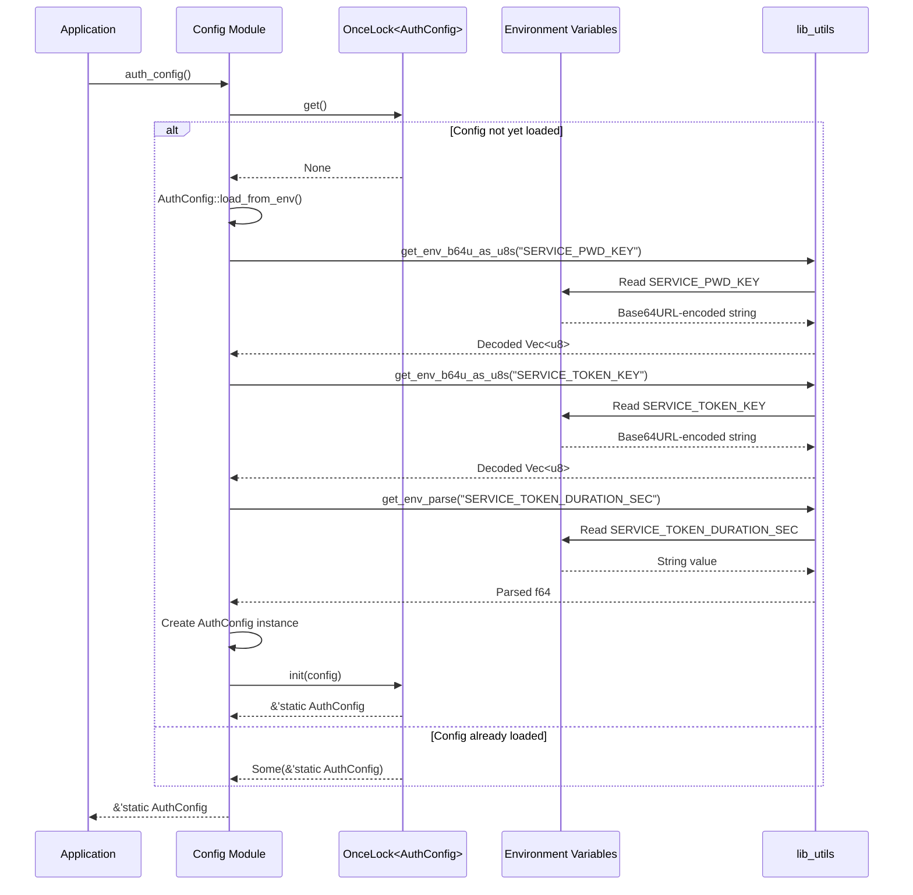

# Configuration Module

## Overview:

The `config` module in the lib-auth library provides centralized configuration management for authentication-related settings. It implements a singleton pattern using Rust's `OnceLock` to ensure configuration is loaded only once and then reused across the application. The module loads sensitive configuration values (like cryptographic keys) from environment variables, promoting secure deployment practices.

This module is crucial to the security of the authentication system as it manages cryptographic keys and other security parameters used throughout the library. It's designed to fail fast if required configuration values are missing or improperly formatted, preventing the application from running with insecure defaults.

## Summary:

### Public Types

#### `AuthConfig`

A structure containing all configuration settings for the authentication system.

```rust
#[allow(non_snake_case)]
pub struct AuthConfig {
    // Cryptographic key for password hashing
    pub PWD_KEY: Vec<u8>,
    
    // Cryptographic key for token signing
    pub TOKEN_KEY: Vec<u8>,
    
    // Token validity duration in seconds
    pub TOKEN_DURATION_SEC: f64,
}
```

### Public Functions

#### `auth_config`

Returns a reference to the singleton `AuthConfig` instance, loading it from environment variables if not already loaded.

```rust
pub fn auth_config() -> &'static AuthConfig

// Example:
let config = auth_config();
let token_key = &config.TOKEN_KEY;
let token_duration = config.TOKEN_DURATION_SEC;
```

## Detail:

### Configuration Loading

The `auth_config` function uses Rust's `OnceLock` to implement a thread-safe singleton pattern. The first call to this function will:

1. Attempt to load configuration from environment variables
2. Panic with a descriptive error message if loading fails
3. Store the loaded configuration in a static variable for future use

Subsequent calls will simply return a reference to the already loaded configuration, avoiding redundant parsing of environment variables.

### Environment Variables

The module expects the following environment variables to be set:

- `SERVICE_PWD_KEY`: Base64URL-encoded cryptographic key for password hashing
- `SERVICE_TOKEN_KEY`: Base64URL-encoded cryptographic key for token signing
- `SERVICE_TOKEN_DURATION_SEC`: Floating-point number representing token validity duration in seconds

### Security Considerations

1. **Key Management**: Cryptographic keys are loaded from environment variables rather than hardcoded in the source code
2. **Fail Fast**: The module panics during initialization if required configuration is missing, preventing insecure operation
3. **Singleton Pattern**: Configuration is loaded only once and then reused, preventing potential inconsistencies
4. **Memory Safety**: Keys are stored as `Vec<u8>` which allows secure memory handling (compared to string slices)

### Flow Diagram



### Implementation Notes

- The configuration uses uppercase naming for its fields (`PWD_KEY`, `TOKEN_KEY`, etc.) to signify they are constants once loaded
- The module relies on the `lib_utils` crate for environment variable loading and parsing
- The configuration is implemented as a thread-safe singleton using `OnceLock`, ensuring it's only loaded once
- The module deliberately panics if configuration loading fails, as running with missing or invalid security configuration would be unsafe
