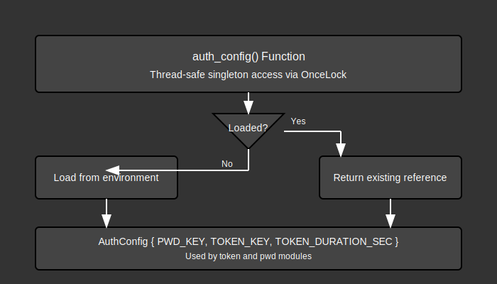

# Config Module Documentation

## Overview:

The `config` module handles the configuration loading and management for the lib-auth crate. It's responsible for securely retrieving and providing access to sensitive configuration values required for authentication operations, such as cryptographic keys and token duration settings. The module follows a singleton pattern, ensuring that configuration is loaded only once during the application's lifecycle and then made available throughout the codebase.

The config module is designed to be:
1. Secure - handling sensitive cryptographic keys
2. Environment-aware - loading configuration from environment variables
3. Fail-fast - panicking on startup if critical configuration is missing rather than failing at runtime
4. Memory-efficient - using a singleton pattern via `OnceLock`
5. Thread-safe - providing safe access from multiple threads

This module is a critical component that underpins the security of both the password hashing and token generation/validation systems.

## Summary:

### Public Types:

#### `AuthConfig`
The main configuration structure containing all authentication-related settings.

```rust
#[allow(non_snake_case)]
pub struct AuthConfig {
    // -- Crypt
    pub PWD_KEY: Vec<u8>,  // Key for password hashing

    pub TOKEN_KEY: Vec<u8>,  // Key for token signing
    pub TOKEN_DURATION_SEC: f64,  // Token validity duration in seconds
}
```

### Public Functions:

#### `auth_config`
Returns a reference to the singleton AuthConfig instance, loading it if not already loaded.

```rust
pub fn auth_config() -> &'static AuthConfig
```

- **Input**: None
- **Output**: A static reference to the AuthConfig singleton

Example:
```rust
// Access configuration values
let config = auth_config();
let token_duration = config.TOKEN_DURATION_SEC;
let pwd_key = &config.PWD_KEY;

// Use in token generation
let token = generate_token("user123", config.TOKEN_DURATION_SEC, salt, &config.TOKEN_KEY)?;
```

## Detail:

### Architecture

The config module uses a singleton pattern implemented with Rust's `OnceLock` to ensure thread-safe, one-time initialization:

1. **Singleton Pattern**: Using `OnceLock` for lazy initialization and thread-safe access
2. **Environment Loading**: Configuration values are loaded from environment variables
3. **Early Failure**: The application will panic during initialization if required configuration is missing
4. **Static Access**: Configuration is accessed via a static reference, avoiding repeated loading

### Security Considerations

- **Sensitive Data Handling**: Cryptographic keys are stored in memory as binary data (`Vec<u8>`)
- **Environment Variables**: Secrets are loaded from environment variables rather than hardcoded or in files
- **Base64 Encoding**: Keys are stored in environment variables as base64-encoded strings for safe handling
- **Memory Safety**: Rust's memory safety ensures sensitive data is properly managed

### Code Flow

1. **Configuration Access Flow**:
   - Code calls `auth_config()` to get configuration
   - If configuration is already loaded, returns existing reference
   - If not loaded, initializes the singleton by loading from environment
   - If loading fails, panics with error message
   - Returns reference to loaded configuration

2. **Configuration Loading Flow**:
   - `AuthConfig::load_from_env()` is called during initialization
   - Each configuration value is loaded from the corresponding environment variable
   - Values are parsed and validated
   - Resulting AuthConfig struct is returned or error is propagated

### Flow Diagram



### Implementation Notes

- The module uses `lib_utils::envs` functions for parsing environment variables
- Cryptographic keys are stored in environment variables as base64url-encoded strings
- The capital-case field names in `AuthConfig` are intentional to match environment variable conventions
- The singleton pattern ensures both thread safety and performance by loading configuration only once
- Panicking on startup for missing configuration is a deliberate design choice to fail fast rather than at runtime
