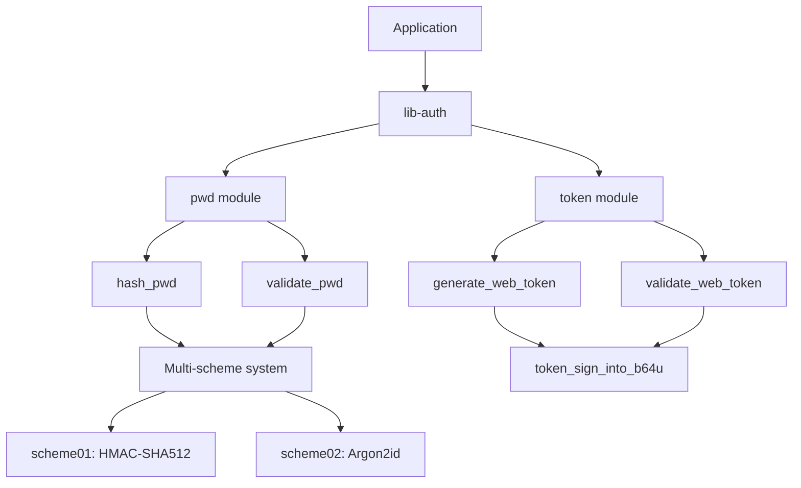

# lib-auth Library

## Overview:

The `lib-auth` library provides a comprehensive authentication system with robust password hashing and token management functionality. It's designed to be secure, flexible, and easy to integrate with various authentication workflows. The library implements multiple password hashing schemes to enable seamless security upgrades and provides a token system with configurable duration and cryptographic signing.

## Summary:

The `lib-auth` library exposes two main modules:

### pwd Module

The password module handles secure password hashing and validation using multiple supported schemes.

```rust
// Hash a password with the default scheme
let content = "user_password";
let salt = Uuid::new_v4();
let to_hash = ContentToHash { content: content.to_string(), salt };
let hashed_pwd = hash_pwd(to_hash).await?;
```

```rust
// Validate a password against a stored hash
let content = "user_password";
let salt = Uuid::from_str("f05e8961-d6ad-4086-9e78-a6de065e5453")?;
let to_hash = ContentToHash { content: content.to_string(), salt };
let status = validate_pwd(to_hash, stored_hash).await?;

match status {
    SchemeStatus::Ok => println!("Password valid and using current scheme"),
    SchemeStatus::Outdated => println!("Password valid but using outdated scheme, should be rehashed"),
}
```

### token Module

The token module manages authentication tokens with secure signing and expiration.

```rust
// Generate a web token for a user
let user_id = "user123";
let salt = Uuid::new_v4();
let token = generate_web_token(user_id, salt)?;
let token_string = token.to_string(); // Can be sent to client
```

```rust
// Validate a token
let token: Token = token_string.parse()?;
validate_web_token(&token, salt)?;
```

## Detail:

The `lib-auth` library is architected around two core security concepts: password hashing and token management. 

### Architecture

The library implements a multi-scheme password hashing system allowing multiple hashing algorithms to coexist. This enables seamless security upgrades by adding new schemes while maintaining compatibility with existing password hashes.

The token system uses cryptographic signatures with Blake3 hashing to ensure token integrity and authenticity. Tokens include expiration timestamps to limit their validity period.

### Security Considerations

1. **Password Hashing**: The library uses industry-standard password hashing algorithms including Argon2id (in scheme02) and HMAC-SHA512 (in scheme01).

2. **Key Management**: Cryptographic keys for both password hashing and token signing are loaded from environment variables, promoting secure deployment practices.

3. **Token Security**: Tokens are signed using Blake3 and include expiration time to mitigate replay attacks.

### Flow Diagram


