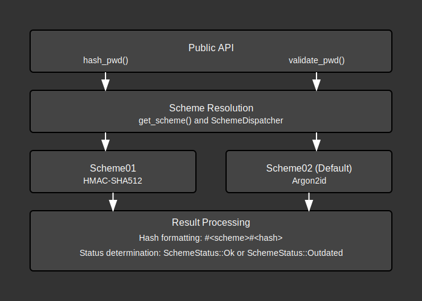

# Password Module Documentation

## Overview:

The `pwd` module is responsible for secure password hashing and validation using a multi-scheme architecture. This design allows for the implementation of different hashing algorithms while maintaining backward compatibility with previously hashed passwords. The module provides a clean interface for asynchronous password hashing and validation, with the ability to detect when passwords need to be re-hashed using the latest scheme.

The module follows security best practices by:
1. Isolating cryptographic operations in separate schemes
2. Using strong cryptographic primitives (Argon2id, HMAC-SHA512)
3. Including unique salt values with each password
4. Executing CPU-intensive operations in separate threads to maintain application responsiveness
5. Supporting scheme versioning to allow for future cryptographic upgrades

## Summary:

### Public Types:

#### `ContentToHash`
Contains the raw content to hash along with a unique salt.

```rust
pub struct ContentToHash {
    pub content: String, // Clear content to hash (like a password)
    pub salt: Uuid,      // Unique salt for this hash
}
```

#### `SchemeStatus`
Represents the status of a password validation, used to detect outdated hashing schemes.

```rust
pub enum SchemeStatus {
    Ok,       // Password uses the latest scheme
    Outdated, // Password uses an old scheme, should be rehashed
}
```

### Public Functions:

#### `hash_pwd`
Hashes a password using the default (latest) scheme.

```rust
pub async fn hash_pwd(to_hash: ContentToHash) -> Result<String>
```

- **Input**: `ContentToHash` containing the password and salt
- **Output**: A string in the format `#<scheme>#<hashed-password>` or an error

Example:
```rust
let salt = Uuid::new_v4();
let content_to_hash = ContentToHash {
    content: "my_secure_password".to_string(),
    salt: salt,
};
let hashed_pwd = hash_pwd(content_to_hash).await?;
// Result: "#02#$argon2id$v=19$m=19456,t=2,p=1$..."
```

#### `validate_pwd`
Validates a password against a previously hashed reference.

```rust
pub async fn validate_pwd(
    to_hash: ContentToHash, 
    pwd_ref: String
) -> Result<SchemeStatus>
```

- **Input**: 
  - `to_hash`: `ContentToHash` containing the password and salt to validate
  - `pwd_ref`: Previously hashed password including scheme information
- **Output**: `SchemeStatus` indicating if the password is valid and whether it uses the latest scheme

Example:
```rust
let salt = user.salt; // From database
let to_hash = ContentToHash {
    content: user_input_password,
    salt: salt,
};
let status = validate_pwd(to_hash, stored_password_hash).await?;
if matches!(status, SchemeStatus::Outdated) {
    // Rehash the password with latest scheme and update in database
}
```

## Detail:

### Architecture

The password module is designed around a multi-scheme architecture that allows for cryptographic agility. This is critical for long-term security as it enables upgrading hashing algorithms without breaking existing systems.

Key components:
1. **Public API**: Async functions `hash_pwd` and `validate_pwd`
2. **Scheme Trait**: Defines the interface for all hashing schemes
3. **Scheme Implementations**: Currently includes two schemes:
   - `Scheme01`: Uses HMAC-SHA512
   - `Scheme02`: Uses Argon2id (the current default)
4. **Password Format**: `#<scheme-id>#<hashed-password>`

### Security Considerations

- **CPU-intensive operations**: Password hashing is deliberately computationally expensive to resist brute-force attacks. The module uses `spawn_blocking` to ensure these operations don't block the async runtime.
- **Argon2id**: The default scheme uses Argon2id, which provides strong resistance against both side-channel and brute-force attacks.
- **Salt**: Each password requires a unique salt to prevent rainbow table attacks.
- **Versioned schemes**: Allows for cryptographic agility when vulnerabilities are discovered.

### Code Flow

1. **Password Hashing Flow**:
   - User calls `hash_pwd` with password and salt
   - Function spawns a blocking task to execute CPU-intensive hashing
   - Gets the default scheme implementation
   - Hashes the password using the scheme
   - Returns formatted result with scheme identifier

2. **Password Validation Flow**:
   - User calls `validate_pwd` with password, salt, and stored hash
   - Function parses the scheme from the stored hash
   - Spawns a blocking task to execute CPU-intensive validation
   - Gets the appropriate scheme implementation
   - Validates the password
   - Returns status indicating if password is valid and using the latest scheme

### Flow Diagram



### Implementation Notes

- The module uses `enum_dispatch` to efficiently dispatch to the correct scheme implementation
- Error handling is comprehensive with specific error types for different failure modes
- The default scheme is defined as a constant (`DEFAULT_SCHEME`) making it easy to update
- The `PwdParts` struct and its `FromStr` implementation handle parsing the scheme and hash from stored passwords
