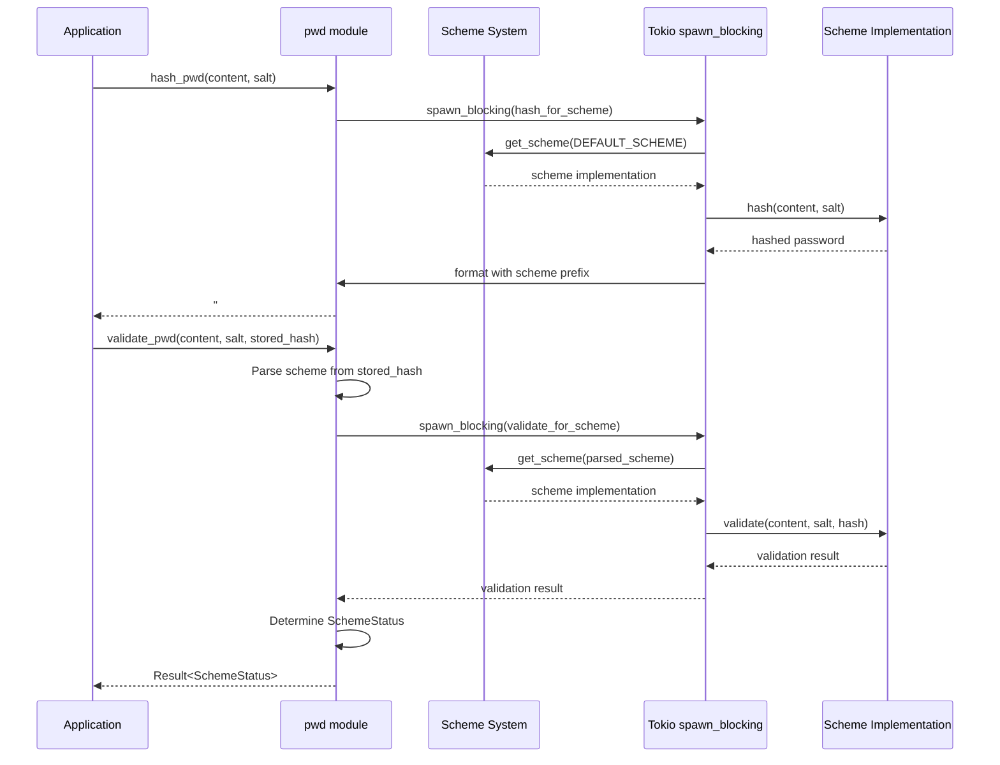

# Password Module (pwd)

## Overview:

The `pwd` module provides secure password hashing and validation functionality. It implements a multi-scheme design pattern that allows the codebase to support multiple hashing algorithms simultaneously. This design is particularly valuable for security upgrades, as it allows introducing new, stronger hashing schemes while maintaining compatibility with passwords hashed using older schemes.

The module separates concerns between the async public API and the synchronous implementation of hashing schemes. It uses Tokio's `spawn_blocking` to ensure that CPU-intensive hashing operations don't block the async runtime.

## Summary:

### Public Types

#### `ContentToHash`

Contains the raw content to hash along with a salt value.

```rust
pub struct ContentToHash {
    pub content: String, // The raw password or content to hash
    pub salt: Uuid,      // A unique salt value
}
```

#### `SchemeStatus`

Indicates the status of a password's hashing scheme after validation.

```rust
pub enum SchemeStatus {
    Ok,       // The password uses the latest scheme
    Outdated, // The password uses an old scheme and should be rehashed
}
```

### Public Functions

#### `hash_pwd`

Asynchronously hashes a password using the default scheme.

```rust
pub async fn hash_pwd(to_hash: ContentToHash) -> Result<String>

// Example:
let salt = Uuid::new_v4();
let to_hash = ContentToHash {
    content: "mypassword".to_string(),
    salt,
};
let hashed = hash_pwd(to_hash).await?;
// Result: "#02$argon2id$v=19$m=19456,t=2,p=1$..."
```

#### `validate_pwd`

Asynchronously validates if a password matches a stored hash and indicates if the hashing scheme is current.

```rust
pub async fn validate_pwd(
    to_hash: ContentToHash,
    pwd_ref: String,
) -> Result<SchemeStatus>

// Example:
let salt = Uuid::from_str("f05e8961-d6ad-4086-9e78-a6de065e5453")?;
let to_hash = ContentToHash {
    content: "mypassword".to_string(),
    salt,
};
let status = validate_pwd(to_hash, stored_hash_from_db).await?;

if matches!(status, SchemeStatus::Outdated) {
    // Password is valid but uses an outdated scheme
    // Should rehash and update the stored hash
}
```

## Detail:

### Code Flow

The password module implements a layered approach to password hashing:

1. **Public API Layer**: Async functions (`hash_pwd`, `validate_pwd`) that provide the interface to the module
2. **Coordination Layer**: Functions that parse the scheme format and dispatch to appropriate implementations
3. **Implementation Layer**: Individual scheme implementations that provide the actual hashing algorithms

Hashed passwords are stored with a scheme identifier prefix in the format `#<scheme-id>#<hashed-content>`, e.g., `#02#$argon2id$v=19$...`. This format allows the system to determine which scheme to use for validation.

### Scheme Support

The module currently supports two schemes:
- **Scheme01**: Uses HMAC-SHA512 for password hashing
- **Scheme02**: Uses Argon2id, a memory-hard function designed to be resistant to GPU attacks

The default scheme is configurable but currently set to "02" (Argon2id).

### Security Considerations

1. **Multi-scheme Design**: Allows gradual security upgrades without forcing immediate password resets
2. **Salt Usage**: Each password is hashed with a unique salt to prevent rainbow table attacks
3. **Offloading Computation**: CPU-intensive hashing is performed in a separate thread pool to prevent DoS vulnerabilities
4. **Memory-hard Algorithm**: Scheme02 uses Argon2id which requires significant memory to compute, making hardware acceleration attacks difficult

### Flow Diagram



### Password Format

The module stores passwords with a scheme identifier:

```
#<scheme-id>#<hashed-content>
```

For example:
- Scheme01: `#01#qO9A90161DoewhNXFwVcnAaljRIVnajvd5zsVDrySCwxpoLwVCACzaz-8Ev2ZpI8RackUTLBVqFI6H5oMe-OIg`
- Scheme02: `#02#$argon2id$v=19$m=19456,t=2,p=1$8F6JYdatQIaeeKbeBl5UUw$TaRnmmbDdQ1aTzk2qQ2yQzPQoZfnKqhrfuTH/TRP5V4`

This format allows the system to determine which validation scheme to use while accommodating future security upgrades.
