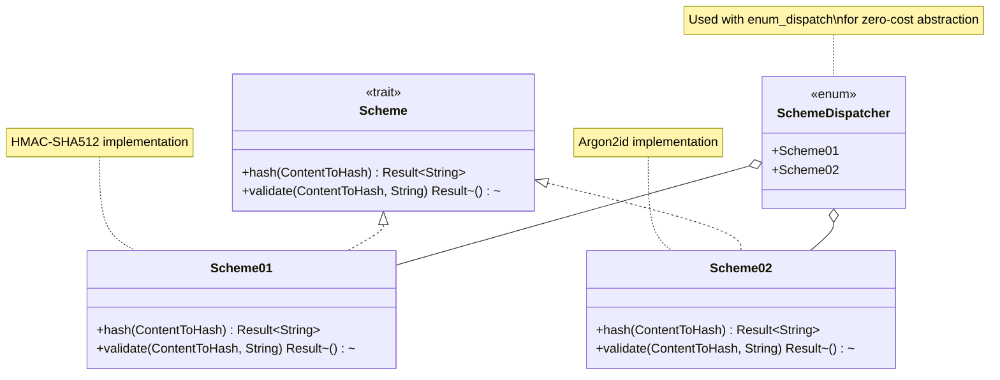
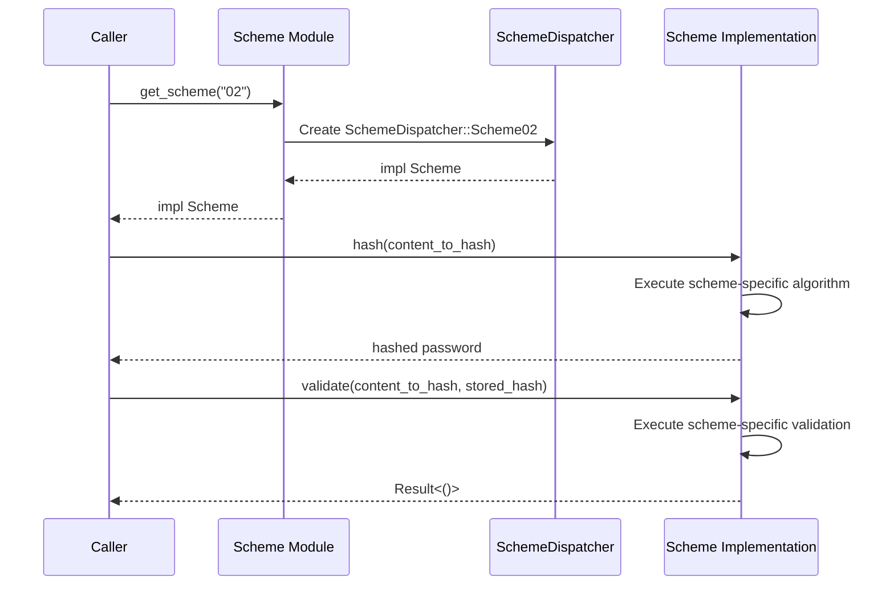

# Password Scheme Module

## Overview:

The `pwd/scheme` module implements a multi-scheme password hashing system, enabling the application to support multiple hashing algorithms simultaneously. This design is crucial for security upgrades, allowing introduction of newer, stronger algorithms while maintaining compatibility with existing password hashes.

The module uses the Enum Dispatch pattern to provide a unified interface for different hashing schemes through the `Scheme` trait. Each scheme implements its own hashing algorithm, with the module providing a mechanism to select the appropriate scheme based on a string identifier.

Currently, the module supports two schemes:
1. `Scheme01`: A legacy scheme using HMAC-SHA512
2. `Scheme02`: The current default scheme using Argon2id (a memory-hard function)

## Summary:

### Public Constants

#### `DEFAULT_SCHEME`

Defines the current default hashing scheme to use for new passwords.

```rust
pub const DEFAULT_SCHEME: &str = "02";  // Currently points to Scheme02 (Argon2id)
```

### Public Types

#### `SchemeStatus`

Indicates whether a password uses the current or an outdated hashing scheme.

```rust
#[derive(Debug)]
pub enum SchemeStatus {
    Ok,       // The password uses the latest scheme (DEFAULT_SCHEME)
    Outdated, // The password uses an older scheme and should be rehashed
}
```

#### `Scheme` Trait

Defines the interface that all password hashing schemes must implement.

```rust
#[enum_dispatch]
pub trait Scheme {
    fn hash(&self, to_hash: &ContentToHash) -> Result<String>;
    fn validate(&self, to_hash: &ContentToHash, pwd_ref: &str) -> Result<()>;
}
```

#### `SchemeDispatcher`

An enum that dispatches calls to the appropriate scheme implementation.

```rust
#[enum_dispatch(Scheme)]
pub enum SchemeDispatcher {
    Scheme01(scheme_01::Scheme01),
    Scheme02(scheme_02::Scheme02),
}
```

### Public Functions

#### `get_scheme`

Returns the appropriate scheme implementation based on a scheme identifier.

```rust
pub fn get_scheme(scheme_name: &str) -> Result<impl Scheme>

// Example:
let scheme = get_scheme("02")?;  // Gets the Scheme02 implementation
let hashed = scheme.hash(&content_to_hash)?;
```

## Detail:

### Scheme Design

The module uses the Enum Dispatch pattern (via the `enum_dispatch` crate) to implement a zero-cost abstraction over different hashing schemes. This allows:

1. A unified interface for all schemes through the `Scheme` trait
2. Static dispatch for better performance compared to dynamic dispatch with trait objects
3. Easy addition of new schemes by implementing the `Scheme` trait

### Supported Schemes

#### Scheme01 (HMAC-SHA512)

The original scheme uses HMAC-SHA512 for password hashing:
- Combines the password, salt, and a secret key
- Uses the HMAC-SHA512 algorithm to generate a hash
- Encodes the result using base64url encoding

#### Scheme02 (Argon2id)

The current default scheme uses Argon2id, a memory-hard function designed to be resistant to GPU attacks:
- Uses the Argon2id algorithm with configurable parameters (memory, iterations, parallelism)
- Incorporates the password, salt, and a secret key
- Returns the result in PHC string format

### Scheme Selection

The `get_scheme` function acts as a factory, returning the appropriate scheme implementation based on a string identifier:
- "01" returns a `Scheme01` instance
- "02" returns a `Scheme02` instance
- Any other identifier returns an error

### Security Considerations

1. **Multi-scheme Support**: Allows upgrading to stronger algorithms without breaking existing passwords
2. **Memory-hard Function**: Default scheme (Argon2id) requires significant memory to compute, deterring hardware acceleration attacks
3. **Secret Key**: All schemes incorporate a secret key in addition to the salt, providing additional protection
4. **Factory Pattern**: The `get_scheme` function allows seamless switching between schemes

### Flow Diagram



### Usage Flow



### Implementation Notes

- The module uses `enum_dispatch` for compile-time dispatching rather than runtime dynamic dispatch
- Each scheme is implemented in its own module (`scheme_01.rs`, `scheme_02.rs`)
- Adding a new scheme requires:
  1. Creating a new implementation file
  2. Adding the new scheme to the `SchemeDispatcher` enum
  3. Adding a new match arm to the `get_scheme` function
- The default scheme is controlled by the `DEFAULT_SCHEME` constant
