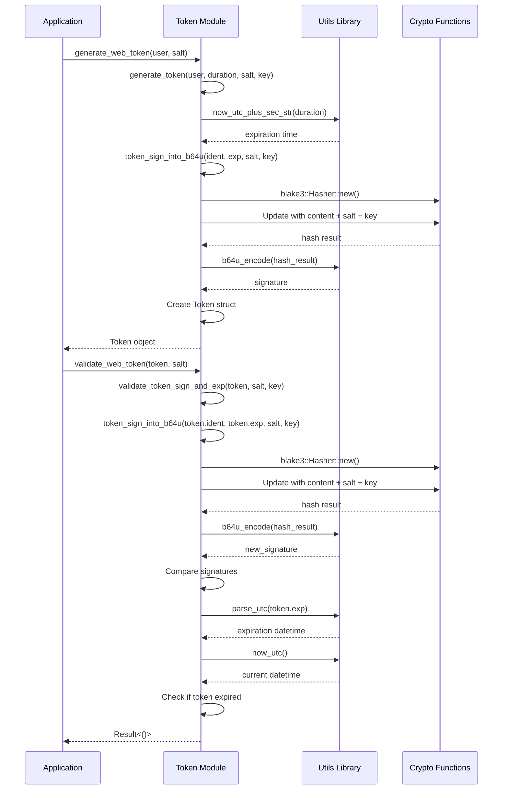

# Token Module

## Overview:

The `token` module provides secure token generation and validation functionality for authentication purposes. It implements a stateless token system similar to JWT (JSON Web Tokens) but with a custom format. The tokens contain an identifier (typically a username or user ID), an expiration timestamp, and a cryptographic signature to ensure integrity and authenticity.

Tokens are designed to be self-contained, meaning they can be validated without database lookups, making them efficient for stateless authentication systems. The module uses the Blake3 cryptographic hash function for token signing, providing strong security guarantees with excellent performance.

## Summary:

### Public Types

#### `Token`

Represents an authentication token with identifier, expiration, and signature.

```rust
pub struct Token {
    pub ident: String,     // Identifier (username, user ID, etc.)
    pub exp: String,       // Expiration time in RFC3339 format
    pub sign_b64u: String, // Base64URL-encoded signature
}
```

The `Token` struct implements `FromStr` to parse from string and `Display` to convert to string, making it easy to serialize/deserialize:

```rust
// Parse a token from string
let token_str = "dXNlcjEyMw.MjAyMy0xMi0zMVQyMzo1OTo1OVo.abc123signature";
let token: Token = token_str.parse()?;

// Convert token to string
let token_str = token.to_string();
```

### Public Functions

#### `generate_web_token`

Generates a signed token for web authentication with configurable duration.

```rust
pub fn generate_web_token(user: &str, salt: Uuid) -> Result<Token>

// Example:
let user_id = "user123";
let salt = Uuid::new_v4();
let token = generate_web_token(user_id, salt)?;
```

#### `validate_web_token`

Validates a token's signature and expiration.

```rust
pub fn validate_web_token(origin_token: &Token, salt: Uuid) -> Result<()>

// Example:
let token_str = "dXNlcjEyMw.MjAyMy0xMi0zMVQyMzo1OTo1OVo.abc123signature";
let token: Token = token_str.parse()?;
let salt = stored_salt_for_user; // The same salt used during token generation
validate_web_token(&token, salt)?;
```

## Detail:

### Token Format

Tokens are formatted as three base64url-encoded components separated by periods:
```
<base64url(identifier)>.<base64url(expiration)>.<signature>
```

For example:
```
dXNlcjEyMw.MjAyMy0xMi0zMVQyMzo1OTo1OVo.abc123signature
```

Where:
- `dXNlcjEyMw` is the base64url-encoded identifier (e.g., "user123")
- `MjAyMy0xMi0zMVQyMzo1OTo1OVo` is the base64url-encoded expiration time (e.g., "2023-12-31T23:59:59Z")
- `abc123signature` is the base64url-encoded signature

### Code Flow

The token generation process follows these steps:
1. Take the user identifier and the current configuration for token duration
2. Calculate an expiration time by adding the duration to the current time
3. Generate a cryptographic signature using the identifier, expiration, a unique salt, and a secret key
4. Format the token as `<base64url(identifier)>.<base64url(expiration)>.<signature>`

The token validation process follows these steps:
1. Parse the token string into its components (identifier, expiration, signature)
2. Regenerate the signature using the extracted identifier, expiration, the provided salt, and the secret key
3. Compare the regenerated signature with the one in the token
4. Check if the token's expiration time is in the future
5. Return an error if the signature doesn't match or the token has expired

### Security Considerations

1. **Signature Verification**: Tokens are signed with a secret key and a salt, making them tamper-resistant
2. **Expiration**: Tokens have a configurable expiration time to limit their validity period
3. **Salt Usage**: Each token is generated with a salt, adding an additional security layer
4. **Blake3 Hashing**: Uses the modern Blake3 cryptographic hash function for signature generation
5. **Base64URL Encoding**: All components are base64url-encoded for safe transport in URLs and HTTP headers

### Flow Diagram



### Implementation Notes

- The token module is designed to be synchronous, allowing for easy integration with both synchronous and asynchronous code
- Token generation and validation are computationally inexpensive operations
- The token format is compact yet provides strong security guarantees
- Tokens are stateless, meaning no database lookup is required for validation, only the original salt used during creation
