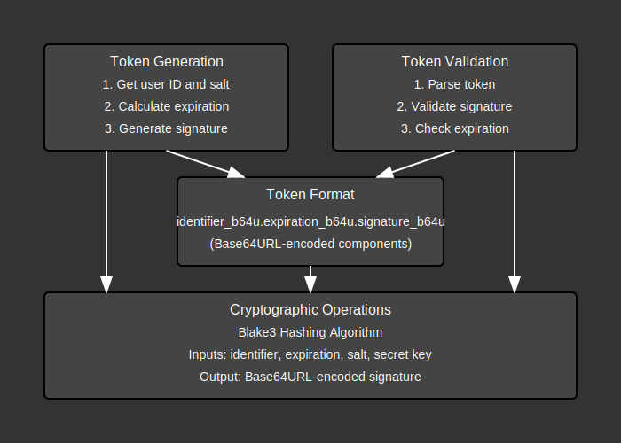

# Token Module Documentation

## Overview:

The `token` module provides a secure mechanism for generating and validating authentication tokens used in web applications. These tokens serve as proof of authentication and can be used for stateless session management. The module implements a three-part token format consisting of an identifier, expiration time, and cryptographic signature, which together ensure the token's authenticity and limit its validity period.

The module is designed to be secure by:
1. Using strong cryptographic primitives (Blake3)
2. Including token expiration to limit the window of vulnerability
3. Binding tokens to specific user identifiers
4. Including a unique salt with each token to prevent replay attacks
5. Validating both signature authenticity and expiration time

The token system is particularly useful for authentication in web applications, APIs, and microservices where maintaining server-side session state is undesirable.

## Summary:

### Public Types:

#### `Token`
Represents an authentication token with its three components.

```rust
pub struct Token {
    pub ident: String,     // Identifier (like username)
    pub exp: String,       // Expiration date in RFC3339 format
    pub sign_b64u: String, // Base64url-encoded signature
}
```

The token is formatted as `ident_b64u.exp_b64u.sign_b64u` when converted to a string.

Example:
```rust
// Parse a token string
let token_str = "dXNlcjEyMw.MjAyMy0xMi0zMVQyMzo1OTo1OVo.S1gnaXUtMTJfcGFzc3dvcmQ";
let token: Token = token_str.parse()?;

// Access token components
println!("User: {}", token.ident);
println!("Expires: {}", token.exp);

// Convert token back to string
let token_str = token.to_string();
```

### Public Functions:

#### `generate_web_token`
Generates a new authentication token for a user.

```rust
pub fn generate_web_token(user: &str, salt: Uuid) -> Result<Token>
```

- **Input**: 
  - `user`: User identifier
  - `salt`: Unique UUID to prevent token replay
- **Output**: A `Token` or an error

Example:
```rust
let user_id = "user123";
let salt = Uuid::new_v4();
let token = generate_web_token(user_id, salt)?;
// Returns a valid token with expiration based on config
```

#### `validate_web_token`
Validates a token's signature and expiration.

```rust
pub fn validate_web_token(origin_token: &Token, salt: Uuid) -> Result<()>
```

- **Input**: 
  - `origin_token`: Token to validate
  - `salt`: The same UUID used to generate the token
- **Output**: `Ok(())` if valid, or an error otherwise

Example:
```rust
// From a request, parse the token and validate
let token_str = request.header("Authorization").split("Bearer ").nth(1)?;
let token: Token = token_str.parse()?;
let user_salt = get_user_salt_from_database(token.ident)?;

// Validate the token
validate_web_token(&token, user_salt)?;
// If successful, the token is authentic and not expired
```

## Detail:

### Architecture

The token module uses a simple yet secure architecture:

1. **Token Structure**: Three-part design (identifier, expiration, signature)
2. **Token Generation**: Creates tokens with configurable expiration
3. **Token Validation**: Verifies both signature and expiration
4. **Cryptographic Signature**: Using Blake3 for fast and secure signatures
5. **Configuration**: Token duration and key from environment variables

### Security Considerations

- **Token Format**: Base64url encoding ensures safe transmission in URLs and headers
- **Expiration**: Limits the window of vulnerability if a token is compromised
- **Signature**: Prevents token forgery using a secure cryptographic hash
- **Salt**: Each token requires the original salt for validation, preventing replay attacks
- **Server-side Key**: Tokens are signed with a server-side key that never leaves the server

### Code Flow

1. **Token Generation Flow**:
   - Application calls `generate_web_token` with user ID and salt
   - Function gets token duration from configuration
   - Creates token with user ID, calculated expiration time
   - Signs the token using Blake3 with user ID, expiration, salt, and secret key
   - Returns formatted token

2. **Token Validation Flow**:
   - Application calls `validate_web_token` with token and salt
   - Function recreates the signature using the same process as generation
   - Compares the original signature with the recreated one
   - Verifies that the token has not expired
   - Returns success or appropriate error

3. **Token Parsing Flow**:
   - Token string is parsed using `FromStr` implementation
   - The three components are split and decoded from base64url
   - Components are validated for correctness

### Flow Diagram



### Implementation Notes

- The module uses Blake3 for its signature algorithm, which provides high security and performance
- Token duration is configurable through environment variables
- Base64url encoding is used for safe transmission in URLs and headers
- The module includes comprehensive error handling with specific error types
- Token validation checks both signature authenticity and expiration time
