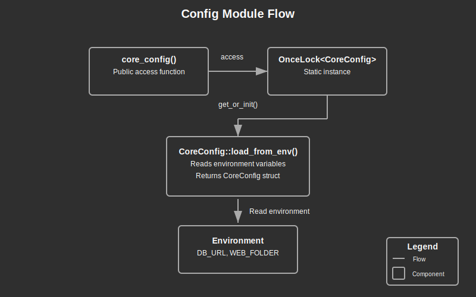

# Config Module Documentation

## Overview:

The Config module provides a centralized configuration management system for the application. It implements a singleton pattern to load and cache environment variables, ensuring consistent configuration access throughout the application. The module is designed to fail fast on startup if required configuration variables are missing, preventing runtime errors related to configuration issues.

This module follows the principles of the 12-factor app methodology for configuration management, where configuration is strictly separated from code and loaded from the environment. This approach facilitates deployment across different environments (development, staging, production) without code changes.

The singleton design ensures that configuration is loaded only once, reducing redundant environment variable lookups and providing a single source of truth for all application components.

## Summary:

### Key Types:

#### `CoreConfig`

The main configuration structure containing all application settings.

```rust
// CoreConfig structure contains all application settings
pub struct CoreConfig {
    // Database connection string
    pub DB_URL: String,
    
    // Web assets folder path
    pub WEB_FOLDER: String,
}
```

### Key Functions:

#### `core_config() -> &'static CoreConfig`

Provides access to the application configuration singleton.

```rust
// Access the configuration anywhere in the application
let config = core_config();

// Use configuration values
let db_url = &config.DB_URL;
let web_folder = &config.WEB_FOLDER;
```

#### `CoreConfig::load_from_env() -> lib_utils::envs::Result<CoreConfig>`

Internal function that loads configuration from environment variables.

```rust
// This is called internally by core_config()
// But could be used directly if needed
match CoreConfig::load_from_env() {
    Ok(config) => println!("Configuration loaded successfully"),
    Err(ex) => panic!("Failed to load configuration: {ex:?}"),
}
```

## Detail:

### Architecture

The configuration system uses a simple but effective singleton pattern:

1. **Lazy Initialization**: The `OnceLock` ensures the configuration is loaded only once on first access
2. **Environment Loading**: The configuration loads settings from environment variables
3. **Fail-Fast Approach**: Missing required configuration causes immediate panic during initialization
4. **Strongly Typed**: Configuration values are converted to appropriate types upon loading

This design provides a balance between simplicity, performance, and correctness.

### Configuration Flow

1. **First Access**: When `core_config()` is first called, it triggers initialization
2. **Environment Loading**: `CoreConfig::load_from_env()` reads variables from the environment
3. **Validation**: Missing or invalid variables cause immediate errors
4. **Caching**: The successfully loaded configuration is stored in the `OnceLock` for future access
5. **Access**: Subsequent calls to `core_config()` return the cached instance

### Security Considerations

1. **Sensitive Data**: The configuration may contain sensitive information like database credentials
2. **Environment Isolation**: Following 12-factor app principles keeps credentials out of code
3. **Panic on Missing Config**: Prevents the application from running with incomplete configuration

### Configuration Categories

The current implementation includes two main categories of configuration:

1. **Database Configuration**:
   - `DB_URL`: The database connection string

2. **Web Assets Configuration**:
   - `WEB_FOLDER`: Location of web assets for serving

This structure can be extended with additional categories as the application evolves.

### Error Handling

The configuration system uses a fail-fast approach:
- Missing required environment variables cause immediate panic
- This prevents partial initialization and potential security issues
- The error messages include the specific variable that was missing

### Flow Diagram



### Implementation Notes

- Uses `std::sync::OnceLock` for thread-safe lazy initialization
- Relies on the `lib_utils::envs` module for environment variable access
- All configuration fields use uppercase naming to denote environment variables
- The `#[allow(non_snake_case)]` attribute is used to maintain environment variable naming conventions
