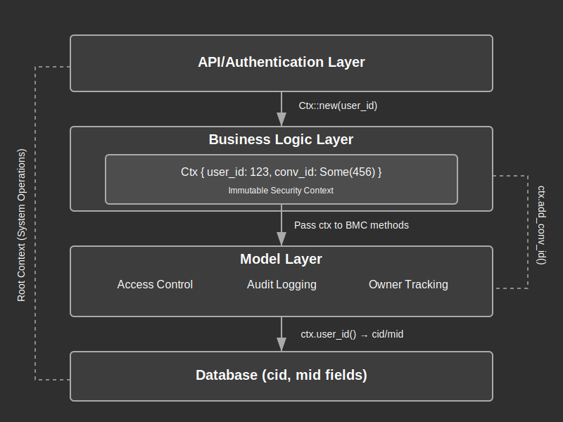

# Context (Ctx) Module Documentation

## Overview:

The Context (Ctx) module provides a fundamental security and identity boundary for the application. It encapsulates user identity information and provides the foundation for the application's access control system. The Ctx object is passed throughout the application to validate access rights and maintain security context.

This module implements a simple yet powerful context mechanism that tracks the current user's identity and optionally the conversation they're working with. This provides essential information for permission checking and audit logging throughout the system. The Ctx is designed to be lightweight, immutable, and easily cloneable to maintain performance while providing a consistent security model.

The module establishes a clear separation between root (system) context and user contexts, preventing unauthorized elevation of privileges and ensuring proper access control throughout the application.

## Summary:

### Key Types:

#### `Ctx`

The core context structure that holds user identity information.

```rust
// Root context (system operations)
let root_ctx = Ctx::root_ctx();

// User context (normal user operations)
let user_ctx = Ctx::new(user_id)?;

// Adding conversation context
let conv_ctx = user_ctx.add_conv_id(conversation_id);
```

#### `Error`

Error types specific to the context module.

```rust
// Error when trying to create a root context incorrectly
match Ctx::new(0) {
    Err(Error::CtxCannotNewRootCtx) => println!("Can't create root ctx with new()"),
    Ok(_) => unreachable!(),
}
```

### Key Functions:

#### Constructors

- `root_ctx() -> Self`: Creates a system/root context (user_id = 0)
- `new(user_id: i64) -> Result<Self>`: Creates a user context with validation
- `add_conv_id(&self, conv_id: i64) -> Ctx`: Creates a new context with conversation ID

```rust
// System operations use root context
let system_ctx = Ctx::root_ctx();

// User operations require a user context
let user_ctx = Ctx::new(user_id)?;

// When operating on a specific conversation, add the conv_id
let conv_ctx = user_ctx.add_conv_id(conv_id);
```

#### Accessors

- `user_id(&self) -> i64`: Gets the user ID from the context
- `conv_id(&self) -> Option<i64>`: Gets the optional conversation ID

```rust
// Get the user ID for logging or access control
let user_id = ctx.user_id();

// Check if context has a conversation ID
if let Some(conv_id) = ctx.conv_id() {
    // Perform conversation-specific operations
}
```

## Detail:

### Architecture

The Context system is built around a simple but effective pattern:

1. **Immutable Context**: The Ctx struct is designed to be immutable, with new instances created when the context changes
2. **Context Propagation**: The context is passed explicitly to functions requiring authorization
3. **Layered Access Control**: The context provides foundational information that can be used by more complex access control systems

This design maintains simplicity while establishing a solid foundation for secure application development.

### Context Lifecycle

1. **Creation**: A context is typically created near the entry point of the application (API endpoint, RPC call, etc.)
2. **Enrichment**: Additional information (like conv_id) can be added to create derived contexts
3. **Validation**: The context is validated at key security boundaries
4. **Usage**: Functions use context attributes for permission checks
5. **Destruction**: When the function completes, the context is dropped

### Security Considerations

1. **Root Context Protection**: The root context (user_id = 0) can only be created via the dedicated root_ctx() constructor
2. **Immutability**: Context objects are immutable after creation, preventing mid-execution privilege changes
3. **Explicit Context Passing**: The context must be explicitly passed to functions, ensuring security awareness
4. **Future ACS Integration**: The context structure is designed for future integration with a more advanced Access Control System

### Future Extensions

The current implementation includes a placeholder for more advanced access control:
- The `conv_id` field provides a foundation for conversation-specific access control
- Comments indicate plans for future ACS (Access Control System) integration
- The `#[cfg_attr(feature = "with-rpc", derive(rpc_router::RpcResource))]` attribute suggests RPC integration capabilities

### Context Flow in Application

The context flows through the application in a top-down manner:

1. **API/Service Layer**: Creates initial context from authentication information
2. **Business Logic Layer**: Receives and validates context for operations
3. **Model Layer**: Uses context for data access control and audit logging
4. **Database Operations**: Context user ID is stored for create/update operations

### Flow Diagram



### Implementation Notes

- The context is designed to be small and efficient to pass around
- The `#[derive(Clone, Debug)]` traits allow easy context duplication and debugging
- Error handling is kept minimal to focus on the core security functionality
- The module supports integration with RPC systems through conditional compilation
