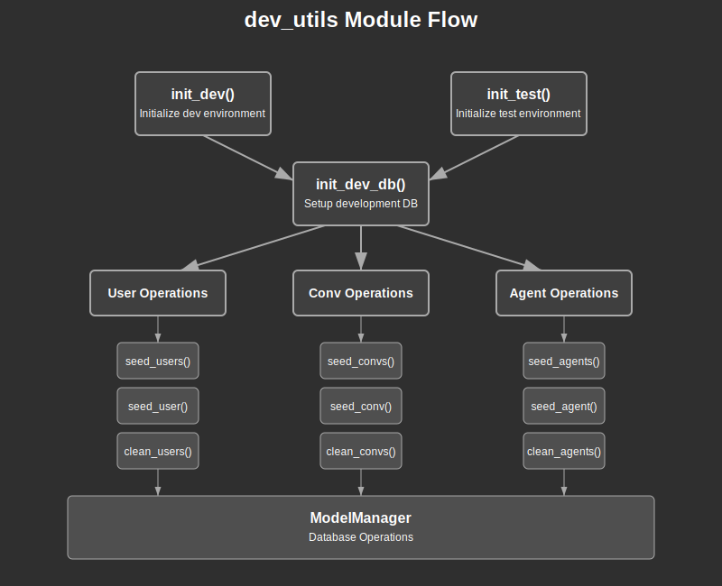

# dev_utils Module Documentation

## Overview:

The `dev_utils` module provides utilities specifically designed for development and testing environments in the application. It serves as a critical component for initializing development and test environments, setting up databases with test data, and managing test entities (Users, Conversations, Agents) throughout the development lifecycle.

This module implements a comprehensive suite of functions to:
1. Initialize development environments with proper database setup
2. Initialize test environments with required model managers
3. Seed test data for users, conversations, and agents
4. Clean up test data when no longer needed

The module is intentionally prefixed with an underscore (`_dev_utils`) and conditionally compiled based on build configuration, indicating that it should not be part of the production code but is essential for development and testing phases.

## Summary:

### Public Functions

#### Environment Initialization

- `init_dev() -> Future<()>` - Initializes the development environment. Sets up the development database using `dev_db::init_dev_db()`.
  
  ```rust
  // Initialize dev environment for local development
  dev_utils::init_dev().await;
  ```

- `init_test() -> Future<ModelManager>` - Initializes the test environment and returns a ModelManager instance. Calls `init_dev()` internally.
  
  ```rust
  // Initialize test environment and get model manager
  let mm = dev_utils::init_test().await;
  ```

#### User Operations

- `seed_users(ctx: &Ctx, mm: &ModelManager, usernames: &[&str]) -> Future<Result<Vec<i64>>>` - Creates multiple users with provided usernames and returns their IDs.
  
  ```rust
  // Create test users
  let user_ids = dev_utils::seed_users(&ctx, &mm, &["test1", "test2"]).await?;
  ```

- `seed_user(ctx: &Ctx, mm: &ModelManager, username: &str) -> Future<Result<i64>>` - Creates a single user with provided username and returns its ID.
  
  ```rust
  // Create a single test user
  let user_id = dev_utils::seed_user(&ctx, &mm, "test_user").await?;
  ```

- `clean_users(ctx: &Ctx, mm: &ModelManager, contains_username: &str) -> Future<Result<usize>>` - Deletes users whose usernames contain the specified string and returns the count of deleted users.
  
  ```rust
  // Clean up test users
  let deleted_count = dev_utils::clean_users(&ctx, &mm, "test").await?;
  ```

#### Conversation Operations

- `seed_convs(ctx: &Ctx, mm: &ModelManager, agent_id: i64, titles: &[&str]) -> Future<Result<Vec<i64>>>` - Creates multiple conversations with provided titles for a specific agent and returns their IDs.
  
  ```rust
  // Create test conversations
  let conv_ids = dev_utils::seed_convs(&ctx, &mm, agent_id, &["Test Conv 1", "Test Conv 2"]).await?;
  ```

- `seed_conv(ctx: &Ctx, mm: &ModelManager, agent_id: i64, title: &str) -> Future<Result<i64>>` - Creates a single conversation with provided title for a specific agent and returns its ID.
  
  ```rust
  // Create a single test conversation
  let conv_id = dev_utils::seed_conv(&ctx, &mm, agent_id, "Test Conversation").await?;
  ```

- `clean_convs(ctx: &Ctx, mm: &ModelManager, contains_title: &str) -> Future<Result<usize>>` - Deletes conversations whose titles contain the specified string and returns the count of deleted conversations.
  
  ```rust
  // Clean up test conversations
  let deleted_count = dev_utils::clean_convs(&ctx, &mm, "Test").await?;
  ```

#### Agent Operations

- `seed_agents(ctx: &Ctx, mm: &ModelManager, names: &[&str]) -> Future<Result<Vec<i64>>>` - Creates multiple agents with provided names and returns their IDs.
  
  ```rust
  // Create test agents
  let agent_ids = dev_utils::seed_agents(&ctx, &mm, &["Test Agent 1", "Test Agent 2"]).await?;
  ```

- `seed_agent(ctx: &Ctx, mm: &ModelManager, name: &str) -> Future<Result<i64>>` - Creates a single agent with provided name and returns its ID.
  
  ```rust
  // Create a single test agent
  let agent_id = dev_utils::seed_agent(&ctx, &mm, "Test Agent").await?;
  ```

- `clean_agents(ctx: &Ctx, mm: &ModelManager, contains_name: &str) -> Future<Result<usize>>` - Deletes agents whose names contain the specified string and returns the count of deleted agents.
  
  ```rust
  // Clean up test agents
  let deleted_count = dev_utils::clean_agents(&ctx, &mm, "Test").await?;
  ```

### Internal Module: dev_db

- `init_dev_db() -> Future<Result<(), Box<dyn std::error::Error>>>` - Initializes the development database with schema and initial data.

### Public Types

The module primarily uses types from other modules and doesn't define its own public types. Key types used in the functions include:

- `Ctx` - Context object for operations, from `crate::ctx::Ctx`
- `ModelManager` - Model manager for database operations, from `crate::model::ModelManager`
- `Result<T>` - Result type from `crate::model`

## Detail:

### Code Flow and Function

The `dev_utils` module follows a layered architecture for development and testing utilities:

1. **Environment Initialization Layer**
   - `init_dev()` - Entry point for development environment setup
   - `init_test()` - Entry point for test environment setup, returns a `ModelManager`

2. **Database Initialization Layer** (in `dev_db` submodule)
   - `init_dev_db()` - Sets up the database for development
   - `pexec()` - Helper function to execute SQL files
   - `new_db_pool()` - Helper function to create a database connection pool

3. **Entity Management Layer**
   - User Operations (`seed_users()`, `seed_user()`, `clean_users()`)
   - Conversation Operations (`seed_convs()`, `seed_conv()`, `clean_convs()`)
   - Agent Operations (`seed_agents()`, `seed_agent()`, `clean_agents()`)

When `init_dev()` is called, it uses `OnceCell` to ensure the initialization happens only once, even if called multiple times. This function then calls `dev_db::init_dev_db()` to set up the database.

When `init_test()` is called, it also uses `OnceCell` to ensure initialization happens only once, calls `init_dev()` to set up the environment, and then creates and returns a `ModelManager` instance.

The database initialization in `dev_db::init_dev_db()` follows these steps:
1. Determine the correct SQL directory path
2. Connect to the Postgres database with admin privileges
3. Execute the `00-recreate-db.sql` script to recreate the application database and user
4. Connect to the application database with application user credentials
5. Execute all remaining SQL files in order
6. Initialize the model layer and set the password for the demo user

The entity management functions provide a consistent pattern for each entity type (Users, Conversations, Agents):
1. Seed functions to create test entities (both single and multiple)
2. Clean functions to remove test entities



### Architecture Considerations

The `dev_utils` module follows these architectural principles:

1. **Separation of Concerns**
   - Clear separation between environment initialization, database setup, and entity management
   - Modular design with distinct responsibilities for each function

2. **Idempotent Operations**
   - Uses `OnceCell` to ensure initialization happens only once
   - Safe to call initialization functions multiple times without side effects

3. **Consistent Patterns**
   - Consistent function naming (seed_*, clean_*)
   - Consistent return types (Result<i64> for single entity creation, Result<Vec<i64>> for multiple)
   - Consistent parameter patterns (ctx, mm, entity-specific parameters)

4. **Resource Management**
   - Proper handling of database connections
   - Cleanup functions to remove test data

### Security Considerations

The `dev_utils` module includes several security considerations:

1. **Development/Test Only**
   - Module is intended for development and testing only, as indicated by the `_` prefix
   - Should be conditionally compiled out of production builds

2. **Database Credentials**
   - Hard-coded database credentials in `dev_db.rs` are clearly marked with a comment indicating they are for development only
   - Production systems should use different credentials management approaches

3. **Test Data Isolation**
   - Clean functions allow for removing test data to maintain isolation between tests
   - Functions filter entities by name/title to avoid accidentally deleting production data

4. **Proper Error Handling**
   - Functions return Results to allow proper error handling
   - SQL execution errors include the SQL that failed for easier debugging

5. **OnceCell Pattern**
   - Using `OnceCell` prevents multiple initializations which could lead to unexpected state
   - Initialization is thread-safe due to `OnceCell`'s guarantees

### Limitations and Considerations

1. The SQL execution in `pexec()` uses a simple string split on semicolons, which may not handle all SQL syntax correctly.
2. Hard-coded credentials are used for development, but should never be used in production.
3. The module is designed to be excluded from production builds, as indicated by the commented `#[cfg(test)]` attribute.
