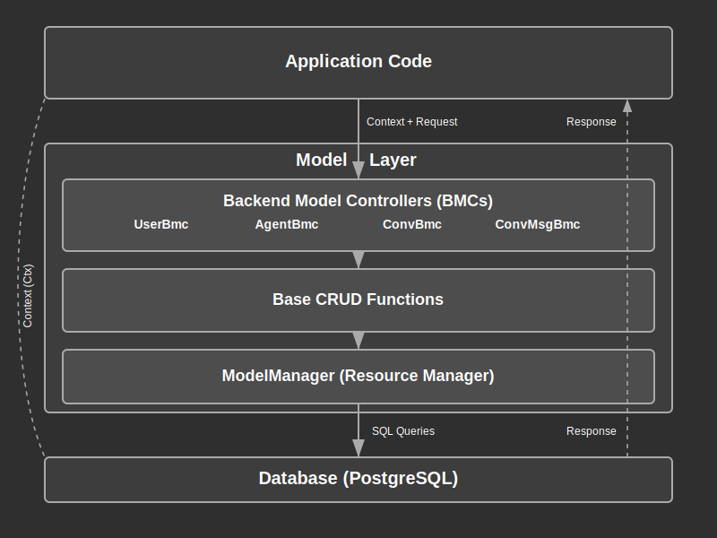

# Model Module Documentation

## Overview:

The Model layer is the core data management component of the application, providing a standardized interface for all data access operations. This layer normalizes data type structures and access patterns across the application, ensuring consistency and proper encapsulation of database operations.

The Model layer follows a structured design where a central `ModelManager` holds internal resources (like database connections) needed by specialized controllers to access data. These Model Controllers (e.g., `ConvBmc`, `AgentBmc`) implement CRUD (Create, Read, Update, Delete) and other data access methods for specific entities. This architecture establishes a clear separation between data access logic and business rules.

A key principle of this layer is that all application code data access must go through the Model layer, preventing direct database access from other parts of the application. This ensures proper validation, error handling, and consistent transaction management.

## Summary:

### Key Types:

#### `ModelManager`

The central resource manager that holds references to database connections and other data stores.

```rust
// Creating a new ModelManager
let mm = ModelManager::new().await?;

// Using ModelManager with a transaction
let mm_txn = mm.new_with_txn()?;
```

#### Entity Types

Common entities that represent data objects in the system:

- `Agent`: Represents an AI agent in the system
- `Conv`: Represents a conversation container
- `ConvMsg`: Represents a message in a conversation
- `User`: Represents a system user

Example:
```rust
// User type example
let user = User {
    id: 123,
    username: "demo_user".to_string(),
    typ: UserTyp::User,
};

// Agent type example
let agent = Agent {
    id: 456,
    owner_id: 123,
    name: "Assistant".to_string(),
    ai_provider: "OpenAI".to_string(),
    ai_model: "gpt-4".to_string(),
    cid: 123,
    ctime: now_utc(),
    mid: 123,
    mtime: now_utc(),
};
```

#### Model Controllers (BMCs)

Backend Model Controllers that provide data access patterns for entities:

- `AgentBmc`: CRUD operations for Agent entities
- `ConvBmc`: CRUD operations for Conv entities
- `UserBmc`: CRUD operations for User entities

Example:
```rust
// Creating a user
let user_id = UserBmc::create(
    &ctx,
    &mm,
    UserForCreate {
        username: "new_user".to_string(),
        pwd_clear: "password123".to_string(),
    },
).await?;

// Retrieving a conversation
let conv = ConvBmc::get(&ctx, &mm, conv_id).await?;
```

#### Filter Types

Types used to filter entities when listing or querying:

- `AgentFilter`
- `ConvFilter`
- `UserFilter`

Example:
```rust
// Listing agents with filtering
let agents = AgentBmc::list(
    &ctx,
    &mm,
    Some(vec![AgentFilter {
        name: Some(OpValString::Contains("assistant".to_string()).into()),
        ..Default::default()
    }]),
    Some(ListOptions { limit: Some(10), ..Default::default() }),
).await?;
```

### Key Functions:

#### ModelManager Methods

- `new() -> Result<Self>`: Create a new ModelManager with database connection
- `new_with_txn(&self) -> Result<ModelManager>`: Create a ModelManager with transaction support
- `dbx(&self) -> &Dbx`: Get the database executor reference

#### BMC Common Methods

Most entity BMCs implement these common CRUD operations:

- `create(ctx, mm, data) -> Result<i64>`: Create a new entity
- `get(ctx, mm, id) -> Result<Entity>`: Get an entity by ID
- `list(ctx, mm, filter, options) -> Result<Vec<Entity>>`: List entities with optional filtering
- `update(ctx, mm, id, data) -> Result<()>`: Update an entity
- `delete(ctx, mm, id) -> Result<()>`: Delete an entity
- `delete_many(ctx, mm, ids) -> Result<u64>`: Delete multiple entities by IDs
- `count(ctx, mm, filter) -> Result<i64>`: Count entities matching a filter
- `first(ctx, mm, filter, options) -> Result<Option<Entity>>`: Get the first entity matching a filter

Example:
```rust
// Creating an agent
let agent_id = AgentBmc::create(
    &ctx,
    &mm,
    AgentForCreate {
        name: "My Assistant".to_string(),
    },
).await?;

// Updating a user's password
UserBmc::update_pwd(&ctx, &mm, user_id, "new_password").await?;

// Listing conversations with pagination
let convs = ConvBmc::list(
    &ctx,
    &mm,
    None,
    Some(ListOptions {
        limit: Some(20),
        offset: Some(40),
        order_bys: Some("mtime DESC".into()),
    }),
).await?;
```

## Detail:

### Architecture

The Model layer follows a hierarchical architecture:

1. **Base Layer**: Provides common database operations through the `DbBmc` trait and utility functions
2. **Entity Layer**: Defines data structures (`User`, `Agent`, etc.) that map to database tables
3. **Controller Layer**: Implements specific business logic for each entity type through BMC structs

This architecture enables a consistent pattern for data access while allowing specialized behavior for different entity types.

### Data Flow Process

1. **Application Code** calls a BMC method with a context (`Ctx`) and model manager (`ModelManager`)
2. The **BMC** implements entity-specific logic and validation
3. The BMC uses **base functions** to perform standardized CRUD operations
4. Base functions use the **ModelManager's** database access (`Dbx`) to execute SQL
5. The `Dbx` manages **transactions** if required
6. Results are returned through the layers, with appropriate error handling

### Transaction Management

The Model layer implements a transaction reference counting system that allows nested transactions:

- `begin_txn()` increments the transaction counter
- `commit_txn()` decrements the counter and commits when it reaches zero
- `rollback_txn()` immediately rolls back and clears the transaction

This allows complex operations to be composed of smaller transactional units while maintaining ACID properties.

### Security Considerations

1. **Access Control**: All entity access is mediated through the `Ctx` object, which contains user identity
2. **Owner Fields**: Entities implement `has_owner_id()` to enforce ownership restrictions
3. **Validation**: Input validation happens at the entity controller level before database operations
4. **Authentication**: Password management follows security best practices (hashing, salting)
5. **SQL Safety**: Parameterized queries prevent SQL injection

### Entity Relationships

- **User**: Core identity entity
- **Agent**: Owned by a User, represents an AI assistant
- **Conv**: Container entity for conversations, linked to an Agent and a User
- **ConvMsg**: Child entity of Conv, contains individual messages

### Common Design Patterns

1. **Repository Pattern**: BMCs act as repositories for entities
2. **Unit of Work**: Transaction management coordinates multiple operations
3. **Factory Methods**: Static constructors create properly initialized entities
4. **Filter Builder**: ModQL integration for flexible query filtering
5. **Contextual Access**: Ctx-based security model

### Flow Diagram



### Implementation Notes

- The system uses SeaQuery and SQLx for type-safe SQL generation and execution
- ModQL integration provides a flexible filtering system
- Timestamp tracking (creation/modification) is automatic for all entities
- Error types are structured for easy client-side interpretation
