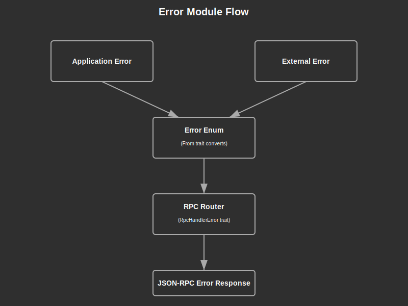

# Error Module Documentation

## Overview:

The `error` module provides a centralized error handling mechanism for the entire `lib-rpc-core` crate. It defines a custom error type (`Error`) that encompasses various error scenarios that can occur during RPC operations, including model errors from the application's core library and serialization errors. The module is designed to work seamlessly with the `rpc-router` crate by implementing the necessary traits (`RpcHandlerError`) to transform application errors into JSON-RPC compatible error responses.

## Summary:

### Types:

#### `Error` enum

A comprehensive error type that represents all possible error conditions in the RPC layer.

```rust
pub enum Error {
    // App library errors
    Model(lib_core::model::Error),
    
    // External module errors
    SerdeJson(serde_json::Error),
}
```

This enum is derived with:
- `Debug` - For debugging output
- `From` - For automatic conversions from inner error types
- `Serialize` - For JSON serialization of errors 
- `RpcHandlerError` - For integration with the rpc-router framework

#### `Result<T>` type alias

A convenient type alias for functions returning a result with the crate's error type.

```rust
pub type Result<T> = core::result::Result<T, Error>;

// Example usage
fn some_rpc_function() -> Result<String> {
    // Success case
    Ok("success".to_string())
    
    // Error case
    // Err(Error::Model(lib_core::model::Error::NotFound))
}
```

### Functions:

The module doesn't expose public functions but implements standard Rust error traits:

- `Display` implementation for human-readable error messages
- `std::error::Error` trait implementation for standard error interoperability

## Detail:

### Code Flow and Function:

1. When an error occurs in an RPC handler function, it can be returned using the `Result<T>` type.
2. The `From` derivation allows automatic conversion from inner error types:
   - Model errors from `lib_core::model::Error`
   - JSON serialization errors from `serde_json::Error`
3. When returned from an RPC handler, the error is processed by the `rpc-router` crate through the `RpcHandlerError` trait implementation.
4. The `rpc-router` converts the error into the appropriate JSON-RPC error response format.
5. The `serde_as` attribute ensures the `serde_json::Error` is serialized as a string representation.

### Architecture:

The error handling follows a layered approach:
1. **Application layer errors** (e.g., model errors) are wrapped in the `Error` enum
2. **External library errors** (e.g., serialization errors) are also wrapped
3. The `Error` type implements the necessary traits to work with the RPC router framework
4. The error is propagated to the RPC client with proper JSON-RPC error formatting

### Security Considerations:

- Error messages may contain sensitive information. The current implementation uses `Debug` formatting which might expose internal details.
- For production environments, consider implementing a more selective `Display` implementation that filters out sensitive information.
- Ensure that internal error details are not leaked to clients in production environments.


