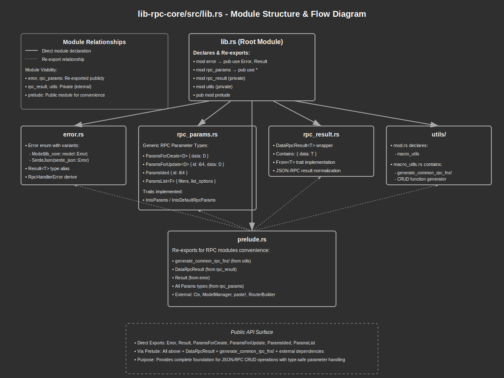

# Lib-RPC-Core Library Documentation

## Overview:

The `lib-rpc-core` crate provides a comprehensive framework for implementing JSON-RPC APIs in Rust applications. It standardizes RPC parameter handling, result formatting, error management, and provides utilities for generating common CRUD (Create, Read, Update, Delete) RPC handlers. The library integrates with the `rpc-router` crate to provide a complete solution for building type-safe, consistent RPC endpoints that follow best practices. This core library is designed to be used by various application-specific RPC modules to ensure consistency across the entire application's API surface.

## Summary:

### Modules:

#### `error`
Contains the error types and handling logic for RPC operations.

```rust
use lib_rpc_core::{Error, Result};

fn some_function() -> Result<String> {
    // Success case
    Ok("Success".to_string())
    
    // Error case using the Error enum
    // Err(Error::Model(lib_core::model::Error::NotFound))
}
```

#### `rpc_params`
Defines standardized parameter structures for RPC methods.

```rust
use lib_rpc_core::{ParamsForCreate, ParamsForUpdate, ParamsIded, ParamsList};
use serde::Deserialize;

#[derive(Deserialize)]
struct UserData {
    name: String,
    email: String,
}

// Parameters for create operations
let create_params: ParamsForCreate<UserData> = serde_json::from_str(r#"
    {"data": {"name": "John", "email": "john@example.com"}}
"#)?;

// Parameters for update operations
let update_params: ParamsForUpdate<UserData> = serde_json::from_str(r#"
    {"id": 1, "data": {"name": "John", "email": "john@example.com"}}
"#)?;

// Parameters for get/delete operations
let id_params: ParamsIded = serde_json::from_str(r#"{"id": 1}"#)?;

// Parameters for list operations
#[derive(Deserialize, Default)]
struct UserFilter {
    name: Option<String>,
}
let list_params: ParamsList<UserFilter> = serde_json::from_str(r#"
    {"filters": [{"name": "John"}], "list_options": {"limit": 10}}
"#)?;
```

#### `rpc_result`
Provides a standardized result format for RPC responses.

```rust
use lib_rpc_core::prelude::DataRpcResult;
use serde::Serialize;

#[derive(Serialize)]
struct User {
    id: i64,
    name: String,
    email: String,
}

// Create a user
let user = User {
    id: 1,
    name: "John".to_string(),
    email: "john@example.com".to_string(),
};

// Wrap in standardized result format
let result: DataRpcResult<User> = user.into();
// When serialized: {"data": {"id": 1, "name": "John", "email": "john@example.com"}}

// Can also wrap collections
let users = vec![user];
let result: DataRpcResult<Vec<User>> = users.into();
// When serialized: {"data": [{"id": 1, "name": "John", "email": "john@example.com"}]}
```

#### `utils`
Contains utility functions and macros for RPC implementation.

```rust
use lib_rpc_core::generate_common_rpc_fns;
use lib_core::ctx::Ctx;
use lib_core::model::ModelManager;

// The macro generates standard CRUD functions
generate_common_rpc_fns!(
    Bmc: UserBmc,
    Entity: User,
    ForCreate: UserForCreate,
    ForUpdate: UserForUpdate,
    Filter: UserFilter,
    Suffix: user
);

// This generates these functions:
// async fn create_user(Ctx, ModelManager, ParamsForCreate<UserForCreate>) -> Result<DataRpcResult<User>>
// async fn get_user(Ctx, ModelManager, ParamsIded) -> Result<DataRpcResult<User>>
// async fn list_users(Ctx, ModelManager, ParamsList<UserFilter>) -> Result<DataRpcResult<Vec<User>>>
// async fn update_user(Ctx, ModelManager, ParamsForUpdate<UserForUpdate>) -> Result<DataRpcResult<User>>
// async fn delete_user(Ctx, ModelManager, ParamsIded) -> Result<DataRpcResult<User>>
```

#### `prelude`
Exports commonly used items for convenient importing in RPC handler modules.

```rust
// Instead of multiple imports
use lib_rpc_core::prelude::*;

// Now you can use all common RPC types and utilities directly
async fn create_something(
    ctx: Ctx,
    mm: ModelManager,
    params: ParamsForCreate<SomethingForCreate>,
) -> Result<DataRpcResult<Something>> {
    // Implementation
    Ok(something.into())
}
```

## Detail:

### Code Flow and Function:

The typical flow for implementing and using RPC handlers with this library follows these steps:

1. **Define Entity Types**:
   - Create data structures for the entity and its create/update variants
   - Define filter types for list operations

2. **Generate RPC Handlers**:
   - Use the `generate_common_rpc_fns` macro to automatically create standard CRUD handlers
   - Implement custom RPC handlers for non-standard operations

3. **Build RPC Router**:
   - Use the re-exported `router_builder` to create an RPC router
   - Register the generated and custom handlers with the router

4. **Request Processing**:
   - When an RPC request is received, the router deserializes the parameters into the appropriate type
   - The handler function is called with the context, model manager, and parameters
   - The handler returns a `Result<DataRpcResult<T>>` which is serialized into the JSON-RPC response

5. **Error Handling**:
   - If an error occurs, it's wrapped in the library's `Error` type
   - The error is converted to a JSON-RPC error response by the router

### Architecture:

The library follows a layered architecture:

1. **Parameter Layer** (`rpc_params`):
   - Provides standardized parameter structures
   - Handles deserialization from JSON-RPC parameters

2. **Result Layer** (`rpc_result`):
   - Provides standardized result format
   - Handles serialization to JSON-RPC result

3. **Error Layer** (`error`):
   - Defines the error hierarchy
   - Integrates with the RPC router's error handling

4. **Utility Layer** (`utils`):
   - Provides macros and helper functions
   - Reduces boilerplate code

5. **Convenience Layer** (`prelude`):
   - Re-exports commonly used items
   - Simplifies imports in RPC handler modules

### Security Considerations:

- **Input Validation**: All client input should be properly validated before processing
- **Authorization**: The context (`Ctx`) should be used to check user permissions
- **Error Information**: Be careful not to leak sensitive information in error messages
- **Resource Limits**: Implement proper pagination and resource limits to prevent DoS attacks
- **Type Safety**: The library's strong typing helps prevent many common security issues, but custom validation is still necessary


