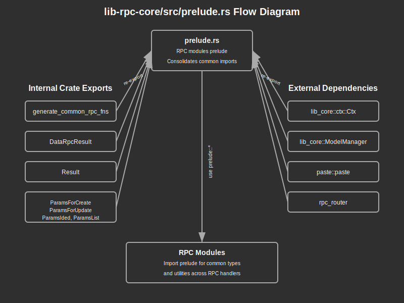

# Prelude Module Documentation

## Overview:

The `prelude` module provides a convenient collection of commonly used imports for RPC handler implementation modules. By bringing all frequently used items into a single namespace, it reduces boilerplate import statements and makes RPC handler code more concise and readable. The prelude includes essential items from the crate itself as well as from dependencies required for RPC handling, such as context types, model management tools, and router building utilities. This module is specifically designed for use within RPC handler modules and submodules.

## Summary:

### Re-exported Items:

#### From the crate itself:

- `generate_common_rpc_fns` - A macro for generating standard CRUD RPC handler functions
- `DataRpcResult` - The standard response wrapper for RPC results
- `Result` - The crate's error result type
- Parameter structures:
  - `ParamsForCreate` - For create operations
  - `ParamsForUpdate` - For update operations
  - `ParamsIded` - For operations requiring an ID
  - `ParamsList` - For list operations with filtering

```rust
// Without prelude, imports would look like:
use crate::generate_common_rpc_fns;
use crate::rpc_result::DataRpcResult;
use crate::Result;
use crate::{ParamsForCreate, ParamsForUpdate, ParamsIded, ParamsList};
use lib_core::ctx::Ctx;
use lib_core::model::ModelManager;
use pastey::paste;
use rpc_router::{router_builder, RouterBuilder};

// With prelude, simply:
use lib_rpc_core::prelude::*;
```

#### From dependencies:

- `Ctx` - The context type from `lib_core`
- `ModelManager` - The model manager from `lib_core`
- `paste` - The paste macro for identifier manipulation
- `router_builder` and `RouterBuilder` - Utilities from `rpc_router` for building RPC routers

### Usage Example:

```rust
use lib_rpc_core::prelude::*;

// Now you can directly use all the imported items
pub async fn create_user(
    ctx: Ctx,
    mm: ModelManager,
    params: ParamsForCreate<UserForCreate>,
) -> Result<DataRpcResult<User>> {
    // Implementation...
    Ok(user.into())  // Uses From<T> for DataRpcResult
}

// Build router with imported router_builder
pub fn build_router() -> RouterBuilder {
    router_builder()
        .rpc("create_user", create_user)
        // Add more routes...
        .build()
}
```

## Detail:

### Code Flow and Function:

1. **Import Simplification**: When a module uses `use lib_rpc_core::prelude::*`, all the re-exported items become available in the current scope.

2. **RPC Handler Implementation**: Developers can directly use the imported types and functions to implement RPC handlers without needing to remember and write numerous import statements.

3. **Macro Usage**: The `generate_common_rpc_fns` macro can be used to generate standard CRUD operations, further reducing boilerplate code.

4. **Router Building**: The imported router utilities can be used to create and configure RPC routers that handle incoming requests.

### Architecture:

The prelude follows the common Rust pattern for convenience imports:
1. It re-exports only the most commonly used items that are needed in most RPC handlers.
2. It is explicitly designed for use within the `rpcs` module and submodules, not for external consumers.
3. It brings together related items from different modules and crates into a unified namespace.

This approach reduces cognitive load on developers and makes the codebase more maintainable by centralizing import decisions.

### Security Considerations:

- **Import Visibility**: While the prelude itself doesn't introduce security concerns, developers should be aware that wildcard imports can sometimes bring unexpected items into scope.
- **Permission Context**: The `Ctx` type imported from `lib_core` likely contains authorization information and should be properly handled in RPC implementations to ensure proper access controls.


