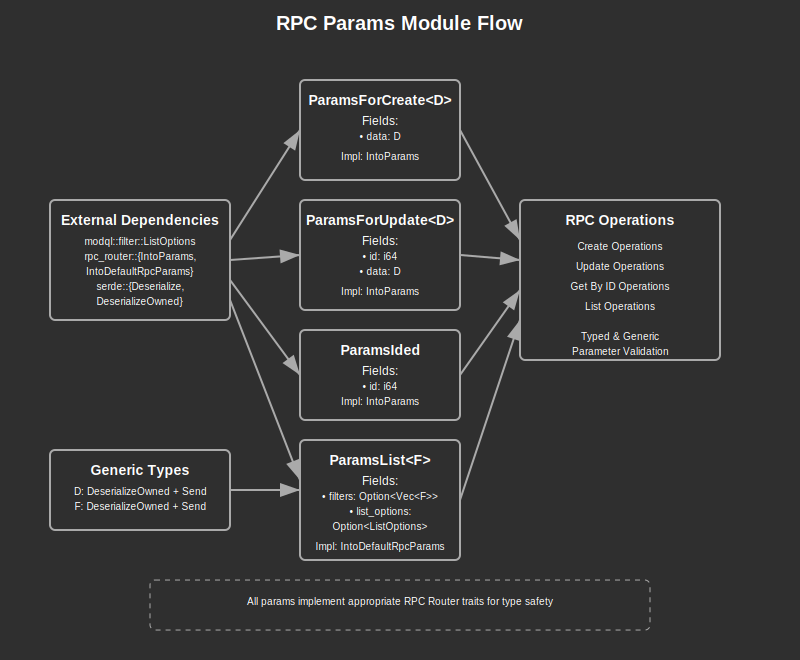

# RPC Parameters Module Documentation

## Overview:

The `rpc_params` module defines a set of standardized parameter structures for JSON-RPC method calls within the application. These structures provide type-safe interfaces for the various CRUD operations (create, read, update, delete, list) that RPC handlers implement. By using generics, the module enables handlers to receive exactly the data types they need while maintaining a consistent parameter structure. The module integrates with the `rpc-router` crate through trait implementations that ensure parameters can be properly deserialized from JSON-RPC requests.

## Summary:

### Types:

#### `ParamsForCreate<D>`

Parameter structure for create operations that includes the data to be created.

```rust
// Define the data type for creating a project
#[derive(Deserialize)]
struct ProjectForCreate {
    name: String,
    description: String,
}

// Use with the parameter structure
let params: ParamsForCreate<ProjectForCreate> = serde_json::from_str(r#"
    {"data": {"name": "New Project", "description": "Project description"}}
"#)?;

// Access the data
let project_data = params.data;
```

#### `ParamsForUpdate<D>`

Parameter structure for update operations that includes both the ID of the entity to update and the data to update.

```rust
// Define the data type for updating a project
#[derive(Deserialize)]
struct ProjectForUpdate {
    name: Option<String>,
    description: Option<String>,
}

// Use with the parameter structure
let params: ParamsForUpdate<ProjectForUpdate> = serde_json::from_str(r#"
    {"id": 42, "data": {"name": "Updated Name"}}
"#)?;

// Access the data
let project_id = params.id;
let update_data = params.data;
```

#### `ParamsIded`

Simple parameter structure that contains just an ID, used for get and delete operations.

```rust
// Use with the parameter structure
let params: ParamsIded = serde_json::from_str(r#"{"id": 42}"#)?;

// Access the id
let project_id = params.id;
```

#### `ParamsList<F>`

Parameter structure for list operations that includes optional filters and list options (pagination, sorting, etc.).

```rust
// Define a filter type
#[derive(Deserialize, Default)]
struct ProjectFilter {
    name: Option<String>,
    status: Option<String>,
}

// Use with the parameter structure
let params: ParamsList<ProjectFilter> = serde_json::from_str(r#"
    {
        "filters": [{"name": "Test"}],
        "list_options": {"limit": 10, "offset": 0}
    }
"#)?;

// Access the filters and options
let filters = params.filters;
let options = params.list_options;
```

### Trait Implementations:

- `IntoParams` - Implemented for `ParamsForCreate<D>`, `ParamsForUpdate<D>`, and `ParamsIded` to enable integration with the `rpc-router` crate
- `IntoDefaultRpcParams` - Implemented for `ParamsList<F>` to provide default values when not all parameters are specified

## Detail:

### Code Flow and Function:

1. **Deserialization**: When an RPC request is received, the `rpc-router` attempts to deserialize the JSON parameters into the appropriate parameter structure based on the requested method.

2. **Type Validation**: The generic parameter structures ensure that only the expected data types can be passed to the handler functions, providing compile-time type safety.

3. **Handler Execution**: The deserialized parameters are passed to the RPC handler function, which can directly access the structure fields (e.g., `params.data` or `params.id`).

4. **Special Handling for Lists**: The `ParamsList<F>` structure handles:
   - One or many filters through the `OneOrMany` deserializer
   - Optional list options for pagination, sorting, etc.
   - Default values when parameters are missing via `IntoDefaultRpcParams`

### Architecture:

The parameter structures follow a consistent pattern:
1. A generic `data` field for create/update operations
2. An `id` field for operations on specific entities
3. `filters` and `list_options` for list operations

This consistency makes the API predictable and easy to understand for both developers and clients.

### Security Considerations:

- **Input Validation**: Since these structures directly deserialize client input, proper validation should be performed in the handler functions to prevent security issues.
- **Resource Limits**: The `list_options` field should be validated to prevent excessive resource consumption (e.g., requesting too many records).
- **Filter Complexity**: Complex filters should be validated to prevent potential DoS attacks through excessively complex queries.


