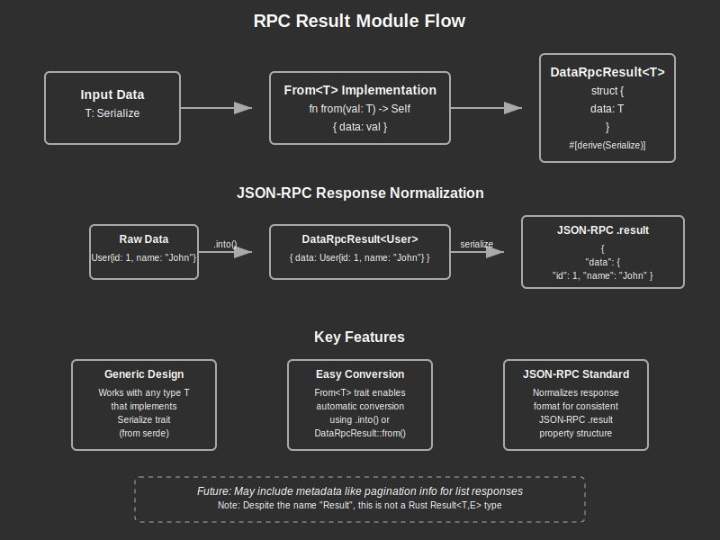

# RPC Result Module Documentation

## Overview:

The `rpc_result` module provides a standardized format for the JSON-RPC response result field. It primarily defines the `DataRpcResult<T>` structure, which wraps any serializable data in a consistent JSON format with a `data` property. This standardization ensures that all RPC responses follow the same structure, making client-side processing more predictable and consistent. The module is designed to be simple yet extensible, with potential for future enhancements like pagination metadata for list results.

## Summary:

### Types:

#### `DataRpcResult<T>`

A generic structure that wraps any serializable data type in a standardized JSON format with a `data` property.

```rust
// Create a DataRpcResult containing a string
let result: DataRpcResult<String> = DataRpcResult::from("Hello, world!".to_string());

// When serialized to JSON, this produces:
// { "data": "Hello, world!" }

// Create a DataRpcResult containing a complex type
#[derive(Serialize)]
struct User {
    id: i64,
    name: String,
}

let user = User { id: 1, name: "John".to_string() };
let result: DataRpcResult<User> = DataRpcResult::from(user);

// When serialized to JSON, this produces:
// { "data": { "id": 1, "name": "John" } }

// Create a DataRpcResult containing a vector
let users = vec![
    User { id: 1, name: "John".to_string() },
    User { id: 2, name: "Jane".to_string() }
];
let result: DataRpcResult<Vec<User>> = DataRpcResult::from(users);

// When serialized to JSON, this produces:
// { "data": [{ "id": 1, "name": "John" }, { "id": 2, "name": "Jane" }] }
```

### Trait Implementations:

- `From<T>` - Allows easy conversion from any serializable type to a `DataRpcResult<T>`, enabling a concise and fluent API

## Detail:

### Code Flow and Function:

1. **Data Wrapping**: When an RPC handler completes successfully, it wraps its result data in a `DataRpcResult` using the `From` trait implementation or direct construction.

2. **Serialization**: The `DataRpcResult` structure is serialized to JSON by the RPC framework, producing a consistent format with a `data` property.

3. **Client Processing**: The client receives the JSON response and can reliably extract the result data from the `data` property, regardless of the specific RPC method called.

4. **Potential Extensions**: As noted in the module documentation, the structure could be extended in the future to include metadata like pagination information for list results, without breaking the existing API contract.

### Architecture:

The `DataRpcResult` structure follows a simple yet effective pattern:
1. It wraps any serializable data type in a structure with a standardized field name (`data`).
2. It provides a convenient `From<T>` implementation for easy conversion.
3. It ensures all RPC responses have a consistent structure, improving API predictability.

This design allows for future expansion (e.g., adding metadata) while maintaining backward compatibility.

### Security Considerations:

- **Data Exposure**: Be careful about what data is returned in the `data` field, as it will be directly exposed to the client.
- **Sensitive Information**: Ensure that any sensitive information is properly filtered or redacted before being wrapped in a `DataRpcResult`.
- **Size Limits**: Very large data structures might cause performance issues during serialization or transmission. Consider pagination for large data sets.


