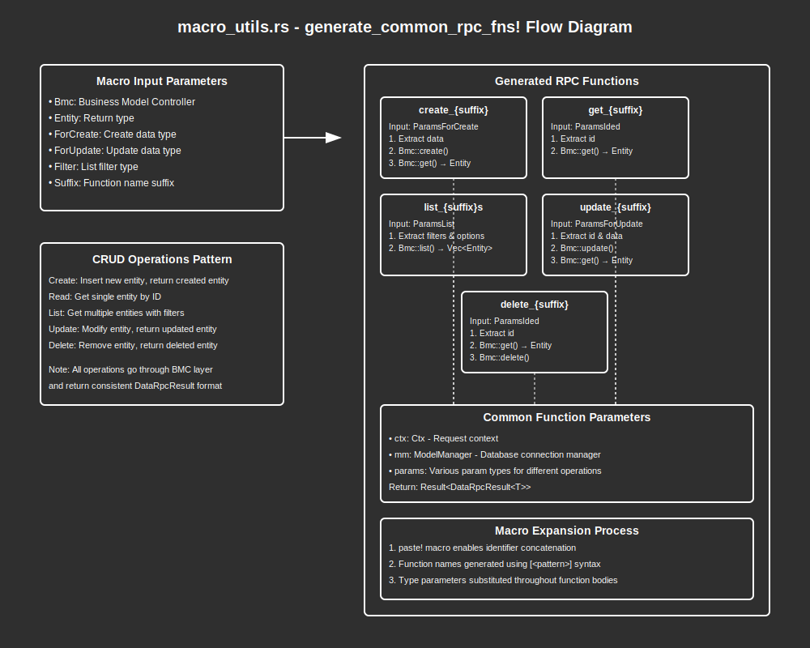

# Macro Utils Module Documentation

## Overview:

The `macro_utils` module provides macro utilities that generate standardized RPC handler functions for common CRUD (Create, Read, Update, Delete, List) operations. The primary macro, `generate_common_rpc_fns`, reduces boilerplate code by automatically generating consistent handler functions based on a set of provided types and naming conventions. This enables developers to quickly implement standardized RPC interfaces for different entity types while maintaining consistency across the application. The generated functions follow a common pattern of interacting with a Business Model Controller (BMC) to perform the actual data operations.

## Summary:

### Macros:

#### `generate_common_rpc_fns`

Generates standard CRUD RPC handler functions for a specific entity type.

Parameters:
- `Bmc` - The Business Model Controller type that handles the entity operations
- `Entity` - The entity type returned by the operations
- `ForCreate` - The data type used for create operations
- `ForUpdate` - The data type used for update operations
- `Filter` - The filter type used for list operations
- `Suffix` - The identifier suffix used in the generated function names

```rust
// Example usage:
generate_common_rpc_fns!(
    Bmc: UserBmc,
    Entity: User,
    ForCreate: UserForCreate,
    ForUpdate: UserForUpdate,
    Filter: UserFilter,
    Suffix: user
);

// This generates the following functions:
// - create_user
// - get_user
// - list_users
// - update_user
// - delete_user
```

Generated Functions:

1. `create_[suffix]` - Creates a new entity and returns it
   - Input: `Ctx`, `ModelManager`, `ParamsForCreate<ForCreate>`
   - Output: `Result<DataRpcResult<Entity>>`

2. `get_[suffix]` - Gets an entity by ID
   - Input: `Ctx`, `ModelManager`, `ParamsIded`
   - Output: `Result<DataRpcResult<Entity>>`

3. `list_[suffix]s` - Lists entities matching the filters
   - Input: `Ctx`, `ModelManager`, `ParamsList<Filter>`
   - Output: `Result<DataRpcResult<Vec<Entity>>>`

4. `update_[suffix]` - Updates an entity and returns it
   - Input: `Ctx`, `ModelManager`, `ParamsForUpdate<ForUpdate>`
   - Output: `Result<DataRpcResult<Entity>>`

5. `delete_[suffix]` - Deletes an entity and returns it
   - Input: `Ctx`, `ModelManager`, `ParamsIded`
   - Output: `Result<DataRpcResult<Entity>>`

## Detail:

### Code Flow and Function:

For each generated RPC handler function, the flow follows this pattern:

1. **Create Operation**:
   - Extract `data` from the `ParamsForCreate` parameters
   - Call `Bmc::create` to create the entity and get its ID
   - Call `Bmc::get` to retrieve the newly created entity
   - Wrap the entity in a `DataRpcResult` and return it

2. **Get Operation**:
   - Extract `id` from the `ParamsIded` parameters
   - Call `Bmc::get` to retrieve the entity
   - Wrap the entity in a `DataRpcResult` and return it

3. **List Operation**:
   - Extract `filters` and `list_options` from the `ParamsList` parameters
   - Call `Bmc::list` to retrieve matching entities
   - Wrap the entities in a `DataRpcResult` and return them

4. **Update Operation**:
   - Extract `id` and `data` from the `ParamsForUpdate` parameters
   - Call `Bmc::update` to update the entity
   - Call `Bmc::get` to retrieve the updated entity
   - Wrap the entity in a `DataRpcResult` and return it

5. **Delete Operation**:
   - Extract `id` from the `ParamsIded` parameters
   - Call `Bmc::get` to retrieve the entity before deletion
   - Call `Bmc::delete` to delete the entity
   - Wrap the deleted entity in a `DataRpcResult` and return it

### Architecture:

The macro system follows a layered architecture:
1. **RPC Handler Layer** (generated by the macro) - Provides standardized API endpoints
2. **Business Model Controller Layer** (`Bmc`) - Implements business logic and data validation
3. **Model Layer** - Handles data access and persistence

The macro uses the `paste!` macro internally to create identifiers by concatenating the suffix with operation names.

### Security Considerations:

- **Context Propagation**: The context (`Ctx`) is passed to all BMC methods, ensuring that security checks can be performed at the business logic layer.
- **Validation**: The BMC is responsible for validating input data, but the RPC layer should also consider additional validation for RPC-specific concerns.
- **Error Handling**: All operations are wrapped in a `Result` type, allowing errors to be properly propagated to the client.
- **Entity Leakage**: The get-after-delete pattern ensures clients receive confirmation of what was deleted, but may reveal sensitive data if not properly filtered.


