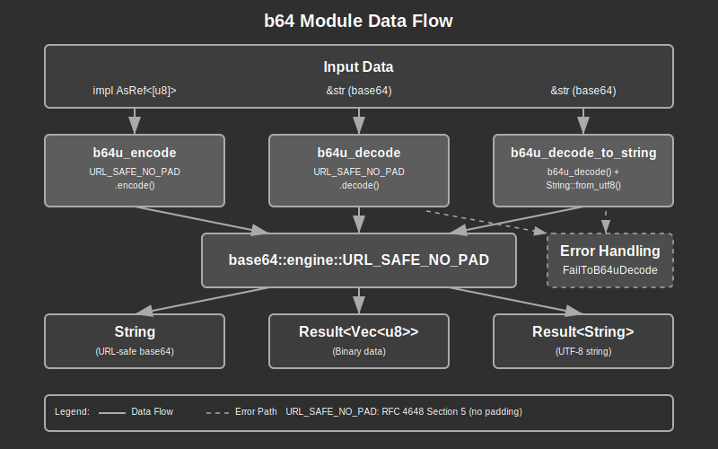

# B64 Module Documentation

## Overview:

The B64 module provides URL-safe base64 encoding and decoding utilities for the application. This module encapsulates the `base64` crate functionality to provide a consistent interface for URL-safe base64 operations without padding, which is commonly used in web applications for encoding tokens, identifiers, and other data that needs to be transmitted safely in URLs and HTTP headers.

The module implements URL-safe base64 encoding (RFC 4648 Section 5) without padding characters, making the encoded strings safe for use in URLs, cookies, and other contexts where standard base64 characters like `+`, `/`, and `=` could cause issues. This is particularly useful for generating secure tokens, encoding binary data for JSON transmission, and creating URL-friendly identifiers.

A key design principle of this module is simplicity and safety. All functions use consistent error handling patterns that integrate with the application's error system, and the module provides both binary and string decoding variants to handle common use cases efficiently.

## Summary:

### Key Types:

#### `Result<T>`

A type alias for the standard Result type using the module's custom Error enum:

```rust
pub type Result<T> = core::result::Result<T, Error>;
```

#### `Error`

The error enumeration for B64 operations:

```rust
#[derive(Debug)]
pub enum Error {
    FailToB64uDecode,
}
```

Example error handling:
```rust
match b64u_decode("invalid-b64") {
    Ok(bytes) => println!("Decoded: {:?}", bytes),
    Err(Error::FailToB64uDecode) => println!("Failed to decode base64"),
}
```

### Key Functions:

#### `b64u_encode(content: impl AsRef<[u8]>) -> String`

Encodes binary data into a URL-safe base64 string without padding.

```rust
// Encode a string
let encoded = b64u_encode("Hello, World!");
println!("{}", encoded); // Outputs: SGVsbG8sIFdvcmxkIQ

// Encode binary data
let binary_data = vec![0x48, 0x65, 0x6c, 0x6c, 0x6f];
let encoded = b64u_encode(&binary_data);
println!("{}", encoded); // Outputs: SGVsbG8
```

#### `b64u_decode(b64u: &str) -> Result<Vec<u8>>`

Decodes a URL-safe base64 string into binary data.

```rust
// Decode to bytes
let decoded = b64u_decode("SGVsbG8sIFdvcmxkIQ")?;
println!("{:?}", decoded); // Outputs byte vector

// Handle decode errors
match b64u_decode("invalid===") {
    Ok(bytes) => process_bytes(bytes),
    Err(Error::FailToB64uDecode) => handle_decode_error(),
}
```

#### `b64u_decode_to_string(b64u: &str) -> Result<String>`

Decodes a URL-safe base64 string directly into a UTF-8 string.

```rust
// Decode to string
let decoded_string = b64u_decode_to_string("SGVsbG8sIFdvcmxkIQ")?;
println!("{}", decoded_string); // Outputs: Hello, World!

// Chain operations safely
let result = b64u_encode("test")
    .pipe(|encoded| b64u_decode_to_string(&encoded))
    .expect("Round-trip should succeed");
```

## Detail:

### Architecture

The B64 module follows a functional architecture pattern with three core responsibilities:

1. **Encoding Layer**: Provides URL-safe base64 encoding using the standard `base64` crate
2. **Decoding Layer**: Handles both binary and string decoding with comprehensive error handling
3. **Error Layer**: Implements a structured error system with proper trait implementations

This architecture ensures consistent behavior across all encoding/decoding operations while maintaining type safety and clear error propagation.

### Data Flow Process

1. **Input Data** is accepted through generic `AsRef<[u8]>` trait for maximum flexibility
2. The **base64 Engine** (URL_SAFE_NO_PAD) performs the actual encoding/decoding operations
3. **Error Mapping** converts base64 crate errors into module-specific error types
4. **String Conversion** applies UTF-8 validation for string decoding operations
5. Results are returned with **structured error handling** for robust error management

### URL-Safe Base64 Specification

The module implements RFC 4648 Section 5 URL-safe base64 encoding:

- Replaces `+` with `-` (hyphen-minus)
- Replaces `/` with `_` (underscore)
- Omits padding characters (`=`) for cleaner URLs
- Maintains full reversibility for all binary data

### Security Considerations

1. **Input Validation**: All decode operations validate input format before processing
2. **UTF-8 Safety**: String decoding validates UTF-8 encoding to prevent invalid string creation
3. **Error Disclosure**: Error types provide minimal information to prevent information leakage
4. **Memory Safety**: Uses safe Rust patterns with no unsafe operations
5. **Constant Time**: Relies on base64 crate's constant-time implementation for timing attack resistance

### Common Use Cases

1. **Token Generation**: Creating URL-safe authentication tokens
2. **Data Serialization**: Encoding binary data for JSON/HTTP transmission
3. **Identifier Creation**: Generating compact, URL-friendly identifiers
4. **Cookie Values**: Encoding complex data for HTTP cookies
5. **Query Parameters**: Safe encoding of binary data in URL parameters

### Design Patterns

1. **Error Consolidation**: Single error type for all decode failures
2. **Generic Input**: `AsRef<[u8]>` enables flexible input types
3. **Dual Decode Path**: Separate functions for binary and string output
4. **Zero-Copy Where Possible**: Minimal data copying in encoding operations
5. **Standard Integration**: Compatible with Rust error handling conventions

### Flow Diagram



### Implementation Notes

- Uses the `base64` crate's `URL_SAFE_NO_PAD` engine for consistent behavior
- Error handling follows application-wide error patterns with Debug trait implementation
- String decoding implements defensive programming with dual validation (base64 + UTF-8)
- Module design prioritizes simplicity and predictable behavior over feature richness
- All operations are deterministic and produce consistent results across platforms

## Notes:

### Dependencies

The module depends on the `base64` crate for the underlying encoding/decoding implementation. This provides battle-tested, optimized base64 operations with security considerations built-in.

### Error Handling Strategy

The module uses a single error variant `FailToB64uDecode` for all decode failures, whether from invalid base64 characters, incorrect padding, or UTF-8 conversion issues. This simplified error model prevents error information leakage while providing clear failure indication.

### Design Decisions

1. **No Padding**: URL-safe encoding without padding reduces output size and eliminates URL encoding issues
2. **Single Error Type**: Simplified error handling reduces complexity and potential information disclosure
3. **String Conversion Helper**: Dedicated function for common UTF-8 string decoding use case
4. **Generic Input**: `AsRef<[u8]>` provides maximum flexibility for input types (strings, vectors, arrays, etc.)
