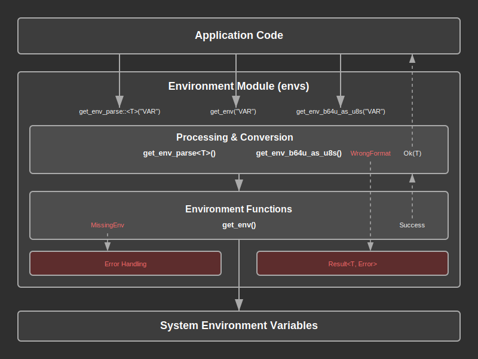

# Environment Module Documentation

## Overview:

The Environment (envs) module is a utility component that provides standardized access to environment variables with type-safe parsing and error handling. This module abstracts the complexities of environment variable retrieval and conversion, ensuring consistent error handling across the application.

The envs module follows a structured approach where environment variable access is normalized through a set of specialized functions that handle different data types and encoding formats. Each function provides comprehensive error handling that distinguishes between missing environment variables and format conversion issues.

A key principle of this module is that all environment variable access should go through these utility functions rather than direct `std::env::var` calls, ensuring proper error categorization and consistent handling of missing or malformed environment data.

## Summary:

### Key Types:

#### `Result<T>`

A type alias for the module's result type that wraps the custom `Error` enum:

```rust
pub type Result<T> = core::result::Result<T, Error>;
```

#### `Error`

The error enum that categorizes environment variable access failures:

```rust
#[derive(Debug)]
pub enum Error {
    MissingEnv(&'static str),  // Environment variable not found
    WrongFormat(&'static str), // Environment variable format invalid
}
```

Example error handling:
```rust
match get_env("DATABASE_URL") {
    Ok(url) => println!("Database URL: {}", url),
    Err(Error::MissingEnv(name)) => eprintln!("Missing required env var: {}", name),
    Err(Error::WrongFormat(name)) => eprintln!("Invalid format for env var: {}", name),
}
```

### Key Functions:

#### `get_env(name: &'static str) -> Result<String>`

Retrieves an environment variable as a String with proper error handling.

```rust
// Basic environment variable retrieval
let database_url = get_env("DATABASE_URL")?;
let app_name = get_env("APP_NAME")?;
```

#### `get_env_parse<T: FromStr>(name: &'static str) -> Result<T>`

Retrieves and parses an environment variable to any type that implements `FromStr`.

```rust
// Parse numeric values
let port: u16 = get_env_parse("PORT")?;
let timeout: u64 = get_env_parse("TIMEOUT_SECONDS")?;

// Parse boolean values
let debug_mode: bool = get_env_parse("DEBUG_MODE")?;

// Parse custom types that implement FromStr
let log_level: LogLevel = get_env_parse("LOG_LEVEL")?;
```

#### `get_env_b64u_as_u8s(name: &'static str) -> Result<Vec<u8>>`

Retrieves and decodes a base64url-encoded environment variable into a byte vector.

```rust
// Decode secret keys or tokens
let secret_key = get_env_b64u_as_u8s("JWT_SECRET")?;
let encryption_key = get_env_b64u_as_u8s("ENCRYPTION_KEY")?;
```

## Detail:

### Architecture

The envs module implements a layered error handling approach:

1. **Base Layer**: Uses `std::env::var` for raw environment variable access
2. **Error Translation Layer**: Maps `std::env::VarError` to custom `Error` types
3. **Type Conversion Layer**: Handles parsing and format conversion with error mapping
4. **Encoding Layer**: Provides specialized decoding for base64url format

This architecture ensures that all environment variable access failures are properly categorized and can be handled appropriately by calling code.

### Data Flow Process

1. **Application Code** calls an envs function with an environment variable name
2. The **envs function** attempts to retrieve the raw string value using `std::env::var`
3. If retrieval fails, a `MissingEnv` error is returned
4. If retrieval succeeds, **type conversion** or **decoding** is attempted
5. If conversion fails, a `WrongFormat` error is returned
6. If successful, the **converted value** is returned

### Security Considerations

1. **Static String Names**: Environment variable names are `&'static str` to prevent runtime name construction
2. **Base64URL Decoding**: Uses URL-safe base64 decoding for security-sensitive data like keys
3. **Error Information**: Errors include the environment variable name for debugging without exposing values
4. **No Default Values**: Functions require explicit environment variables, preventing insecure fallbacks

### Error Handling Strategy

The module implements a two-tier error classification:

- **MissingEnv**: Indicates configuration issues where required environment variables are not set
- **WrongFormat**: Indicates data integrity issues where environment variables contain invalid formats

This distinction allows calling code to implement different recovery strategies:
- Missing variables might trigger setup instructions or fallback configuration
- Format errors might trigger validation warnings or data sanitization

### Common Design Patterns

1. **Result Pattern**: All functions return `Result<T>` for consistent error handling
2. **Type Safety**: Generic parsing function ensures compile-time type checking
3. **Single Responsibility**: Each function handles one specific conversion type
4. **Error Categorization**: Distinguishes between missing data and format issues

### Flow Diagram



## Implementation Notes:

### Dependencies

- `std::env`: Standard library environment variable access
- `std::str::FromStr`: Standard library string parsing trait
- `crate::b64::b64u_decode`: Internal base64url decoding utility

### Error Handling

The module implements the standard Rust error handling pattern with `Display` and `std::error::Error` traits for integration with error handling libraries and frameworks.

### Design Decisions

- **Static Lifetimes**: Environment variable names use static lifetimes to prevent runtime string allocation
- **No Caching**: Values are retrieved fresh on each call to ensure current environment state
- **Explicit Parsing**: Type conversion is explicit rather than automatic to prevent silent failures
- **Base64URL**: Uses URL-safe base64 encoding for compatibility with web standards
