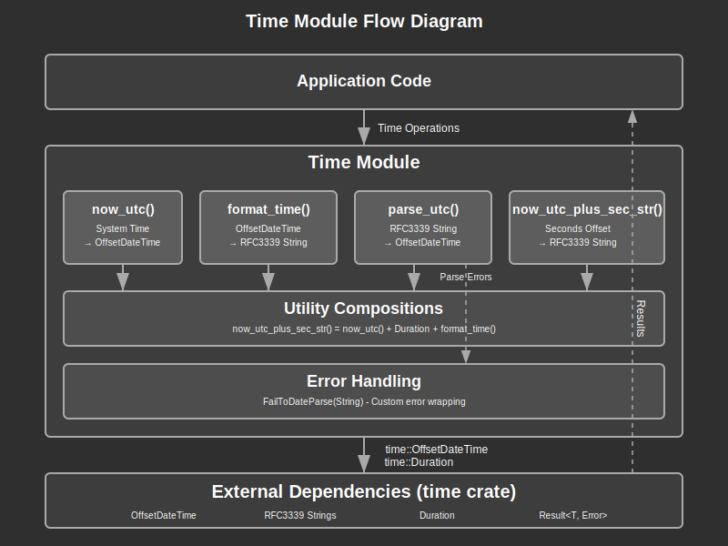

# Time Module Documentation

## Overview:

The Time module provides a standardized interface for time-related operations throughout the application, offering utilities for UTC time handling, string formatting, parsing, and time calculations. This module serves as a thin abstraction layer over the Rust `time` crate, ensuring consistent time handling patterns and RFC3339 formatting compliance across the entire application.

The module centralizes all time operations to prevent inconsistencies that could arise from direct usage of various time libraries throughout the codebase. By providing a unified API, it ensures that all timestamps are handled in UTC format and consistently formatted using the RFC3339 standard, which is essential for web applications that need to handle time zones properly.

A key design principle is that all application code should use this module for time operations rather than directly importing time-related functionality from external crates. This approach provides better maintainability, consistent error handling, and a single point of control for time-related configurations and behaviors.

## API Summary:

### Key Types:

#### Re-exported Types

```rust
pub use time::format_description::well_known::Rfc3339;
```

The module re-exports the RFC3339 format descriptor from the `time` crate for external usage when needed.

#### Error Types

```rust
pub type Result<T> = core::result::Result<T, Error>;

#[derive(Debug)]
pub enum Error {
    FailToDateParse(String),
}
```

Custom error type for time parsing failures that includes the original string that failed to parse.

### Key Functions:

#### `now_utc() -> OffsetDateTime`

Returns the current UTC time as an `OffsetDateTime`.

```rust
use lib_utils::time::now_utc;

let current_time = now_utc();
println!("Current UTC time: {:?}", current_time);
```

#### `format_time(time: OffsetDateTime) -> String`

Formats an `OffsetDateTime` to an RFC3339 string representation.

```rust
use lib_utils::time::{now_utc, format_time};

let time = now_utc();
let formatted = format_time(time);
println!("Formatted time: {}", formatted); // e.g., "2024-01-15T14:30:00Z"
```

#### `now_utc_plus_sec_str(sec: f64) -> String`

Returns a formatted string representing the current UTC time plus the specified number of seconds.

```rust
use lib_utils::time::now_utc_plus_sec_str;

// Get time 30 seconds from now
let future_time = now_utc_plus_sec_str(30.0);
println!("30 seconds from now: {}", future_time);

// Get time 1 hour ago
let past_time = now_utc_plus_sec_str(-3600.0);
println!("1 hour ago: {}", past_time);
```

#### `parse_utc(moment: &str) -> Result<OffsetDateTime>`

Parses an RFC3339 formatted string into an `OffsetDateTime`.

```rust
use lib_utils::time::parse_utc;

match parse_utc("2024-01-15T14:30:00Z") {
    Ok(parsed_time) => println!("Parsed time: {:?}", parsed_time),
    Err(e) => eprintln!("Parse error: {}", e),
}

// Handling invalid format
match parse_utc("invalid-date") {
    Ok(_) => unreachable!(),
    Err(e) => println!("Expected error: {}", e), // FailToDateParse("invalid-date")
}
```

## Detail:

### Architecture

The Time module follows a simple functional architecture with clear separation of concerns:

1. **Core Functions**: Provide basic time operations (now, format, parse)
2. **Utility Functions**: Combine core operations for common use cases
3. **Error Handling**: Centralized error types for time-related failures
4. **Type Safety**: Leverages Rust's type system to prevent time-related bugs

This architecture ensures that time operations are predictable, testable, and maintainable while providing a clean API for application code.

### Data Flow Process

1. **Time Acquisition**: `now_utc()` gets current system time in UTC
2. **Time Formatting**: `format_time()` converts time objects to RFC3339 strings
3. **Time Parsing**: `parse_utc()` converts RFC3339 strings back to time objects
4. **Time Calculation**: Functions combine these operations for complex scenarios
5. **Error Handling**: Parse failures are wrapped in custom error types

### Security Considerations

1. **UTC Only**: All operations use UTC to prevent timezone-related vulnerabilities
2. **Standard Format**: RFC3339 compliance ensures interoperability and prevents injection
3. **Input Validation**: String parsing includes proper error handling for malformed input
4. **Type Safety**: Strong typing prevents common time-related programming errors

### Time Handling Patterns

The module implements several important patterns:

1. **Immutable Operations**: All functions return new values rather than modifying existing ones
2. **Error Propagation**: Parsing errors are explicitly handled and propagated
3. **Format Consistency**: Single format (RFC3339) used throughout the application
4. **UTC Normalization**: All times are normalized to UTC to prevent timezone issues

### Common Design Patterns

1. **Facade Pattern**: Provides simplified interface over the complex `time` crate
2. **Factory Methods**: Functions like `now_utc()` act as factory methods for time creation
3. **Strategy Pattern**: Single formatting strategy (RFC3339) applied consistently
4. **Error Wrapping**: External library errors are wrapped in domain-specific error types

### Flow Diagram



### Implementation Notes

#### Dependencies

The module depends on the `time` crate (version specified in Cargo.toml):
- Uses `OffsetDateTime` for time representation
- Leverages `Duration` for time calculations
- Imports RFC3339 formatting from `time::format_description::well_known`

#### Error Handling

The module defines a custom `Error` enum with a single variant:
- `FailToDateParse(String)`: Captures the original string that failed to parse
- Implements standard error traits (`Debug`, `Display`, `std::error::Error`)
- Uses a type alias `Result<T>` for consistency with Rust conventions

#### Design Decisions

1. **UTC-Only Approach**: Simplifies time handling by eliminating timezone complexity at the utility layer
2. **RFC3339 Standard**: Chosen for web compatibility and standardization
3. **Panic on Format**: `format_time()` currently panics on format errors (marked as TODO for safety review)
4. **Float Seconds**: `now_utc_plus_sec_str()` accepts `f64` for sub-second precision
5. **String-Heavy API**: Many functions work with strings for easier integration with web APIs

#### Future Improvements

- Replace `unwrap()` in `format_time()` with proper error handling
- Add support for custom time formats if needed
- Consider adding timezone-aware utilities for display purposes
- Add duration parsing utilities for configuration strings
- Implement time range validation utilities
