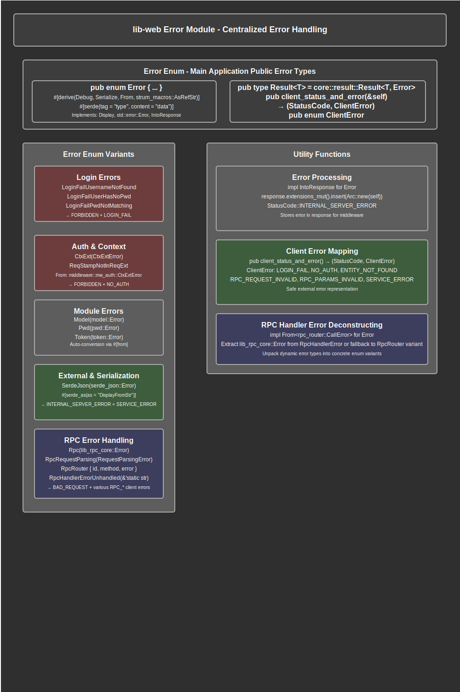

# Error Module Documentation

## Overview

The error module provides comprehensive centralized error handling for the web application. This module serves as the unified error system that manages all application errors, from authentication failures and RPC processing errors to external library failures and client-side error mapping. The module implements a structured error hierarchy that enables precise error classification, appropriate HTTP status code mapping, and safe client-side error representation.

The module defines the primary `Error` enum that encompasses all possible error conditions within the application, implementing automatic conversion from various error types through the `From` trait. This design provides seamless error propagation throughout the application stack while maintaining structured error information for debugging, logging, and client communication.

Key responsibilities include defining comprehensive error variants for all application domains, implementing automatic error conversion from external libraries, providing HTTP status code mapping for web responses, offering safe client error representation that prevents information disclosure, integrating with the RPC system for proper error deconstructing, and maintaining structured serializable error data for logging and monitoring.

## API Summary

### Key Types

#### `Error`

The main application error enum that encompasses all possible error conditions with structured variants and automatic serialization.

```rust
#[serde_as]
#[derive(Debug, Serialize, From, strum_macros::AsRefStr)]
#[serde(tag = "type", content = "data")]
pub enum Error {
    // Authentication and login errors
    LoginFailUsernameNotFound,
    LoginFailUserHasNoPwd { user_id: i64 },
    LoginFailPwdNotMatching { user_id: i64 },
    
    // Context extraction errors
    CtxExt(middleware::mw_auth::CtxExtError),
    ReqStampNotInReqExt,
    
    // Module-specific errors (auto-converted)
    Model(model::Error),
    Pwd(pwd::Error),
    Token(token::Error),
    Rpc(lib_rpc_core::Error),
    
    // RPC processing errors
    RpcRequestParsing(rpc_router::RequestParsingError),
    RpcLibRpc(lib_rpc_core::Error),
    RpcHandlerErrorUnhandled(&'static str),
    RpcRouter { id: Value, method: String, error: rpc_router::Error },
    
    // External library errors
    SerdeJson(serde_json::Error),
}
```

The `Error` enum uses tagged serialization with `#[serde(tag = "type", content = "data")]` for structured JSON output and implements multiple traits for comprehensive error handling functionality.

#### `ClientError`

Safe client-side error representation that prevents sensitive information disclosure while providing meaningful error feedback.

```rust
#[derive(Debug, Serialize, strum_macros::AsRefStr)]
#[serde(tag = "message", content = "detail")]
#[allow(non_camel_case_types)]
pub enum ClientError {
    LOGIN_FAIL,
    NO_AUTH,
    ENTITY_NOT_FOUND { entity: &'static str, id: i64 },
    RPC_REQUEST_INVALID(String),
    RPC_REQUEST_METHOD_UNKNOWN(String),
    RPC_PARAMS_INVALID(String),
    SERVICE_ERROR,
}
```

The `ClientError` enum provides safe external error representation with minimal information disclosure while maintaining client-side error handling capabilities.

#### `Result<T>`

Application-specific result type that uses the centralized error system.

```rust
pub type Result<T> = core::result::Result<T, Error>;
```

This type alias provides consistent error handling across the application with the centralized `Error` type.

### Key Functions

#### `client_status_and_error`

Maps internal application errors to appropriate HTTP status codes and safe client error representations.

```rust
impl Error {
    pub fn client_status_and_error(&self) -> (StatusCode, ClientError)
}
```

**Returns:** A tuple containing the appropriate HTTP status code and corresponding client-safe error

**Mapping Examples:**
```rust
// Login errors → FORBIDDEN + LOGIN_FAIL
LoginFailUsernameNotFound | LoginFailUserHasNoPwd { .. } | LoginFailPwdNotMatching { .. } 
    => (StatusCode::FORBIDDEN, ClientError::LOGIN_FAIL)

// Authentication errors → FORBIDDEN + NO_AUTH  
CtxExt(_) => (StatusCode::FORBIDDEN, ClientError::NO_AUTH)

// Entity not found → BAD_REQUEST + ENTITY_NOT_FOUND
Model(model::Error::EntityNotFound { entity, id }) 
    => (StatusCode::BAD_REQUEST, ClientError::ENTITY_NOT_FOUND { entity, id })

// RPC parsing errors → BAD_REQUEST + RPC_REQUEST_INVALID
RpcRequestParsing(err) => (StatusCode::BAD_REQUEST, ClientError::RPC_REQUEST_INVALID)

// Fallback → INTERNAL_SERVER_ERROR + SERVICE_ERROR
_ => (StatusCode::INTERNAL_SERVER_ERROR, ClientError::SERVICE_ERROR)
```

#### `From<rpc_router::CallError> for Error`

Specialized conversion that deconstructs RPC handler errors into appropriate application error variants.

```rust
impl From<rpc_router::CallError> for Error {
    fn from(call_error: rpc_router::CallError) -> Self
}
```

**Process:**
1. Extracts error details from `CallError` (id, method, error)
2. Matches on `rpc_router::Error::Handler` to extract known error types
3. Attempts to extract `lib_rpc_core::Error` from handler error
4. Falls back to `RpcHandlerErrorUnhandled` for unknown types or `RpcRouter` for non-handler errors

**Example Usage:**
```rust
// Automatic conversion when RPC call fails
let result: Result<Response> = rpc_call.await?; // CallError auto-converts to Error
```

## Details

### Architecture

The error module implements a comprehensive hierarchical error system with multiple integration layers:

1. **Core Error Enum Layer**: Central error type that encompasses all application error conditions
2. **Automatic Conversion Layer**: Implements `From` traits for seamless error propagation from external libraries
3. **RPC Error Processing Layer**: Specialized handling for RPC system error deconstructing and type extraction
4. **HTTP Integration Layer**: Maps internal errors to appropriate HTTP status codes and responses
5. **Client Safety Layer**: Provides safe external error representation preventing information disclosure
6. **Serialization Layer**: Structured JSON error serialization for logging, debugging, and API responses
7. **Standard Trait Implementation Layer**: Implements `Display`, `std::error::Error`, and `IntoResponse` for comprehensive error handling

### Error Classification Strategy

The module organizes errors into logical categories for systematic handling:

#### Authentication and Authorization Errors
- **Login Failures**: Username not found, missing password, password mismatch
- **Context Extraction**: Authentication middleware failures, missing request context
- **Status Mapping**: All authentication errors map to `FORBIDDEN` status with `LOGIN_FAIL` or `NO_AUTH` client errors

#### Module Integration Errors  
- **Model Layer**: Database and entity-related errors from the model module
- **Authentication**: Password and token-related errors from lib-auth components
- **RPC Core**: Core RPC functionality errors from lib-rpc-core
- **Automatic Conversion**: All module errors use `#[from]` for seamless integration

#### RPC System Errors
- **Request Parsing**: Malformed RPC request structure and format errors
- **Handler Processing**: Application RPC handler errors with dynamic type extraction
- **Router Errors**: RPC router-level errors including method resolution and parameter parsing
- **Error Deconstructing**: Specialized logic to extract concrete error types from dynamic handler errors

#### External Library Errors
- **Serialization**: JSON processing errors from serde_json with display formatting
- **Future Integration**: Structure supports additional external library error types

### Data Flow Process

The error handling process follows a structured flow for comprehensive error management:

1. **Error Origin**: Errors originate from various application layers (handlers, middleware, external libraries)
2. **Automatic Conversion**: External errors are automatically converted using `From` implementations
3. **RPC Error Processing**: RPC errors undergo specialized deconstructing to extract concrete error types  
4. **Error Propagation**: Errors propagate up the call stack using the `Result<T>` type alias
5. **HTTP Integration**: Errors are converted to HTTP responses via `IntoResponse` implementation
6. **Status Code Mapping**: Internal errors are mapped to appropriate HTTP status codes
7. **Client Error Generation**: Safe client error representations are generated preventing information disclosure
8. **Response Extension**: Error objects are stored in HTTP response extensions for middleware processing
9. **Structured Logging**: Error information is captured in structured format for observability
10. **Debug Output**: Error details are logged for development and debugging purposes

### RPC Error Deconstructing Strategy

The module implements sophisticated RPC error handling for dynamic error type management:

#### Handler Error Processing
```rust
// Extract known error types from RpcHandlerError
if let Some(lib_rpc_error) = rpc_handler_error.remove::<lib_rpc_core::Error>() {
    Error::RpcLibRpc(lib_rpc_error)
}
// Handle unknown error types  
else {
    let type_name = rpc_handler_error.type_name();
    warn!("Unhandled RpcHandlerError type: {type_name}");
    Error::RpcHandlerErrorUnhandled(type_name)
}
```

#### Error Type Strategy
- **Known Types**: Extract and convert recognized error types into concrete enum variants
- **Unknown Types**: Capture type name information for debugging and code completion
- **Non-Handler Errors**: Pass through router-level errors with complete context information
- **Warning Logging**: Alert developers about unhandled error types requiring code updates

### HTTP Response Integration

The module provides comprehensive HTTP integration through the `IntoResponse` implementation:

#### Response Processing
1. **Debug Logging**: Log error information for development debugging
2. **Status Code Setting**: Set appropriate HTTP status code (default: INTERNAL_SERVER_ERROR)
3. **Error Storage**: Store error object in response extensions using `Arc<Error>` for middleware access
4. **Response Generation**: Generate proper HTTP response structure

#### Client Error Mapping
The `client_status_and_error` method provides systematic error mapping:
- **Authentication Errors**: Map to `FORBIDDEN` with safe client error messages
- **Validation Errors**: Map to `BAD_REQUEST` with descriptive client feedback  
- **Entity Errors**: Provide specific entity and ID information in safe format
- **RPC Errors**: Map various RPC error conditions to appropriate client representations
- **Unknown Errors**: Fallback to `INTERNAL_SERVER_ERROR` with generic `SERVICE_ERROR`

### Security Considerations

1. **Information Disclosure Prevention**: Client errors provide minimal information to prevent sensitive data exposure
2. **Error Context Sanitization**: Internal error details are not exposed to external clients
3. **Structured Error Data**: Error information is captured in structured format for secure logging
4. **Authentication Error Handling**: Login and authentication errors provide consistent responses to prevent timing attacks
5. **Debug Information Isolation**: Detailed error information is only available in development/logging contexts

### Integration Points

The error module integrates with multiple system components:

- **Middleware Stack**: Authentication middleware (`mw_auth`) and request context extraction
- **Model Layer**: Database and entity operations through `model::Error` integration
- **RPC System**: Core RPC functionality (`lib_rpc_core`) and router (`rpc_router`) integration
- **Authentication Libraries**: Password (`lib_auth::pwd`) and token (`lib_auth::token`) handling
- **Serialization**: JSON processing through `serde_json` for structured data handling
- **HTTP Framework**: Axum integration for HTTP status codes and response generation
- **Logging System**: Tracing integration for structured error logging and debugging

### Serialization and Structure Design

The error system implements comprehensive serialization for structured error handling:

#### Tagged Serialization
```rust
#[serde(tag = "type", content = "data")]
pub enum Error { ... }
```
- **Type Discrimination**: Error variants are serialized with type tags for structured processing
- **Content Organization**: Error data is organized in structured content fields
- **JSON Compatibility**: Serialization produces clean JSON suitable for APIs and logging

#### Error Data Preservation
```rust
// Structured error data with context
LoginFailUserHasNoPwd { user_id: i64 }
RpcRouter { id: Value, method: String, error: rpc_router::Error }
```
- **Context Preservation**: Important error context is maintained in structured format
- **Debugging Information**: Rich error data supports comprehensive debugging and analysis
- **Audit Trail**: Error information provides complete audit trail for security analysis

## Flow Diagram



## Implementation Notes

### Dependencies

The module relies on several key dependencies for comprehensive error handling:

- **Axum**: HTTP status codes and response integration for web framework compatibility
- **lib-core**: Model errors and core application error types integration
- **lib-auth**: Password and token error integration for authentication systems
- **lib-rpc-core**: Core RPC error types for distributed system error handling
- **rpc-router**: RPC routing and handler error integration with dynamic type extraction
- **serde/serde_json**: JSON serialization for structured error representation and API compatibility
- **derive_more**: Automatic trait derivation including `From` for error conversion
- **strum_macros**: String representation utilities for error type names and debugging
- **tracing**: Structured logging for error information and debugging output

### Design Decisions

1. **Centralized Error Enum**: Single comprehensive error type captures all application error conditions
2. **Automatic Conversion Strategy**: `#[from]` attributes enable seamless error propagation from external libraries
3. **Hierarchical Error Organization**: Errors are organized by functional domain for systematic handling
4. **Client Safety Priority**: Client error representation prioritizes safety over detailed information
5. **Structured Serialization**: Tagged serialization supports structured logging and API integration
6. **RPC Error Deconstructing**: Specialized RPC error handling manages dynamic error type extraction
7. **HTTP Integration**: Native Axum integration provides seamless web framework compatibility

### Performance Considerations

- **Zero-Cost Abstractions**: Error conversion uses compile-time trait implementations without runtime overhead
- **Memory Efficiency**: Error variants are sized appropriately for common and exceptional cases
- **Serialization Optimization**: Structured serialization avoids unnecessary data copying
- **Arc Storage**: Response extension storage uses `Arc<Error>` for efficient error sharing
- **Lazy Evaluation**: Error processing only occurs when errors actually happen
- **Type Erasure Avoidance**: Concrete error types prevent runtime type checking overhead

### Error Handling Best Practices

When working with the error module:

- Use the `Result<T>` type alias consistently throughout the application
- Let automatic `From` implementations handle error conversion where possible
- Map internal errors to appropriate client errors using `client_status_and_error`
- Ensure new error types are added to the client error mapping function
- Use structured error variants with context data for debugging and analysis
- Implement proper error handling in RPC handlers for type extraction compatibility
- Test error conversion and mapping for all error paths
- Maintain security-conscious client error representation

### Future Enhancement Opportunities

The module supports several potential enhancements:

- **Additional External Libraries**: Structure supports integration with more external error types
- **Enhanced RPC Error Types**: Additional concrete error types can be extracted from RPC handlers
- **Monitoring Integration**: Error metrics and monitoring can be added to error processing
- **Error Recovery Strategies**: Retry logic and error recovery can be integrated
- **Custom Error Contexts**: Additional error context fields can be added to variants
- **Performance Metrics**: Error handling performance can be monitored and optimized
- **Error Analytics**: Structured error data can support error pattern analysis