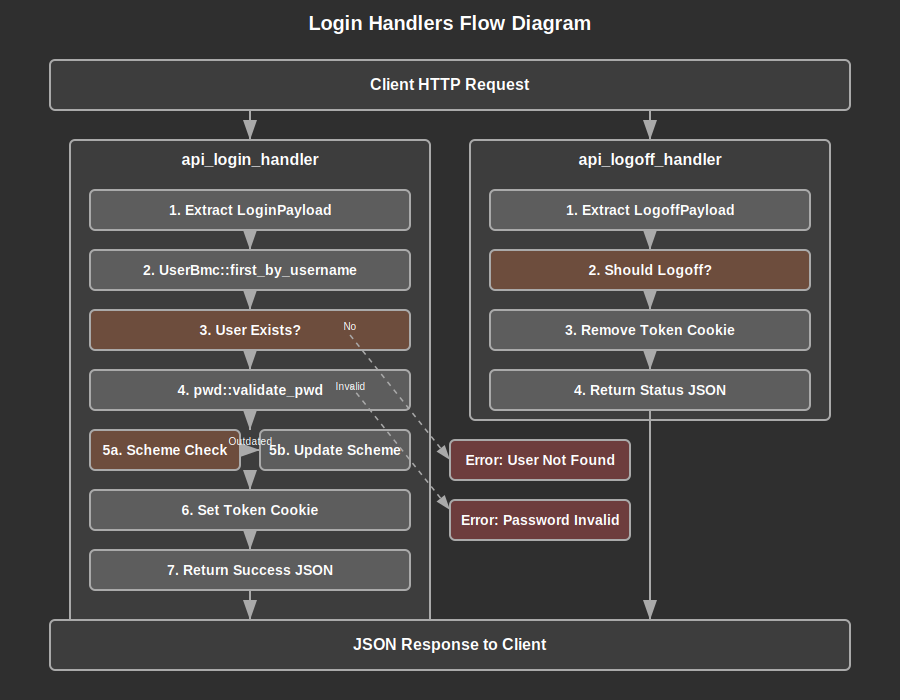

# Login Handlers Documentation

## Overview

The Login Handlers module provides secure authentication endpoints for the web application, implementing user login and logout functionality through Axum HTTP handlers. This module serves as the primary authentication gateway, handling credential validation, password scheme management, and session token management through HTTP cookies.

The module exposes two main API endpoints: `api_login_handler` for user authentication and `api_logoff_handler` for session termination. Both handlers follow RESTful principles and return JSON responses, integrating seamlessly with the application's error handling and security framework.

The authentication system implements robust security measures including password validation through the lib_auth crate, automatic password scheme upgrades for enhanced security, and secure token-based session management. All operations are performed within proper context boundaries using the application's Ctx system for authorization and audit trails.

## API Summary

### Key Handler Functions

#### `api_login_handler`

Primary authentication endpoint that validates user credentials and establishes authenticated sessions.

```rust
pub async fn api_login_handler(
    State(mm): State<ModelManager>,
    cookies: Cookies,
    Json(payload): Json<LoginPayload>,
) -> Result<Json<Value>>
```

**Parameters:**
- `State(mm)`: ModelManager for database operations
- `cookies`: Tower cookies for session management
- `Json(payload)`: LoginPayload containing username and password

**Returns:** JSON response with success status

**Example Usage:**
```rust
// POST /api/login
{
    "username": "demo_user",
    "pwd": "secure_password"
}

// Success Response
{
    "result": {
        "success": true
    }
}
```

#### `api_logoff_handler`

Session termination endpoint that handles user logout operations.

```rust
pub async fn api_logoff_handler(
    cookies: Cookies,
    Json(payload): Json<LogoffPayload>,
) -> Result<Json<Value>>
```

**Parameters:**
- `cookies`: Tower cookies for session management
- `Json(payload)`: LogoffPayload containing logout flag

**Returns:** JSON response with logout status

**Example Usage:**
```rust
// POST /api/logoff
{
    "logoff": true
}

// Response
{
    "result": {
        "logged_off": true
    }
}
```

### Payload Types

#### `LoginPayload`

Input structure for login requests containing user credentials.

```rust
#[derive(Debug, Deserialize)]
pub struct LoginPayload {
    username: String,
    pwd: String,
}
```

#### `LogoffPayload`

Input structure for logout requests with logout confirmation.

```rust
#[derive(Debug, Deserialize)]
pub struct LogoffPayload {
    logoff: bool,
}
```


## Details

### Architecture

The Login Handlers module follows a layered architecture pattern that separates concerns across authentication, authorization, and session management:

1. **Handler Layer**: Axum HTTP handlers that process incoming requests and return JSON responses
2. **Authentication Layer**: Password validation and user lookup through UserBmc and lib_auth integration
3. **Session Layer**: Token-based session management using HTTP cookies via tower_cookies
4. **Security Layer**: Password scheme management with automatic upgrades for enhanced security

This architecture ensures clean separation between HTTP handling, business logic, and security concerns while maintaining high cohesion within each layer.

### Data Flow Process

#### Login Flow

1. **Request Reception**: `api_login_handler` receives HTTP POST with JSON payload containing username and password
2. **User Lookup**: Uses `UserBmc::first_by_username` with root context to retrieve user data including password hash and salt
3. **Password Validation**: Calls `pwd::validate_pwd` from lib_auth to verify credentials using secure hashing
4. **Scheme Management**: Checks `SchemeStatus` and upgrades password scheme if outdated using `UserBmc::update_pwd`
5. **Session Creation**: Sets secure HTTP cookie with user token using `token::set_token_cookie`
6. **Response**: Returns JSON success response to client

#### Logout Flow

1. **Request Reception**: `api_logoff_handler` receives HTTP POST with JSON payload containing logout flag
2. **Session Termination**: If logout requested, calls `token::remove_token_cookie` to clear session cookie
3. **Response**: Returns JSON response indicating logout status

### Security Considerations

1. **Password Security**: Uses lib_auth for secure password hashing and validation with salt
2. **Scheme Upgrades**: Automatically upgrades outdated password schemes to maintain security standards
3. **Session Management**: Implements secure token-based sessions with HTTP-only cookies
4. **Error Handling**: Structured error responses prevent information disclosure about user existence
5. **Context Security**: Uses root context for user lookup while maintaining audit trails
6. **Input Validation**: JSON deserialization provides automatic input validation and type safety

### Authentication Patterns

The module implements several important authentication patterns:

1. **Fail-Safe Design**: Default behavior is to reject authentication on any error condition
2. **Password Upgrade Pattern**: Automatic migration to stronger password schemes without user intervention
3. **Token Session Pattern**: Stateless authentication using secure tokens rather than server-side sessions
4. **Structured Error Pattern**: Consistent error handling with specific error types for different failure modes


### Error Handling

The module defines structured error types for different authentication failure scenarios:

- `Error::LoginFailUsernameNotFound`: Username does not exist in system
- `Error::LoginFailUserHasNoPwd`: User account exists but has no password set
- `Error::LoginFailPwdNotMatching`: Password validation failed for existing user

These errors provide specific feedback for logging and debugging while maintaining security by not exposing sensitive information to clients.

### Flow Diagram



### Implementation Notes

#### Dependencies

The module integrates with several key application components:

- **lib_auth**: Provides `pwd` module for secure password operations and validation
- **lib_core**: Supplies `Ctx` for security context and `UserBmc` for user data access
- **Axum**: Web framework providing HTTP handling, JSON extraction, and state management
- **tower_cookies**: Session management through secure HTTP cookies
- **serde/serde_json**: JSON serialization and deserialization for API payloads

#### Error Handling Strategy

The authentication system employs a comprehensive error handling strategy:

1. **Structured Errors**: Custom error types provide specific failure information
2. **Security Conscious**: Error messages avoid leaking sensitive information
3. **Logging Integration**: Debug statements provide audit trails for security events
4. **Result Propagation**: Uses Rust's Result type for explicit error handling

#### Design Decisions

1. **Root Context Usage**: Uses `Ctx::root_ctx()` for user lookup to bypass permission checks during authentication
2. **Automatic Scheme Upgrades**: Transparently upgrades password schemes to maintain security without user friction
3. **Cookie-Based Sessions**: Uses HTTP cookies for session management rather than bearer tokens for web client compatibility
4. **JSON API Pattern**: Consistent JSON request/response format for easy client integration
5. **Async Design**: Fully async handlers support high-concurrency authentication scenarios

#### Performance Considerations

- **Password Validation**: CPU-intensive operations are properly handled in async context
- **Database Queries**: Minimal database operations per authentication request
- **Memory Efficiency**: Payload structs use owned strings for thread safety in async context
- **Cookie Management**: Efficient token operations without server-side session storage
