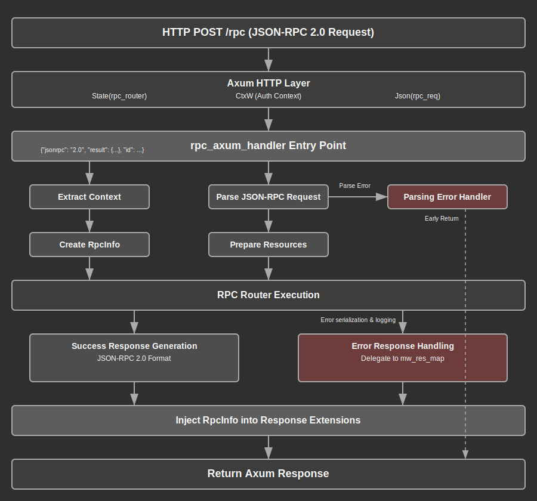

# RPC Handlers Module Documentation

## Overview

The RPC handlers module provides JSON-RPC 2.0 compliant request processing for the web application. This module serves as the primary entry point for remote procedure calls, handling request parsing, validation, routing, and response serialization while maintaining proper error handling and logging capabilities.

The module implements a centralized RPC handler that processes incoming JSON-RPC requests through the `rpc_axum_handler` function. This handler integrates with the broader application architecture by leveraging the authentication middleware context, RPC router system, and response mapping middleware to provide a complete request-response cycle.

Key responsibilities include parsing JSON-RPC requests, validating request structure, routing to appropriate RPC methods, managing request-specific resources, and preparing standardized JSON-RPC responses. The module also captures request metadata for downstream logging and error handling processes.

## API Summary

### Key Types

#### `RpcInfo`

A debug-enabled struct that captures RPC request metadata for downstream processing.

```rust
#[derive(Debug)]
pub struct RpcInfo {
    pub id: Option<Value>,
    pub method: String,
}
```

The `RpcInfo` struct stores the JSON-RPC request ID (which can be null per the JSON-RPC specification) and the method name being called. This information is injected into the Axum response extensions for use by the response mapping middleware (`mw_res_map`) for logging and error serialization.

### Key Functions

#### `rpc_axum_handler`

The main RPC handler function that processes JSON-RPC requests.

```rust
pub async fn rpc_axum_handler(
    State(rpc_router): State<rpc_router::Router>,
    ctx: CtxW,
    Json(rpc_req): Json<Value>,
) -> Response
```

**Parameters:**
- `rpc_router`: The RPC router instance from Axum state
- `ctx`: Wrapped authentication context from middleware
- `rpc_req`: JSON-RPC request payload

**Returns:** An Axum Response containing either a successful JSON-RPC response or error information

**Example Usage:**
```rust
// The handler is typically registered in the Axum router
let app = Router::new()
    .route("/rpc", post(rpc_axum_handler))
    .with_state(rpc_router);
```

**JSON-RPC Request Format:**
```json
{
    "jsonrpc": "2.0",
    "method": "user.create",
    "params": {
        "username": "john_doe",
        "email": "john@example.com"
    },
    "id": 1
}
```

**JSON-RPC Success Response Format:**
```json
{
    "jsonrpc": "2.0",
    "result": {
        "id": 123,
        "username": "john_doe",
        "created_at": "2024-01-01T00:00:00Z"
    },
    "id": 1
}
```

## Details

### Architecture

The RPC handlers module follows a layered architecture that integrates with several key components:

1. **HTTP Layer**: Receives HTTP POST requests with JSON-RPC payloads
2. **Authentication Layer**: Extracts and validates user context through middleware
3. **Request Processing Layer**: Parses and validates JSON-RPC request structure
4. **Routing Layer**: Dispatches validated requests to appropriate RPC methods
5. **Resource Management Layer**: Provides request-specific resources to RPC methods
6. **Response Generation Layer**: Formats successful responses according to JSON-RPC 2.0 specification
7. **Error Handling Layer**: Delegates error response generation to middleware


### Data Flow Process

The RPC handler follows this step-by-step process for each request:

1. **Request Extraction**: Axum extracts the RPC router state, authentication context, and JSON request body
2. **Context Unwrapping**: The authentication context is unwrapped from the middleware wrapper
3. **Request Parsing**: The JSON payload is parsed into a validated `rpc_router::Request` structure
4. **Error Handling**: Parsing errors are immediately converted to error responses and returned
5. **Metadata Capture**: RPC request ID and method name are captured for downstream processing
6. **Resource Preparation**: Request-specific resources (including the authentication context) are prepared for the RPC method
7. **Method Execution**: The RPC router executes the requested method with the prepared resources
8. **Response Generation**: Successful results are wrapped in a JSON-RPC 2.0 compliant response format
9. **Extension Injection**: The captured RPC metadata is injected into the Axum response extensions
10. **Response Return**: The complete response is returned to the client

### Resource Management Strategy

The module implements a resource overlay pattern for RPC method execution:

- **Base Resources**: The RPC router contains base services and resources available to all methods
- **Request-Specific Resources**: Additional resources (primarily the authentication context) are prepared per request
- **Resource Overlay**: Request-specific resources overlay the base resources, taking precedence without replacement
- **Context Propagation**: The authenticated user context is made available to all RPC methods that require it

This approach ensures that RPC methods have access to both shared application resources and request-specific data while maintaining proper isolation between requests.

### Security Considerations

1. **Authentication Validation**: All requests must pass through authentication middleware before reaching the RPC handler
2. **Context Propagation**: User identity and permissions are propagated to RPC methods through the context
3. **Request Validation**: JSON-RPC request structure is validated before processing
4. **Error Information Leakage**: Error details are managed by downstream middleware to prevent information disclosure
5. **Resource Isolation**: Each request receives isolated resources to prevent cross-request data contamination

### Error Handling Strategy

The module implements a centralized error handling approach:

- **Parsing Errors**: JSON-RPC parsing errors are immediately converted to error responses
- **Execution Errors**: RPC method execution errors are captured and passed to response mapping middleware
- **Error Delegation**: Detailed error response generation is delegated to `mw_res_map` middleware
- **Consistent Format**: All errors follow JSON-RPC 2.0 error response format
- **Logging Integration**: Error information is available for logging through response extensions


### JSON-RPC 2.0 Compliance

The handler strictly adheres to JSON-RPC 2.0 specification requirements:

- **Version Field**: All responses include `"jsonrpc": "2.0"`
- **ID Preservation**: Request IDs are preserved in responses for proper correlation
- **Null ID Support**: Handles optional/null request IDs correctly
- **Result Structure**: Success responses use the `result` field for return values
- **Error Delegation**: Error responses are generated by downstream middleware using proper error structure

### Common Design Patterns

1. **Middleware Integration**: Seamless integration with Axum middleware stack
2. **Extension Pattern**: Uses Axum response extensions for cross-cutting concerns
3. **Resource Overlay**: Composable resource management for flexible service injection
4. **Error Propagation**: Structured error handling with downstream delegation
5. **Context Threading**: Authentication context threading through the request lifecycle

## Flow Diagram



## Implementation Notes

### Dependencies

The module relies on several key dependencies:

- **Axum**: Web framework providing HTTP handling, state extraction, and response types
- **rpc-router**: Custom RPC routing library handling method dispatch and resource management
- **serde_json**: JSON serialization/deserialization for request/response handling
- **Authentication Middleware**: Provides `CtxW` wrapper containing user context

### Design Decisions

1. **Single Handler Approach**: Uses one handler function rather than per-method handlers for consistency
2. **Extension-Based Metadata**: Stores request metadata in response extensions for middleware access
3. **Error Delegation**: Delegates error response generation to middleware for centralized error handling
4. **Resource Composition**: Uses resource overlay pattern for flexible dependency injection
5. **Context Wrapping**: Authentication context is wrapped/unwrapped at middleware boundaries

### Performance Considerations

- **Async Processing**: Full async/await support for efficient request handling
- **Resource Reuse**: Base RPC router resources are shared across requests
- **Memory Efficiency**: Request-specific resources are created per-request and disposed after use
- **Error Short-Circuiting**: Parsing errors return immediately without unnecessary processing

### Integration Points

The module integrates with several other system components:

- **Authentication Middleware (`mw_auth`)**: Provides user context validation
- **Response Mapping Middleware (`mw_res_map`)**: Handles error response generation and logging
- **RPC Router System**: Dispatches method calls to appropriate handlers
- **Error System**: Converts various error types to standardized application errors

### Testing Considerations

When testing the RPC handler:

- Mock the RPC router for testing request routing logic
- Test both successful and error response paths
- Verify proper JSON-RPC 2.0 response format compliance
- Ensure authentication context is properly propagated
- Validate that RPC metadata is correctly captured in response extensions
