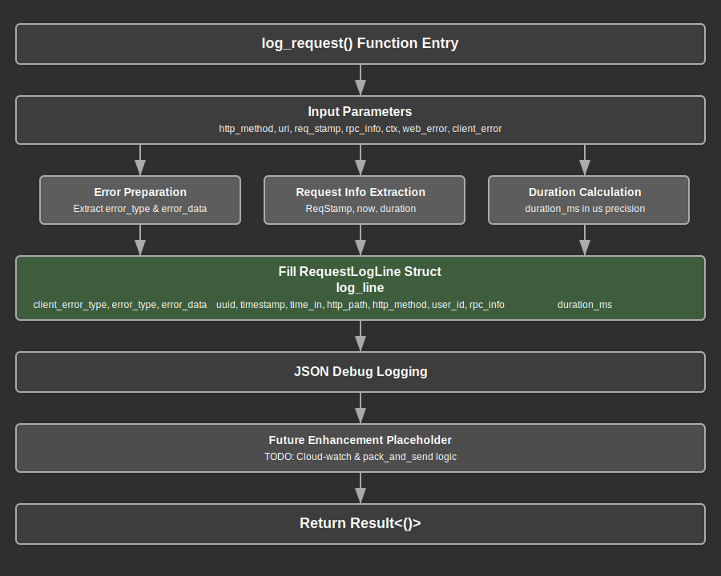

# Log Module Documentation

## Overview

The log module provides structured request logging capabilities for the web application. This module serves as the central logging mechanism for HTTP requests, capturing comprehensive request and response metadata including timing information, user context, RPC details, and error information for observability and debugging purposes.

The module implements a unified logging interface through the `log_request` function that processes incoming request data from various middleware layers. This function creates structured log entries that include request identifiers, timing metrics, user context, HTTP details, RPC method information, and error data, providing a complete audit trail for each request processed by the application.

Key responsibilities include aggregating request metadata from multiple sources, calculating precise timing metrics, formatting structured log entries, preparing data for external logging systems, and maintaining consistent logging format across all request types. The module integrates seamlessly with the middleware stack to capture request lifecycle information.

## API Summary

### Key Types

#### `RequestLogLine`

A serializable struct that represents a complete request log entry with comprehensive metadata.

```rust
#[skip_serializing_none]
#[derive(Serialize)]
struct RequestLogLine {
    uuid: String,          // Request identifier
    timestamp: String,     // Request completion time (RFC3339)
    time_in: String,       // Request start time (RFC3339)
    duration_ms: f64,      // Request duration in milliseconds

    // User and context attributes
    user_id: Option<i64>,

    // HTTP request attributes
    http_path: String,
    http_method: String,

    // RPC information
    rpc_id: Option<String>,
    rpc_method: Option<String>,

    // Error attributes
    client_error_type: Option<String>,
    error_type: Option<String>,
    error_data: Option<Value>,
}
```

The `RequestLogLine` struct uses `#[skip_serializing_none]` to omit null fields from the JSON output, creating clean log entries that only include relevant information. This structure captures the complete request context required for comprehensive logging and monitoring.

### Key Functions

#### `log_request`

The primary logging function that processes request metadata and generates structured log entries.

```rust
pub async fn log_request(
    http_method: Method,
    uri: Uri,
    req_stamp: ReqStamp,
    rpc_info: Option<&RpcInfo>,
    ctx: Option<Ctx>,
    web_error: Option<&Error>,
    client_error: Option<ClientError>,
) -> Result<()>
```

**Parameters:**
- `http_method`: HTTP method (GET, POST, etc.) from the request
- `uri`: Request URI containing the path and query parameters
- `req_stamp`: Request timestamp information containing UUID and start time
- `rpc_info`: Optional RPC method details (ID and method name)
- `ctx`: Optional user authentication context
- `web_error`: Optional server-side error information
- `client_error`: Optional client-side error information

**Returns:** A Result indicating successful log processing or an error

**Example Usage:**
```rust
// Called from response mapping middleware
log_request(
    Method::POST,
    uri,
    req_stamp,
    rpc_info.as_ref(),
    Some(ctx),
    web_error.as_ref(),
    client_error
).await?;
```

## Details

### Architecture

The log module follows a data aggregation and structured output architecture that integrates with multiple system components:

1. **Middleware Integration Layer**: Receives request data from various middleware components
2. **Data Aggregation Layer**: Combines request metadata from multiple sources into a unified structure
3. **Timing Calculation Layer**: Computes precise request duration with microsecond precision
4. **Error Processing Layer**: Extracts and serializes error information from different error types
5. **Serialization Layer**: Converts the log data into structured JSON format
6. **Output Layer**: Outputs structured logs for debugging and prepares for external systems

### Data Flow Process

The logging process follows these steps for each request:

1. **Parameter Collection**: Function receives request metadata from middleware layers
2. **Error Data Extraction**: Web errors are processed to extract type information and associated data
3. **Request Identification**: UUID and timing information are extracted from the request stamp
4. **Duration Calculation**: Precise request duration is calculated using high-precision timing
5. **Context Processing**: User context information is extracted when available
6. **RPC Information Extraction**: RPC method details are processed when present
7. **Log Line Assembly**: All collected data is assembled into a RequestLogLine structure
8. **JSON Serialization**: The log line is serialized to JSON for structured output
9. **Debug Output**: The structured log is output via the debug logging system
10. **Future Enhancement Preparation**: Structure prepares for cloud logging integration

### Timing Precision Strategy

The module implements high-precision timing measurement:

- **Microsecond Resolution**: Duration calculation uses floating-point seconds converted to microseconds
- **Precision Preservation**: Duration is stored as milliseconds with microsecond precision (floor operation)
- **Consistent Format**: All timestamps use RFC3339 format for standardization
- **Timezone Handling**: All times are normalized to UTC for consistency across deployments


### Error Handling Strategy

The module implements comprehensive error data extraction and processing:

1. **Error Type Identification**: Web errors are converted to string representations using `as_ref().to_string()`
2. **Error Data Extraction**: Complex error data is extracted from the JSON serialization of error objects
3. **Client Error Processing**: Client-side errors are captured separately from server-side errors
4. **Data Sanitization**: Error data extraction handles potential serialization failures gracefully
5. **Structured Error Logging**: All error information is preserved in structured format for analysis

### Resource Management

The logging function manages resources efficiently:

- **Async Processing**: Full async support ensures non-blocking logging operations
- **Memory Efficiency**: Temporary data structures are created and disposed per request
- **Error Isolation**: Error processing failures don't affect the main request flow
- **Resource Cleanup**: All temporary resources are automatically cleaned up after processing

### Security Considerations

1. **Data Sanitization**: Error data is extracted safely with proper error handling
2. **Context Validation**: User context is processed only when properly authenticated
3. **Information Disclosure**: Error data extraction prevents sensitive information leakage
4. **Audit Trail**: Complete request logging provides security audit capabilities
5. **User Identification**: User IDs are logged for security analysis when available

### Integration Points

The log module integrates with several key system components:

- **Request Stamp Middleware (`mw_req_stamp`)**: Provides request timing and identification
- **Authentication Middleware (`mw_auth`)**: Supplies user context information
- **RPC Handlers**: Provides RPC method information for API calls
- **Error System**: Integrates with application error types for comprehensive error logging
- **Response Mapping Middleware (`mw_res_map`)**: Called during response processing phase

### Data Structure Design

The `RequestLogLine` structure is designed for comprehensive observability:

```rust
// Core request identification and timing
uuid: String,          // Unique request identifier for correlation
timestamp: String,     // Request completion timestamp
time_in: String,       // Request initiation timestamp
duration_ms: f64,      // Precise duration measurement

// Request context
user_id: Option<i64>,  // Authenticated user identification
http_path: String,     // Request path for routing analysis
http_method: String,   // HTTP method for request categorization

// RPC-specific information
rpc_id: Option<String>,     // RPC request ID for correlation
rpc_method: Option<String>, // RPC method name for analysis

// Error information
client_error_type: Option<String>, // Client-side error classification
error_type: Option<String>,        // Server-side error type
error_data: Option<Value>,         // Detailed error information
```

### Logging Output Format

The module produces structured JSON logs with the following characteristics:

- **Consistent Structure**: All log entries follow the same JSON schema
- **Optional Fields**: Null/empty fields are omitted for clean output
- **Timestamp Standardization**: All timestamps use RFC3339 format
- **Precision Timing**: Duration measurements include microsecond precision
- **Error Details**: Comprehensive error information when available

Example log output:
```json
{
  "uuid": "550e8400-e29b-41d4-a716-446655440000",
  "timestamp": "2024-01-01T12:00:00.123456Z",
  "time_in": "2024-01-01T12:00:00.100000Z",
  "duration_ms": 23.456,
  "user_id": 123,
  "http_path": "/rpc",
  "http_method": "POST",
  "rpc_method": "user.create",
  "rpc_id": "1"
}
```

## Flow Diagram



## Implementation Notes

### Dependencies

The module relies on several key dependencies:

- **Axum**: HTTP types for method and URI extraction
- **lib-core**: Context types for user authentication information
- **lib-utils**: Time utilities for precise timing and formatting
- **serde/serde_json**: JSON serialization for structured logging output
- **time**: High-precision timing calculations and duration management
- **tracing**: Debug logging output for development and debugging

### Design Decisions

1. **Single Function Approach**: One comprehensive logging function handles all request types
2. **Optional Parameter Design**: Optional parameters allow flexible usage across different request types
3. **Structured Output**: JSON structured logging for machine parsing and analysis
4. **Async Design**: Async function signature for non-blocking logging operations
5. **Error Tolerance**: Logging errors don't affect main request processing

### Performance Considerations

- **Minimal Processing**: Only necessary data transformations are performed
- **Async Operations**: Non-blocking design prevents request delays
- **Memory Efficiency**: Temporary data structures are minimized
- **Precision vs Performance**: Timing precision balanced with computational efficiency
- **Error Handling**: Error processing doesn't impact performance of successful requests

### Future Enhancement Opportunities

The module includes preparation for future enhancements:

- **Cloud Integration**: TODO comment indicates planned CloudWatch integration
- **Batch Processing**: Structure supports pack-and-send logic for efficient transmission
- **Format Flexibility**: Design allows for multiple output formats (JSON lines, Parquet)
- **External Systems**: Architecture supports integration with various logging backends
- **Metrics Extraction**: Structured data enables metric generation and analysis

### Testing Considerations

When testing the log module:

- Test with various combinations of optional parameters
- Verify timing precision calculations
- Validate JSON serialization output format
- Test error data extraction from different error types
- Ensure proper handling of missing or null data
- Verify RFC3339 timestamp formatting
- Test async operation completion
