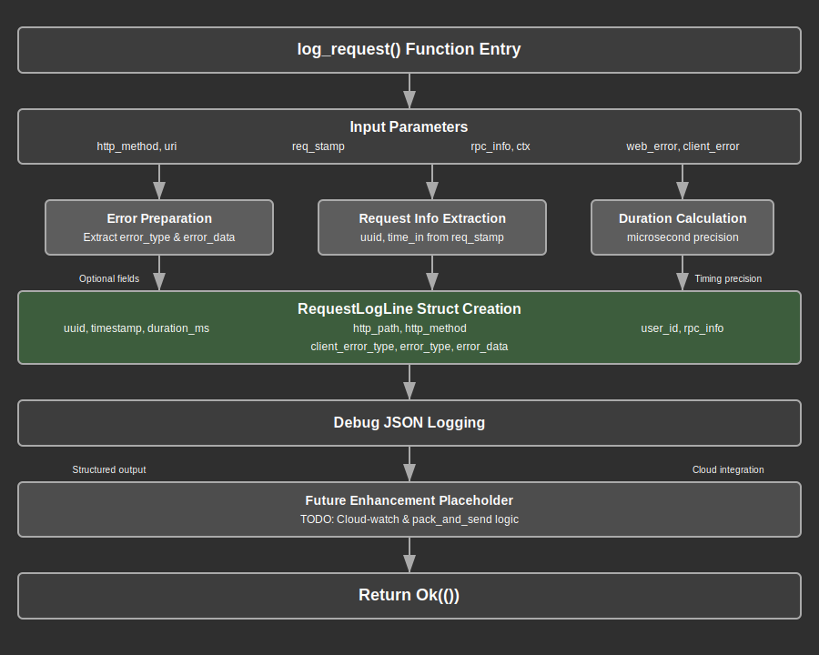

# Log Module Documentation

## Overview

The log module provides structured request logging functionality for the web application. This module serves as the centralized logging component that captures comprehensive request/response metadata, timing information, error details, and user context for monitoring, debugging, and analytics purposes.

The module implements a standardized logging approach through the `log_request` function, which processes HTTP requests, RPC calls, authentication context, and error information to generate structured log entries. These log entries follow a consistent format that includes timing metrics, user identification, request details, and error information when applicable.

Key responsibilities include collecting request timing data, extracting user and authentication context, capturing HTTP request metadata, processing RPC-specific information, handling error details with appropriate serialization, and generating structured JSON log entries for downstream processing. The module integrates seamlessly with the application's middleware stack to provide comprehensive observability.

## API Summary

### Key Types

#### `RequestLogLine`

A serializable struct that represents a standardized log entry for request processing.

```rust
#[skip_serializing_none]
#[derive(Serialize)]
struct RequestLogLine {
    uuid: String,
    timestamp: String,
    time_in: String,
    duration_ms: f64,
    user_id: Option<i64>,
    http_path: String,
    http_method: String,
    rpc_id: Option<String>,
    rpc_method: Option<String>,
    client_error_type: Option<String>,
    error_type: Option<String>,
    error_data: Option<Value>,
}
```

The `RequestLogLine` struct captures all essential request processing information including timing metrics, user context, HTTP details, RPC information, and error data. The `skip_serializing_none` attribute ensures clean JSON output by omitting null fields.

### Key Functions

#### `log_request`

The primary logging function that processes request information and generates structured log entries.

```rust
pub async fn log_request(
    http_method: Method,
    uri: Uri,
    req_stamp: ReqStamp,
    rpc_info: Option<&RpcInfo>,
    ctx: Option<Ctx>,
    web_error: Option<&Error>,
    client_error: Option<ClientError>,
) -> Result<()>
```

**Parameters:**
- `http_method`: HTTP method from the request (GET, POST, etc.)
- `uri`: Request URI containing path and query parameters
- `req_stamp`: Request timestamp information containing UUID and start time
- `rpc_info`: Optional RPC request metadata including method and ID
- `ctx`: Optional authentication context containing user information
- `web_error`: Optional server-side error information
- `client_error`: Optional client-side error information

**Returns:** A Result indicating successful log processing or error

**Example Usage:**
```rust
log_request(
    Method::POST,
    "/api/users".parse()?,
    req_stamp,
    Some(&rpc_info),
    Some(ctx),
    None,
    None
).await?;
```

## Details

### Architecture

The log module follows a centralized logging architecture that integrates with multiple application layers:

1. **Middleware Integration Layer**: Receives logging calls from response mapping middleware
2. **Data Collection Layer**: Aggregates timing, context, and error information from various sources
3. **Processing Layer**: Transforms raw request data into structured log format
4. **Serialization Layer**: Converts log data to JSON format for output
5. **Output Layer**: Directs structured logs to appropriate destinations (debug output, cloud services)

### Data Flow Process

The logging process follows this comprehensive workflow:

1. **Request Information Gathering**: Collects HTTP method, URI, and request timing from middleware
2. **Context Extraction**: Extracts user ID and authentication information when available
3. **RPC Metadata Processing**: Captures RPC method names and request IDs for RPC-based requests
4. **Error Information Processing**: Serializes server and client error details with data extraction
5. **Timing Calculation**: Computes precise request duration with microsecond precision
6. **Log Line Construction**: Assembles all collected information into a standardized structure
7. **JSON Serialization**: Converts the log structure to JSON format for output
8. **Output Generation**: Sends structured log to debug output and prepares for cloud delivery
### Request Timestamp Management

The module implements precise request timing through the `ReqStamp` structure:

- **UUID Generation**: Each request receives a unique identifier for correlation across systems
- **High-Precision Timing**: Uses microsecond-precision timestamps for accurate performance measurement
- **Duration Calculation**: Computes exact request processing time from middleware entry to logging
- **Time Formatting**: Converts timestamps to RFC3339 format for standardized time representation

### Error Information Processing

The logging system handles multiple error types with careful data extraction:

1. **Server Error Processing**: Extracts error type information and associated data from web errors
2. **Client Error Handling**: Captures client-side error classifications for request categorization
3. **Data Sanitization**: Safely extracts error data while preventing sensitive information leakage
4. **Error Serialization**: Converts complex error structures to JSON-compatible formats

### User Context Integration

The module integrates with the authentication system to capture user-specific information:

- **Context Propagation**: Receives authenticated user context from middleware
- **User ID Extraction**: Safely extracts user identification for request attribution
- **Optional Handling**: Gracefully handles requests without authentication context
- **Privacy Considerations**: Limits logged user information to identification only

### RPC Request Processing

For RPC-based requests, the module captures additional metadata:

- **Method Identification**: Records the specific RPC method being called
- **Request ID Correlation**: Maintains JSON-RPC request ID for client correlation
- **Optional Processing**: Handles both RPC and non-RPC requests seamlessly
- **Metadata Extraction**: Safely processes RPC information when available

### Performance Optimization Strategies

1. **Asynchronous Processing**: Full async/await support for non-blocking log processing
2. **Conditional Serialization**: Only processes error data when errors are present
3. **Efficient Duration Calculation**: Uses optimized floating-point arithmetic for timing
4. **Memory Management**: Minimizes allocations through efficient string handling
5. **Optional Field Handling**: Reduces JSON payload size by omitting null values

### Security Considerations

The logging system implements several security measures:

1. **Data Sanitization**: Carefully extracts error data to prevent information disclosure
2. **Context Validation**: Safely handles authentication context without exposing credentials
3. **Error Data Filtering**: Processes error information while maintaining security boundaries
4. **UUID Anonymization**: Uses UUIDs instead of potentially sensitive identifiers
5. **Structured Output**: Maintains consistent log format to prevent injection attacks

### JSON Output Format

The module generates structured JSON logs with this format:

```json
{
    "uuid": "550e8400-e29b-41d4-a716-446655440000",
    "timestamp": "2024-01-01T12:00:00.123456Z",
    "time_in": "2024-01-01T12:00:00.000000Z",
    "duration_ms": 123.456,
    "user_id": 12345,
    "http_path": "/api/users",
    "http_method": "POST",
    "rpc_id": "1",
    "rpc_method": "user.create",
    "client_error_type": "ValidationError",
    "error_type": "DatabaseError",
    "error_data": {"field": "email", "message": "Invalid format"}
}
```

### Integration with Cloud Services

The module is designed for future integration with cloud logging services:

- **Structured Format**: JSON output compatible with cloud logging platforms
- **Batch Processing**: Architecture supports future batch sending capabilities
- **Format Flexibility**: Can adapt to various cloud service requirements (newline JSON, Parquet)
- **Scalability**: Designed to handle high-volume logging scenarios

## Flow Diagram



## Implementation Notes

### Dependencies

The log module relies on several key dependencies:

- **Axum**: Provides HTTP method and URI types for request information
- **lib-core**: Supplies authentication context (Ctx) for user identification
- **lib-utils**: Offers time utilities for timestamp formatting and duration calculation
- **serde/serde_json**: Handles JSON serialization and value manipulation
- **time**: Provides high-precision time calculations and duration management
- **tracing**: Supplies debug logging infrastructure for development

### Design Decisions

1. **Centralized Logging**: Single function handles all request logging to ensure consistency
2. **Structured Data**: Uses strongly-typed structs for reliable log format
3. **Optional Fields**: Leverages `skip_serializing_none` for clean JSON output
4. **Async Processing**: Full async support for scalable logging performance
5. **Error Data Extraction**: Safely processes complex error structures
6. **Microsecond Precision**: Provides detailed timing information for performance analysis

### Performance Considerations

- **Non-Blocking Operations**: Async processing prevents request blocking
- **Efficient Serialization**: Conditional processing reduces unnecessary work
- **Memory Efficiency**: Minimizes allocations through careful string handling
- **Timing Precision**: Balances accuracy with computational efficiency
- **Optional Processing**: Skips expensive operations when data is unavailable

### Error Handling Strategy

The module implements robust error handling:

- **Safe Extraction**: Error data extraction handles malformed or missing data
- **Type Preservation**: Maintains error type information for categorization
- **Data Validation**: Safely processes JSON values without panicking
- **Graceful Degradation**: Continues logging even when some data is unavailable
- **Result Propagation**: Returns logging errors to calling middleware

### Future Enhancements

The module is architected to support future improvements:

1. **Cloud Integration**: Ready for AWS CloudWatch or similar service integration
2. **Batch Processing**: Architecture supports efficient batch log sending
3. **Format Expansion**: Can accommodate additional log formats (Parquet, JSONL)
4. **Filtering Capabilities**: Framework exists for log-level filtering
5. **Metrics Extraction**: Timing data can support metrics generation

### Integration Points

The log module integrates with several system components:

- **Response Mapping Middleware (`mw_res_map`)**: Primary caller for request logging
- **Request Timestamp Middleware (`mw_req_stamp`)**: Provides timing information
- **Authentication Middleware (`mw_auth`)**: Supplies user context
- **RPC Handlers**: Provides RPC-specific metadata
- **Error System**: Supplies structured error information

### Testing Considerations

When testing the log module:

- Mock time functions for consistent timing tests
- Test all optional parameter combinations
- Verify JSON serialization format compliance
- Ensure error data extraction safety
- Validate UUID and timestamp formatting
- Test async logging performance under load

### Monitoring and Observability

The structured logging approach enables:

- **Request Correlation**: UUID-based request tracking across services
- **Performance Monitoring**: Precise timing data for latency analysis
- **Error Analysis**: Detailed error information for debugging
- **User Activity Tracking**: Anonymous user behavior analysis
- **RPC Method Metrics**: Usage statistics for API endpoints

### Configuration Options

Future configuration possibilities include:

- **Log Level Control**: Filtering by severity or request type
- **Field Selection**: Configurable field inclusion/exclusion
- **Output Destinations**: Multiple logging backend support
- **Format Customization**: Adaptable output format configuration
- **Performance Tuning**: Configurable precision and processing options
