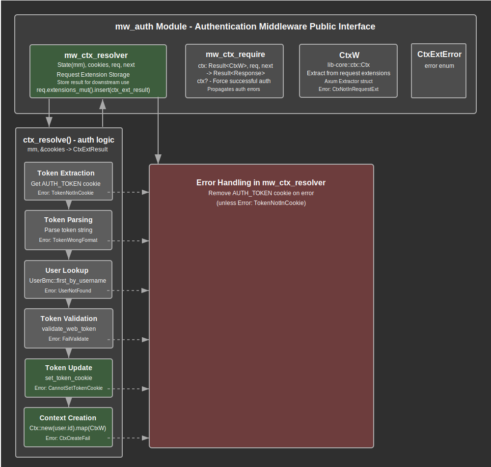

# Authentication Middleware Documentation

## Overview

The authentication middleware module provides secure user authentication and authorization mechanisms for the web application. This module serves as the primary security layer that validates user tokens, manages authentication context, and controls request access based on authentication status.

The module implements a two-phase authentication architecture through the resolver-validator pattern. The `mw_ctx_resolver` middleware extracts and validates authentication tokens from cookies, while the `mw_ctx_require` middleware enforces authentication requirements for protected endpoints. This design ensures flexible authentication handling across different endpoint security requirements.

Key responsibilities include extracting authentication tokens from HTTP cookies, validating token format and cryptographic signatures, retrieving user authentication data from the model layer, creating secure user context objects, managing token refresh and cookie updates, and providing request-scoped authentication context through the Axum extractor pattern.

## API Summary

### Key Types

#### `CtxW`

A wrapper struct around the core application context that implements the Axum `FromRequestParts` trait for dependency injection.

```rust
#[derive(Debug, Clone)]
pub struct CtxW(pub Ctx);
```

The `CtxW` wrapper provides seamless integration with Axum's request processing pipeline, allowing authenticated context to be extracted automatically in route handlers that require authentication. The inner `Ctx` contains the authenticated user's ID and provides access to user-scoped operations throughout the application.

#### `CtxExtError`

An enumeration representing all possible authentication and context extraction errors.

```rust
#[derive(Clone, Serialize, Debug)]
pub enum CtxExtError {
    TokenNotInCookie,           // Authentication token not found in request cookies
    TokenWrongFormat,           // Token string cannot be parsed into valid Token structure
    UserNotFound,               // User referenced by token does not exist in database
    ModelAccessError(String),   // Database or model layer access error
    FailValidate,              // Token cryptographic validation failed
    CannotSetTokenCookie,      // Unable to set refreshed token cookie in response
    CtxNotInRequestExt,        // Context result not found in request extensions
    CtxCreateFail(String),     // Context creation failed with detailed error message
}
```

The error enumeration provides comprehensive error handling for all authentication failure scenarios, enabling precise error reporting and appropriate error responses for different failure modes.

#### `CtxExtResult`

A type alias for the Result type used throughout the authentication middleware.

```rust
type CtxExtResult = core::result::Result<CtxW, CtxExtError>;
```

### Key Functions
#### `mw_ctx_resolver`

The authentication context resolver middleware that processes authentication tokens and stores the result in request extensions.

```rust
pub async fn mw_ctx_resolver(
    State(mm): State<ModelManager>,
    cookies: Cookies,
    mut req: Request<Body>,
    next: Next,
) -> Response
```

**Parameters:**
- `State(mm)`: Application state containing the model manager for database operations
- `cookies`: Cookie jar containing HTTP cookies from the request
- `req`: Mutable HTTP request for storing authentication results in extensions
- `next`: Next middleware or handler in the processing chain

**Returns:** HTTP response after processing the request through subsequent middleware

**Critical Design Note:** This middleware never fails and always calls the next handler, regardless of authentication success or failure. Authentication errors are captured and stored in request extensions for downstream processing.

**Example Usage:**
```rust
// Applied as middleware to routes requiring authentication context
let app = Router::new()
    .route("/api/protected", get(protected_handler))
    .layer(middleware::from_fn_with_state(mm.clone(), mw_ctx_resolver));
```

#### `mw_ctx_require`

The authentication enforcement middleware that requires successful authentication and fails fast on authentication errors.

```rust
pub async fn mw_ctx_require(
    ctx: Result<CtxW>,
    req: Request<Body>,
    next: Next,
) -> Result<Response>
```

**Parameters:**
- `ctx`: Authentication context result extracted from request extensions
- `req`: HTTP request being processed
- `next`: Next middleware or handler in the processing chain

**Returns:** Result containing HTTP response or authentication error

**Example Usage:**
```rust
// Applied to routes that absolutely require authentication
let protected_routes = Router::new()
    .route("/admin", get(admin_handler))
    .layer(middleware::from_fn(mw_ctx_require));
```

#### `ctx_resolve`

Internal function that performs the complete authentication token resolution process.

```rust
async fn ctx_resolve(mm: ModelManager, cookies: &Cookies) -> CtxExtResult
```

**Parameters:**
- `mm`: Model manager for database operations
- `cookies`: Reference to cookie jar for token extraction

**Returns:** Result containing validated authentication context or specific error

**Process Steps:**
1. Extract authentication token from cookies
2. Parse token string into structured Token object
3. Retrieve user authentication data from database
4. Validate token cryptographic signature
5. Refresh token cookie with updated timestamp
6. Create and return authentication context

This function encapsulates the complete authentication workflow and provides detailed error information for each potential failure point.

## Details

### Architecture

The authentication middleware follows a layered security architecture with clear separation of concerns:

1. **Token Extraction Layer**: Safely extracts authentication tokens from HTTP cookies with proper error handling
2. **Token Parsing Layer**: Converts string tokens into structured Token objects with format validation
3. **User Resolution Layer**: Retrieves user authentication data from the database using the model manager
4. **Cryptographic Validation Layer**: Validates token signatures using user-specific salt values
5. **Token Refresh Layer**: Updates authentication cookies with fresh timestamps for session management
6. **Context Creation Layer**: Creates secure user context objects for request-scoped operations
7. **Integration Layer**: Provides Axum extractor integration for seamless dependency injection

### Authentication Flow Process

The authentication process follows these sequential steps for each request:

1. **Cookie Extraction**: Authentication token is extracted from the request cookies using the `AUTH_TOKEN` constant
2. **Token Parsing**: Raw token string is parsed into a structured Token object containing identity and signature
3. **User Lookup**: User authentication data is retrieved from the database using the token's identity field
4. **Signature Validation**: Token cryptographic signature is validated against the user's stored salt value
5. **Token Refresh**: A new authentication cookie is set with updated timestamp for session continuation
6. **Context Creation**: User context object is created containing the authenticated user's ID
7. **Extension Storage**: Authentication result (success or specific error) is stored in request extensions
8. **Request Processing**: Request continues to next middleware or handler with authentication context available

### Security Model

The module implements a comprehensive security model with multiple layers of protection:

#### Token-Based Authentication
- **Cryptographic Signatures**: All tokens include cryptographic signatures validated against user-specific salts
- **Identity Verification**: Token identity is matched against existing users in the database
- **Format Validation**: Token strings must conform to expected structural format before processing- **Session Management**: Automatic token refresh prevents session expiration for active users

#### Cookie Security
- **Secure Transport**: Authentication tokens are transmitted via HTTP cookies with appropriate security flags
- **Automatic Cleanup**: Invalid or expired tokens are automatically removed from client cookies
- **Refresh Mechanism**: Valid tokens are refreshed automatically to maintain session continuity

#### Error Handling Security
- **Information Disclosure Prevention**: Error messages provide sufficient detail for debugging without exposing sensitive information
- **Graceful Degradation**: Authentication failures don't crash the application but provide appropriate error responses
- **Audit Trail**: All authentication attempts and failures are logged for security monitoring

### Request Processing Strategy

The middleware implements a two-phase processing strategy optimized for flexibility and performance:

#### Phase 1: Resolution (Always Succeeds)
The `mw_ctx_resolver` middleware operates with a "never fail" philosophy:
- **Error Capture**: All authentication errors are captured and stored rather than propagated
- **Request Continuation**: Request processing continues regardless of authentication status
- **Cookie Cleanup**: Invalid cookies are removed automatically without stopping request processing
- **Extension Storage**: Authentication results are stored in request extensions for downstream access

#### Phase 2: Enforcement (Conditional)
The `mw_ctx_require` middleware provides strict authentication enforcement:
- **Fast Failure**: Immediately returns error responses for authentication failures
- **Context Validation**: Ensures authentication context exists and is valid
- **Access Control**: Blocks access to protected resources for unauthenticated requests

### Data Flow Architecture

The authentication data flows through several key components:

1. **HTTP Request**: Contains authentication cookies from client browser
2. **Cookie Extraction**: Middleware extracts token from cookie jar3. **Token Processing**: Token parsing and validation using lib-auth components
4. **Database Access**: User data retrieval through UserBmc and ModelManager
5. **Context Creation**: Authenticated context object creation with user ID
6. **Request Extensions**: Storage of authentication results in request extension map
7. **Handler Access**: Route handlers access context through CtxW extractor
8. **Response Processing**: Updated cookies are included in HTTP response

### Error Propagation Strategy

The module implements sophisticated error handling with different strategies for different middleware layers:

#### Resolver Layer Error Handling
- **Error Capture**: All errors are captured and converted to `CtxExtError` variants
- **No Propagation**: Errors are never propagated as HTTP errors
- **Extension Storage**: Errors are stored in request extensions for later processing
- **Cookie Cleanup**: Invalid cookies are removed when specific error types occur

#### Requirement Layer Error Handling  
- **Error Propagation**: Authentication errors are converted to HTTP errors
- **Fast Failure**: Immediate error response for authentication failures
- **Error Conversion**: `CtxExtError` is converted to application `Error` type

#### Extractor Error Handling
- **Context Validation**: Ensures context results exist in request extensions
- **Error Conversion**: Missing or invalid context results in extractor errors
- **Type Safety**: Compile-time guarantees for authenticated context access

### Integration Points

The authentication middleware integrates with several key system components:

- **lib-auth Token System**: Uses `validate_web_token` for cryptographic validation and Token parsing
- **lib-core Context System**: Creates and manages Ctx objects for user identification
- **lib-core Model Layer**: Accesses UserBmc for user authentication data retrieval
- **lib-web Token Utilities**: Uses `set_token_cookie` for cookie management and AUTH_TOKEN constant
- **Axum Framework**: Implements FromRequestParts trait for dependency injection integration
- **Tower Cookies**: Manages HTTP cookie extraction and manipulation
- **Tracing System**: Provides debug logging for authentication flow monitoring
### Context Extractor Design

The `CtxW` extractor provides type-safe authentication context access:

```rust
// Automatic extraction in route handlers
async fn protected_handler(ctx: CtxW) -> Result<Json<Response>> {
    let user_id = ctx.0.user_id(); // Access authenticated user ID
    // Handler logic with guaranteed authentication
}

// Manual extraction from request parts
impl<S: Send + Sync> FromRequestParts<S> for CtxW {
    type Rejection = Error;
    
    async fn from_request_parts(parts: &mut Parts, _state: &S) -> Result<Self> {
        parts.extensions
            .get::<CtxExtResult>()
            .ok_or(Error::CtxExt(CtxExtError::CtxNotInRequestExt))?
            .clone()
            .map_err(Error::CtxExt)
    }
}
```

### Performance Characteristics

The authentication middleware is designed for high performance:

- **Single Database Query**: Only one user lookup per authentication attempt
- **Extension Caching**: Authentication results are cached in request extensions
- **Minimal Allocations**: Efficient string and object handling throughout the pipeline
- **Async Processing**: Fully async implementation prevents blocking operations
- **Early Termination**: Fast failure paths for invalid tokens reduce processing overhead

## Flow Diagram



## Implementation Notes

### Dependencies

The module relies on several key dependencies for its functionality:

- **Axum**: Core web framework providing middleware traits, request/response types, and extractor functionality
- **lib-auth**: Token validation and cryptographic signature verification
- **lib-core**: Context types (Ctx) and model access (UserBmc, ModelManager) for user data operations- **lib-web utilities**: Token cookie management and authentication constants
- **Tower Cookies**: HTTP cookie extraction and manipulation capabilities
- **Serde**: Serialization support for error types and debugging
- **Tracing**: Debug logging and request flow monitoring

### Design Decisions

1. **Two-Phase Architecture**: Separation of authentication resolution and enforcement allows flexible security requirements across different endpoints
2. **Never-Fail Resolver**: The resolver middleware never fails to ensure downstream middleware can execute and handle authentication appropriately
3. **Extension Storage Pattern**: Using request extensions for context passing provides type-safe access without global state
4. **Wrapper Type Pattern**: CtxW wrapper around Ctx provides clean separation between core and web concerns
5. **Comprehensive Error Types**: Detailed error enumeration enables precise error handling and debugging

### Security Considerations

1. **Token Validation**: All tokens undergo cryptographic validation using user-specific salts
2. **Cookie Security**: Automatic cleanup of invalid cookies prevents security issues
3. **Error Information**: Error messages provide debugging information without exposing sensitive data
4. **Session Management**: Automatic token refresh maintains security while providing good user experience
5. **Database Access**: All user data access goes through the model layer with proper error handling

### Performance Considerations

- **Single User Query**: Authentication requires only one database query per request
- **Request Extension Caching**: Authentication results are cached for the request duration
- **Efficient Token Processing**: Token parsing and validation use optimized algorithms
- **Memory Management**: Minimal heap allocations during authentication processing
- **Async Design**: Non-blocking operations throughout the authentication pipeline

### Error Recovery Strategies

The module implements several error recovery mechanisms:

1. **Cookie Cleanup**: Invalid cookies are automatically removed to prevent repeated failures
2. **Graceful Degradation**: Authentication failures don't crash the application
3. **Detailed Error Context**: Specific error types enable appropriate recovery actions
4. **Extension Fallback**: Missing context extensions are handled gracefully with appropriate errors
### Testing Considerations

When testing the authentication middleware:

- **Token Format Testing**: Test various invalid token formats to ensure proper error handling
- **Database Error Simulation**: Test behavior when user lookup fails or returns no results
- **Cookie State Testing**: Test scenarios with missing, invalid, or corrupted authentication cookies
- **Middleware Ordering**: Verify proper behavior when middleware is applied in different orders
- **Context Extraction**: Test route handlers with and without context requirements
- **Error Propagation**: Verify that resolver errors are captured while requirement errors propagate
- **Token Refresh Testing**: Ensure token refresh works correctly and cookies are updated properly
- **Security Testing**: Verify that invalid tokens are rejected and don't provide unauthorized access

### Usage Patterns

#### Basic Authentication Setup
```rust
// Apply resolver to all routes that might need authentication
let app = Router::new()
    .route("/api/users", get(list_users))
    .route("/api/profile", get(get_profile))
    .layer(middleware::from_fn_with_state(mm.clone(), mw_ctx_resolver));

// Apply requirement only to protected routes  
let protected = Router::new()
    .route("/admin", get(admin_panel))
    .layer(middleware::from_fn(mw_ctx_require));
```

#### Handler Implementation
```rust
// Optional authentication - works with or without valid context
async fn list_users(ctx: Option<CtxW>) -> Result<Json<Vec<User>>> {
    match ctx {
        Some(ctx) => get_user_specific_data(ctx.0.user_id()).await,
        None => get_public_data().await,
    }
}

// Required authentication - guaranteed valid context
async fn get_profile(ctx: CtxW) -> Result<Json<UserProfile>> {
    let user_id = ctx.0.user_id();
    get_user_profile(user_id).await
}
```

### Future Enhancement Opportunities

The authentication middleware provides a foundation for future security enhancements:

- **Multi-Factor Authentication**: Extension points for additional authentication factors
- **Session Management**: Enhanced session tracking and management capabilities
- **Role-Based Access**: Integration with permission and role systems
- **Token Rotation**: Advanced token rotation and revocation mechanisms
- **Audit Logging**: Comprehensive authentication event logging and monitoring