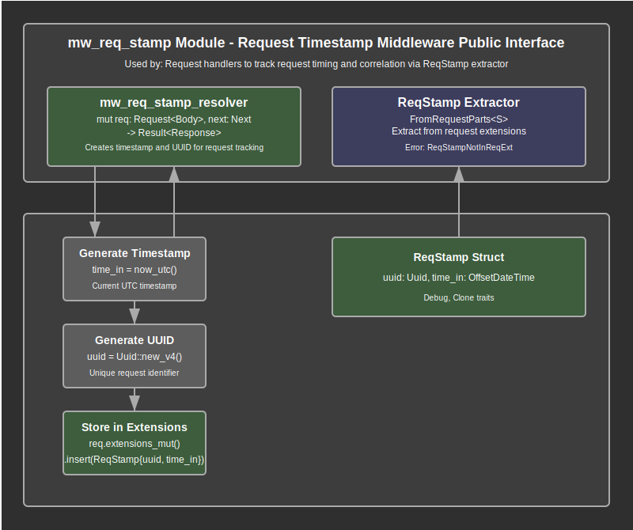

# Request Stamp Middleware Documentation

## Overview

The request stamp middleware (`mw_req_stamp`) provides request identification and timing capabilities for the web application. This module serves as the foundational layer for request tracking, generating unique identifiers and precise timestamps for each incoming HTTP request. It enables comprehensive request correlation, timing analysis, and audit trail functionality across the application lifecycle.

The module implements a dual-purpose system through the `mw_req_stamp_resolver` middleware function that creates request stamps and the `ReqStamp` type that serves as both a data structure and an extractor. This design enables efficient request tracking while providing convenient access to timing and identification data throughout the request processing pipeline.

Key responsibilities include generating unique request identifiers (UUIDs), capturing precise request initiation timestamps, storing timing data in request extensions, providing convenient extractor interface for downstream handlers, and enabling request correlation across distributed operations. The module integrates seamlessly with the middleware stack to provide foundational tracking capabilities.

## API Summary

### Key Types

#### `ReqStamp`

A cloneable struct that contains essential request identification and timing information.

```rust
#[derive(Debug, Clone)]
pub struct ReqStamp {
    pub uuid: Uuid,
    pub time_in: OffsetDateTime,
}
```

The `ReqStamp` struct captures the essential metadata for request tracking and timing analysis. The UUID provides a unique identifier for correlating request data across different system components, while the timestamp enables precise duration calculations and request timing analysis.

**Fields:**
- `uuid: Uuid` - Unique identifier generated for each request using UUID v4
- `time_in: OffsetDateTime` - Precise UTC timestamp captured at request initiation

**Traits:**
- `Debug` - Enables debug formatting for development and logging
- `Clone` - Allows efficient copying of stamp data across request handlers

#### `ReqStamp` as Extractor

The `ReqStamp` type implements `FromRequestParts` to serve as an Axum extractor for convenient access in handlers.

```rust
impl<S: Send + Sync> FromRequestParts<S> for ReqStamp {
    type Rejection = Error;

    async fn from_request_parts(parts: &mut Parts, _state: &S) -> Result<Self> {
        // Extracts ReqStamp from request extensions
    }
}
```

### Key Functions

#### `mw_req_stamp_resolver`

The primary middleware function that creates and attaches request stamps to incoming requests.

```rust
pub async fn mw_req_stamp_resolver(
    mut req: Request<Body>,
    next: Next,
) -> Result<Response>
```

**Parameters:**
- `mut req: Request<Body>` - Mutable HTTP request allowing extension modification
- `next: Next` - Next middleware or handler in the processing chain

**Returns:** A `Result<Response>` indicating successful processing or an error

**Functionality:**
1. Generates current UTC timestamp using `now_utc()`
2. Creates unique UUID v4 identifier for request correlation
3. Constructs `ReqStamp` instance with timing and identification data
4. Inserts stamp into request extensions for downstream access
5. Continues request processing through the middleware chain

**Example Usage:**
```rust
// Applied as middleware in route configuration
let app = Router::new()
    .route("/api/users", post(create_user))
    .layer(from_fn(mw_req_stamp_resolver));

// Accessed in handlers via extractor
async fn create_user(req_stamp: ReqStamp, payload: Json<UserData>) -> Response {
    println!("Request ID: {}", req_stamp.uuid);
    // Handler implementation
}
```

## Details

### Architecture

The request stamp middleware follows a simple but effective two-layer architecture that provides request identification and timing services:

1. **Middleware Layer**: Intercepts all incoming requests to generate and attach stamp data
2. **Extractor Layer**: Provides convenient access to stamp data throughout the request lifecycle
3. **Data Storage Layer**: Utilizes Axum's request extensions system for efficient data transport
4. **Integration Layer**: Seamlessly integrates with timing utilities and error handling systems

### Data Flow Process

The request stamping process follows these steps for each incoming request:

1. **Middleware Interception**: The `mw_req_stamp_resolver` function intercepts the incoming request
2. **Timestamp Generation**: Current UTC timestamp is captured using the `now_utc()` utility function
3. **UUID Generation**: A new UUID v4 is generated to provide unique request identification
4. **Stamp Creation**: The `ReqStamp` struct is constructed with the timestamp and UUID data
5. **Extension Storage**: The stamp data is inserted into the request's extensions map
6. **Request Continuation**: The request is passed to the next middleware or handler in the chain
7. **Extractor Access**: Downstream handlers can access stamp data using the `ReqStamp` extractor
8. **Data Retrieval**: The extractor retrieves stamp data from request extensions
9. **Error Handling**: Missing stamp data results in `ReqStampNotInReqExt` error
10. **Request Completion**: Stamp data remains available throughout the entire request lifecycle

### Timing Precision Strategy

The module implements high-precision timing measurement for accurate request duration calculations:

- **UTC Standardization**: All timestamps use UTC timezone to ensure consistency across deployments
- **High-Resolution Timing**: The `now_utc()` utility provides microsecond-precision timestamps
- **OffsetDateTime Usage**: Uses the `time` crate's `OffsetDateTime` for robust time handling
- **Immutable Timestamps**: Stamp creation time is immutable, ensuring accurate duration calculations
- **Early Capture**: Timestamps are captured as early as possible in the request processing pipeline

### Error Handling Strategy

The module implements straightforward error handling focused on data availability:

1. **Extension Validation**: The extractor validates that stamp data exists in request extensions
2. **Type Safety**: Strong typing ensures only valid `ReqStamp` instances are stored and retrieved
3. **Error Propagation**: Missing stamp data results in `Error::ReqStampNotInReqExt` for proper error handling
4. **Graceful Degradation**: Errors in stamp access don't crash the application but provide clear feedback
5. **Debug Integration**: Error conditions are logged for debugging and monitoring purposes

### Resource Management

The middleware manages resources efficiently with minimal overhead:

- **Stack Allocation**: `ReqStamp` is a simple struct with minimal memory footprint
- **UUID Efficiency**: UUID generation is optimized for performance using the `uuid` crate
- **Extension System**: Leverages Axum's efficient request extensions for data storage
- **Memory Cleanup**: Request extensions are automatically cleaned up when requests complete
- **Clone Semantics**: Efficient cloning allows data sharing without expensive deep copies

### Security Considerations

1. **UUID Unpredictability**: UUID v4 generation provides cryptographically random identifiers
2. **Data Isolation**: Request stamps are isolated per request and cannot leak between requests
3. **No Sensitive Data**: Timestamps and UUIDs contain no sensitive application data
4. **Extension Security**: Request extensions are scoped to individual requests preventing data leakage
5. **Timing Attack Resistance**: UUID generation timing is not predictable or exploitable

### Integration Points

The request stamp middleware integrates with several key system components:

- **Timing Utilities (`lib_utils::time`)**: Provides high-precision UTC timestamp generation
- **Error System**: Integrates with application error types for consistent error handling
- **Logging System (`tracing`)**: Outputs debug information for development and troubleshooting
- **Authentication Middleware**: Stamp data is available for user context correlation
- **Logging Middleware (`log`)**: Provides timing data for comprehensive request logging
- **Response Mapping**: Enables duration calculation for complete request timing analysis

### Data Structure Design

The `ReqStamp` structure is designed for simplicity and efficiency:

```rust
pub struct ReqStamp {
    // Unique identifier for request correlation across system components
    pub uuid: Uuid,

    // Precise UTC timestamp for duration calculations and timing analysis
    pub time_in: OffsetDateTime,
}
```

**Design Principles:**
- **Minimal Fields**: Only essential data is stored to minimize memory usage
- **Public Access**: Fields are public for direct access when needed
- **Type Safety**: Strong typing prevents invalid data from being stored
- **Clone Efficiency**: Simple structure enables efficient cloning operations
- **Debug Support**: Debug trait provides clear representation for development

### Middleware Integration Pattern

The module follows Axum's standard middleware pattern with request extension storage:

```rust
// Middleware function signature
async fn mw_req_stamp_resolver(mut req: Request<Body>, next: Next) -> Result<Response>

// Extension storage pattern
req.extensions_mut().insert(ReqStamp { uuid, time_in });

// Extractor retrieval pattern
parts.extensions.get::<ReqStamp>().cloned().ok_or(Error::ReqStampNotInReqExt)
```

This pattern ensures:
- **Consistent Interface**: Standard middleware function signature
- **Type Safety**: Extensions system provides type-safe data storage and retrieval
- **Error Handling**: Clear error conditions when data is not available
- **Performance**: Efficient storage and retrieval through Axum's extension system

## Flow Diagram



## Implementation Notes

### Dependencies

The module relies on several key dependencies for its functionality:

- **Axum**: Core HTTP types including `Request`, `Response`, `Next`, and extension system
- **lib_utils**: Time utilities providing the `now_utc()` function for precise timestamp generation
- **time**: High-precision date and time handling with `OffsetDateTime` type
- **uuid**: UUID generation capabilities for unique request identification
- **tracing**: Debug logging output for development and troubleshooting
- **lib-core**: Error types for consistent error handling across the application

### Design Decisions

1. **Simple Structure**: The `ReqStamp` struct contains only essential data to minimize overhead
2. **Extension Storage**: Uses Axum's request extensions for efficient and type-safe data transport
3. **Early Generation**: Stamps are created as early as possible for accurate timing measurements
4. **Extractor Pattern**: Implements `FromRequestParts` for convenient handler access
5. **Public Fields**: Direct field access provides flexibility for advanced use cases
6. **UUID v4**: Uses random UUIDs for unpredictable and unique request identification

### Performance Considerations

- **Minimal Overhead**: Simple struct with two fields provides minimal memory footprint
- **Efficient UUID Generation**: The `uuid` crate provides optimized UUID generation
- **Stack Allocation**: Small struct size enables efficient stack allocation
- **Extension Efficiency**: Axum's extension system provides O(1) storage and retrieval
- **Clone Performance**: Simple structure enables fast cloning operations
- **Early Capture**: Timestamp generation occurs once per request minimizing timing overhead

### Future Enhancement Opportunities

The module provides a solid foundation for future enhancements:

- **Distributed Tracing**: UUID data can be used for distributed request tracing
- **Performance Metrics**: Timing data enables comprehensive performance analysis
- **Request Correlation**: UUID provides foundation for cross-service request correlation
- **Audit Logging**: Timing and identification data supports comprehensive audit trails
- **Rate Limiting**: Request identification enables sophisticated rate limiting strategies
- **Request Analytics**: Timestamp data supports request pattern analysis and optimization

### Testing Considerations

When testing the request stamp middleware:

- Test middleware function creates stamps correctly
- Verify UUID uniqueness across multiple requests
- Validate timestamp accuracy and UTC timezone
- Test extractor retrieval of stamp data
- Verify error handling when stamp data is missing
- Test integration with other middleware components
- Validate clone behavior and data integrity
- Test concurrent request handling and data isolation

### Usage Patterns

Common usage patterns for the request stamp middleware:

```rust
// Basic middleware application
let app = Router::new()
    .route("/api/endpoint", post(handler))
    .layer(from_fn(mw_req_stamp_resolver));

// Handler with stamp extraction
async fn handler(req_stamp: ReqStamp) -> Response {
    let request_id = req_stamp.uuid;
    let start_time = req_stamp.time_in;
    // Handler logic
}

// Duration calculation example
async fn timed_handler(req_stamp: ReqStamp) -> Response {
    let duration = now_utc() - req_stamp.time_in;
    println!("Request took: {}ms", duration.whole_milliseconds());
    // Handler logic
}

// Request correlation example
async fn correlated_handler(req_stamp: ReqStamp) -> Response {
    tracing::info!("Processing request {}", req_stamp.uuid);
    // Handler logic with request correlation
}
```
