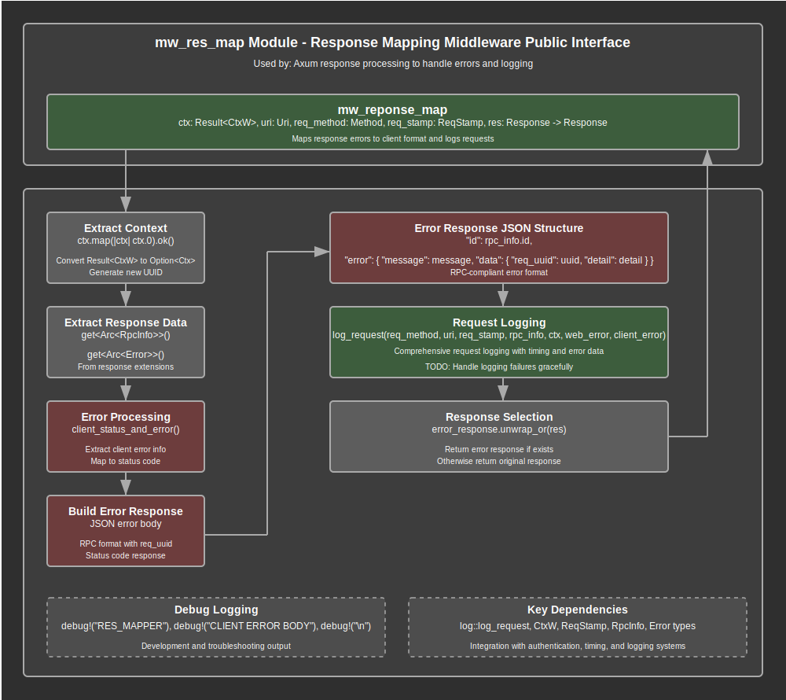

# Response Mapping Middleware Documentation

## Overview

The response mapping middleware (`mw_res_map`) provides comprehensive response processing and error handling capabilities for the web application. This module serves as the final processing layer in the middleware stack, responsible for transforming server errors into client-friendly responses, performing comprehensive request logging, and ensuring consistent error format across all API endpoints.

The module implements a unified response processing interface through the `mw_reponse_map` function that processes outgoing responses from various handlers and middleware layers. This function examines response extensions for error information, constructs appropriate client error responses in RPC-compliant format, and coordinates with the logging system to capture complete request lifecycle data.

Key responsibilities include extracting error information from response extensions, transforming server errors into client-appropriate formats, building RPC-compliant error responses with proper status codes, coordinating comprehensive request logging with timing and context data, and ensuring consistent error presentation across all API endpoints. The module integrates seamlessly with the middleware stack to provide final response processing capabilities.

## API Summary

### Key Functions

#### `mw_reponse_map`

The primary response mapping function that processes responses and handles error transformation and logging.

```rust
pub async fn mw_reponse_map(
    ctx: Result<CtxW>,      // Authentication context wrapper
    uri: Uri,               // Request URI
    req_method: Method,     // HTTP method
    req_stamp: ReqStamp,    // Request timing and identification
    res: Response,          // Original response from handlers
) -> Response
```

**Parameters:**
- `ctx: Result<CtxW>` - Authentication context result from middleware chain (Note: Axum 0.8 no longer supports Option)
- `uri: Uri` - Request URI containing path and query parameters for logging
- `req_method: Method` - HTTP method (GET, POST, etc.) for logging and analysis
- `req_stamp: ReqStamp` - Request timestamp and UUID information for correlation
- `res: Response` - Original response from handlers or upstream middleware

**Returns:** A `Response` containing either a transformed error response or the original response

**Functionality:**
1. Extracts authentication context from `Result<CtxW>` and converts to `Option<Ctx>`
2. Generates new UUID for error response correlation
3. Extracts RPC information and error data from response extensions
4. Processes server errors to determine client error status and format
5. Builds RPC-compliant error responses when client errors are detected
6. Coordinates comprehensive request logging with all available context data
7. Returns either the constructed error response or original response

**Example Usage:**
```rust
// Applied as response middleware in route configuration
let app = Router::new()
    .route("/rpc", post(rpc_handler))
    .layer(map_response_with_state(
        app_state.clone(),
        mw_reponse_map
    ));

// Error response format (JSON output)
{
    "id": "1",
    "error": {
        "message": "UserNotFound",
        "data": {
            "req_uuid": "550e8400-e29b-41d4-a716-446655440000",
            "detail": "User with id 123 not found"
        }
    }
}
```

### Error Response Structure

The module constructs RPC-compliant error responses with a standardized JSON format:

```rust
// Client error body structure
{
    "id": rpc_info.id,           // RPC request ID for correlation
    "error": {
        "message": message,       // Error variant name
        "data": {
            "req_uuid": uuid,     // Request correlation UUID
            "detail": detail      // Detailed error information
        }
    }
}
```

**Response Components:**
- **ID Field**: RPC request identifier for client-side correlation (from `RpcInfo`)
- **Error Message**: Error variant name extracted from server error for client categorization
- **Request UUID**: Unique identifier for request correlation and debugging
- **Error Detail**: Detailed error information extracted from server error data
- **Status Code**: Appropriate HTTP status code mapped from server error type

## Details

### Architecture

The response mapping middleware follows a transformation and coordination architecture that processes responses before final delivery:

1. **Context Extraction Layer**: Processes authentication context from middleware chain results
2. **Extension Processing Layer**: Extracts RPC and error information from response extensions
3. **Error Analysis Layer**: Analyzes server errors to determine client error representation
4. **Response Construction Layer**: Builds RPC-compliant error responses with proper formatting
5. **Logging Coordination Layer**: Orchestrates comprehensive request logging with all context data
6. **Response Selection Layer**: Chooses between error response and original response for final delivery

### Data Flow Process

The response mapping process follows these steps for each response:

1. **Context Processing**: Authentication context is extracted from `Result<CtxW>` and converted to `Option<Ctx>`
2. **UUID Generation**: A new UUID is generated for error response correlation and debugging
3. **Extension Extraction**: RPC information and error data are extracted from response extensions
4. **Error Analysis**: Server errors are analyzed using `client_status_and_error()` to determine client representation
5. **Error Response Construction**: RPC-compliant error responses are built when client errors are detected
6. **JSON Serialization**: Error data is serialized to JSON with proper message and detail extraction
7. **Response Building**: Complete HTTP responses are constructed with appropriate status codes
8. **Request Logging**: Comprehensive logging is performed with all available context and error data
9. **Response Selection**: Either the error response or original response is selected for final delivery
10. **Debug Output**: Development logging provides visibility into response processing

### Error Transformation Strategy

The module implements sophisticated error transformation from server to client format:

1. **Server Error Detection**: Response extensions are examined for `Arc<Error>` instances
2. **Client Error Mapping**: Server errors are mapped to client errors using `client_status_and_error()`
3. **Status Code Extraction**: Appropriate HTTP status codes are determined from error types
4. **Message Extraction**: Error variant names are extracted for client categorization
5. **Detail Processing**: Detailed error information is extracted from JSON serialization
6. **RPC Format Construction**: Client errors are formatted according to RPC specification
7. **Response Replacement**: Original responses are replaced with error responses when appropriate

### Error Response Format Design

The error response format follows RPC specification and includes comprehensive debugging information:

```rust
let client_error_body = json!({
    "id": rpc_info.as_ref().map(|rpc| rpc.id.clone()),
    "error": {
        "message": message,    // Error variant name for client handling
        "data": {
            "req_uuid": uuid.to_string(),  // Request correlation
            "detail": detail               // Detailed error information
        }
    }
});
```

**Design Principles:**
- **RPC Compliance**: Follows JSON-RPC error response specification
- **Client Debugging**: Includes request UUID for client-side debugging and correlation
- **Error Categorization**: Message field provides error type for client error handling
- **Detailed Information**: Detail field contains specific error context when available
- **Request Correlation**: RPC ID enables request/response correlation in client applications

### Logging Integration Strategy

The module coordinates comprehensive request logging through integration with the log system:

1. **Parameter Aggregation**: All available request data is collected for logging
2. **Context Inclusion**: Authentication context is included when available
3. **Error Data Processing**: Both server and client error information is prepared for logging
4. **Timing Information**: Request timing data from `ReqStamp` is included for performance analysis
5. **RPC Information**: RPC method and ID information is included for API analysis
6. **Asynchronous Logging**: Logging operations are performed asynchronously to avoid blocking responses
7. **Error Tolerance**: Logging failures are handled gracefully without affecting response delivery

### Resource Management

The response mapping middleware manages resources efficiently:

- **Arc Handling**: Shared references to RPC and error data are processed efficiently
- **Memory Efficiency**: Temporary data structures are created only when needed
- **JSON Processing**: Error serialization is performed only for client error responses
- **Extension Cleanup**: Response extensions are automatically cleaned up after processing
- **Async Operations**: Logging operations are non-blocking and don't delay response delivery

### Security Considerations

1. **Error Information Filtering**: Server errors are filtered to prevent sensitive information disclosure
2. **Client Error Mapping**: Only appropriate error information is exposed to clients
3. **Request Correlation**: UUIDs provide debugging capability without exposing sensitive data
4. **Context Validation**: Authentication context is processed only when properly validated
5. **Debug Information**: Debug logging is controlled and doesn't expose sensitive data in production

### Integration Points

The response mapping middleware integrates with several key system components:

- **Authentication Middleware (`mw_auth`)**: Receives authentication context through `CtxW` wrapper
- **Request Stamp Middleware (`mw_req_stamp`)**: Receives timing and identification data through `ReqStamp`
- **RPC Handlers**: Processes RPC information and error data from handler extensions
- **Error System**: Integrates with application error types for comprehensive error handling
- **Logging System (`log`)**: Coordinates with logging infrastructure for request logging
- **Response Extensions**: Utilizes Axum's extension system for cross-cutting data transport

### Data Structure Integration

The module integrates with several key data structures:

```rust
// Context wrapper from authentication middleware
Result<CtxW> -> Option<Ctx>

// Request identification and timing from request stamp middleware  
ReqStamp { uuid: Uuid, time_in: OffsetDateTime }

// RPC information from handlers
Arc<RpcInfo> { id: String, method: String }

// Error information from handlers or middleware
Arc<Error> -> (StatusCode, ClientError)

// Response extensions for cross-cutting data transport
response.extensions().get::<Arc<Type>>()
```

### Async Processing Pattern

The module follows async processing patterns for non-blocking operations:

```rust
// Async function signature for non-blocking response processing
pub async fn mw_reponse_map(...) -> Response

// Async logging coordination without blocking response delivery
let _ = log_request(...).await;

// Error handling that doesn't propagate logging failures
// TODO: Need to handle if log_request fail (but should not fail request)
```

## Flow Diagram



## Implementation Notes

### Dependencies

The module relies on several key dependencies for its functionality:

- **Axum**: Core HTTP types including `Method`, `Uri`, `Response`, and `Json` for response construction
- **serde_json**: JSON serialization capabilities for error response construction and data extraction
- **uuid**: UUID generation for error response correlation and debugging
- **std::sync::Arc**: Shared ownership for RPC and error data from response extensions
- **tracing**: Debug logging output for development, troubleshooting, and monitoring
- **Application Modules**: Integration with `error`, `log`, `handlers_rpc`, `mw_auth`, and `mw_req_stamp`

### Design Decisions

1. **Single Function Approach**: One comprehensive response mapping function handles all response types
2. **Extension-Based Data Transport**: Uses Axum's response extensions for cross-cutting data transport
3. **RPC-Compliant Format**: Error responses follow JSON-RPC specification for consistency
4. **Async Logging**: Logging operations are asynchronous to prevent response delays
5. **Error Tolerance**: Logging failures don't affect response delivery to ensure system reliability
6. **UUID Generation**: New UUIDs are generated for error correlation separate from request UUIDs

### Performance Considerations

- **Conditional Processing**: Error response construction occurs only when client errors are detected
- **Arc Efficiency**: Shared references avoid expensive data cloning for RPC and error information
- **JSON Serialization**: Error serialization is performed only when needed for client responses
- **Async Logging**: Non-blocking logging operations prevent response delays
- **Extension Access**: O(1) extension access provides efficient data retrieval
- **Memory Efficiency**: Temporary data structures are minimized and automatically cleaned up

### Error Handling Strategy

The module implements comprehensive error handling across multiple dimensions:

1. **Server Error Processing**: Server errors are safely extracted and transformed
2. **Client Error Construction**: Client errors are built with proper error handling
3. **JSON Serialization**: Error data serialization handles potential failures gracefully
4. **Logging Error Tolerance**: Logging failures are captured but don't affect response delivery
5. **Extension Safety**: Extension access handles missing data gracefully
6. **Response Fallback**: Original responses are returned when error processing fails

### Future Enhancement Opportunities

The module includes preparation for future enhancements:

- **Logging Error Handling**: TODO comment indicates planned improvement for logging failure handling
- **Metrics Integration**: Response processing data can support metrics collection
- **Error Response Customization**: Structure supports customizable error response formats
- **Performance Monitoring**: Timing data enables response processing performance analysis
- **Security Enhancements**: Error filtering can be enhanced for additional security measures

### Testing Considerations

When testing the response mapping middleware:

- Test with various authentication context states (success, failure, missing)
- Verify error response construction with different error types
- Validate JSON serialization of error responses
- Test logging coordination with various parameter combinations
- Ensure proper handling of missing extension data
- Verify response selection logic (error vs original)
- Test async logging operations and error tolerance
- Validate RPC compliance of error response format
- Test UUID generation and correlation capabilities
- Ensure proper resource cleanup and memory management

### Debug and Monitoring Features

The module provides comprehensive debug and monitoring capabilities:

```rust
// Debug output for development and troubleshooting
debug!("{:<12} - mw_reponse_map", "RES_MAPPER");
debug!("CLIENT ERROR BODY:\n{client_error_body}");
debug!("\n");

// Error response correlation
"req_uuid": uuid.to_string()  // For client-side debugging

// Comprehensive logging integration
log_request(req_method, uri, req_stamp, rpc_info, ctx, web_error, client_error)
```

These features enable effective debugging, monitoring, and troubleshooting of response processing operations.