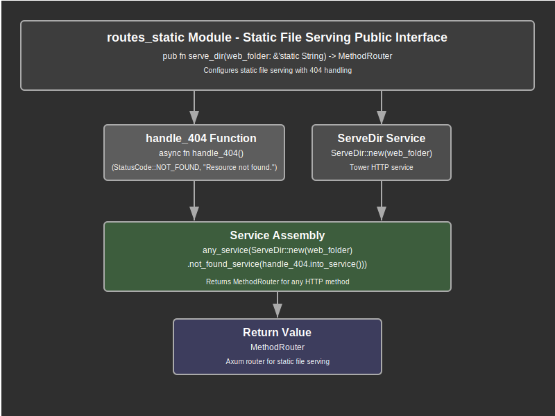

# Routes Static Module Documentation

## Overview

The routes_static module provides static file serving capabilities for the web application. This module serves as a specialized routing handler that enables serving static assets such as CSS, JavaScript, images, and other web resources directly from the filesystem using high-performance static file handling.

The module implements a streamlined static file serving interface through the `serve_dir` function that creates a routing service for serving files from a specified directory path. This function configures a complete static file server with custom error handling, providing a robust solution for serving web assets with proper HTTP status codes and error responses.

Key responsibilities include configuring static file serving middleware, implementing custom 404 error handling for missing resources, creating method-agnostic routing services, integrating with the Axum routing system, and providing efficient file system access with proper error responses. The module focuses on simplicity and performance for static asset delivery.

## API Summary

### Key Functions

#### `serve_dir`

The primary function that creates a static file serving router for a specified directory.

```rust
pub fn serve_dir(web_folder: &'static String) -> MethodRouter
```

**Parameters:**
- `web_folder`: A static string reference pointing to the filesystem directory containing static files to serve

**Returns:** A `MethodRouter` that handles all HTTP methods for static file requests

**Example Usage:**
```rust
use crate::routes::routes_static::serve_dir;

// Create static file router for web assets
let static_router = serve_dir(&"/path/to/web/assets".to_string());

// Mount in main router
let app = Router::new()
    .nest_service("/static", static_router);
```

### Internal Components

#### `handle_404`

An internal async function that provides custom 404 error responses for missing static files.

```rust
async fn handle_404() -> (StatusCode, &'static str)
```

**Returns:** A tuple containing `StatusCode::NOT_FOUND` and a static error message

This function is used internally by the `ServeDir` service to provide consistent error responses when requested static files are not found in the specified directory.

## Details

### Architecture

The routes_static module follows a service-based architecture that leverages Tower's service ecosystem:

1. **Service Configuration Layer**: Creates and configures the `ServeDir` service with custom error handling
2. **Error Handling Layer**: Implements custom 404 responses for missing files
3. **Method Router Layer**: Wraps the service in an Axum `MethodRouter` for framework integration
4. **File System Interface Layer**: Interfaces with the operating system for file access and serving

### Data Flow Process

The static file serving process follows these steps:

1. **Router Configuration**: The `serve_dir` function creates a configured static file service
2. **Service Creation**: A `ServeDir` service is instantiated with the specified directory path
3. **Error Handler Assignment**: Custom 404 error handling is configured for missing files
4. **Method Router Wrapping**: The service is wrapped in a `MethodRouter` for Axum compatibility
5. **Request Processing**: Incoming requests are processed by the `ServeDir` service
6. **File Resolution**: The service attempts to locate the requested file in the filesystem
7. **Content Serving**: Found files are served with appropriate headers and status codes
8. **Error Response**: Missing files trigger the custom 404 error handler

### Service Design Strategy

The module uses Tower's service architecture for optimal performance:

- **Service-First Approach**: Returns a `MethodRouter` rather than a full `Router` since `ServeDir` is already a service
- **Method Agnostic**: Uses `any_service` to handle all HTTP methods appropriately
- **Error Service Integration**: Custom error handling is integrated at the service level
- **Zero-Copy Design**: Static file serving leverages efficient file system operations

### Error Handling Strategy

The module implements focused error handling for static file scenarios:

1. **404 Not Found**: Custom handler provides clear error messages for missing files
2. **Consistent Response Format**: All error responses follow the same format pattern
3. **Service-Level Integration**: Error handling is integrated at the Tower service level
4. **Static Error Messages**: Error responses use static strings for performance

### Performance Characteristics

The static file serving implementation optimizes for performance:

- **Tower Service**: Leverages Tower's high-performance service abstractions
- **ServeDir Efficiency**: Uses `tower-http`'s optimized `ServeDir` implementation
- **Method Router**: Minimal overhead routing with `any_service` configuration
- **Static Directory**: Single directory configuration minimizes path resolution overhead

### Security Considerations

1. **Path Traversal Protection**: `ServeDir` includes built-in protection against directory traversal attacks
2. **Directory Boundaries**: File serving is restricted to the specified directory and its subdirectories
3. **Error Information**: 404 responses don't leak filesystem structure information
4. **Static Content**: Only serves files from the configured directory, preventing access to system files

### Integration Points

The routes_static module integrates with several key system components:

- **Axum Router**: Provides `MethodRouter` for integration with the main application router
- **Tower HTTP**: Uses `tower-http::services::ServeDir` for efficient static file serving
- **File System**: Direct integration with the operating system's file system for asset access
- **HTTP Layer**: Proper HTTP status codes and headers for static file responses

### Configuration Design

The module follows a simple configuration approach:

```rust
// Single directory configuration
pub fn serve_dir(web_folder: &'static String) -> MethodRouter
```

- **Static Lifetime**: Directory path must have static lifetime for service configuration
- **Single Directory**: One function serves one directory for clear resource boundaries
- **Immutable Configuration**: Directory path is set at creation time and cannot be changed

### Usage Patterns

Common integration patterns with the routes_static module:

```rust
// Basic static file serving
let static_files = serve_dir(&"/var/www/static".to_string());
app = app.nest_service("/assets", static_files);

// Multiple static directories
let css_files = serve_dir(&"/var/www/css".to_string());
let js_files = serve_dir(&"/var/www/js".to_string());
app = app
    .nest_service("/css", css_files)
    .nest_service("/js", js_files);

// Single page application support
let spa_files = serve_dir(&"/var/www/dist".to_string());
app = app.fallback_service(spa_files);
```

## Flow Diagram



## Implementation Notes

### Dependencies

The module relies on several key dependencies:

- **Axum**: Core framework types including `MethodRouter` and routing utilities
- **tower-http**: Provides the `ServeDir` service for efficient static file serving
- **HTTP Status Codes**: Uses Axum's HTTP types for proper status code responses

### Design Decisions

1. **Service-Based Approach**: Returns `MethodRouter` instead of full `Router` for efficiency
2. **Custom Error Handling**: Implements specific 404 handler rather than using defaults
3. **Method Agnostic**: Uses `any_service` to handle GET, HEAD, and OPTIONS requests appropriately
4. **Static Lifetime Requirement**: Directory path requires static lifetime for service lifecycle management
5. **Single Responsibility**: Each function call serves exactly one directory

### Performance Considerations

- **Service Efficiency**: Leverages Tower's optimized service ecosystem for maximum performance
- **File System Access**: Direct file system access without additional processing layers
- **Static Configuration**: Immutable configuration reduces runtime overhead
- **Method Router**: Minimal routing overhead with direct service integration

### Future Enhancement Opportunities

The module could be extended with additional capabilities:

- **Cache Headers**: Adding appropriate cache control headers for static assets
- **Compression**: Integration with compression middleware for optimized delivery
- **Directory Listing**: Optional directory browsing capabilities
- **Content Type Detection**: Enhanced MIME type detection for various file formats
- **Range Requests**: Support for partial content requests and byte-range serving

### Testing Considerations

When testing the routes_static module:

- Test serving various file types (HTML, CSS, JS, images)
- Verify 404 responses for missing files
- Test directory traversal attack prevention
- Validate proper HTTP headers and status codes
- Test integration with the main application router
- Verify performance with large files and many concurrent requests
