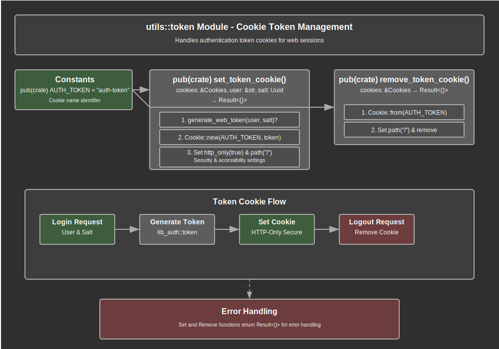

# Token Module Documentation

## Overview

The token module provides secure HTTP cookie-based authentication token management for the web application. This module serves as the web layer interface for token-based authentication, handling the secure creation, storage, and removal of authentication tokens through HTTP cookies. The module acts as a bridge between the lower-level authentication library (`lib-auth`) and the web application's cookie-based session management.

The module implements a simplified cookie management interface through two primary functions that handle token lifecycle operations. These functions integrate with the authentication middleware to maintain user sessions by managing authentication tokens stored in secure HTTP cookies. The module ensures proper security configurations for cookies including HTTP-only settings and path restrictions.

Key responsibilities include generating secure authentication tokens using cryptographic functions, creating properly configured HTTP cookies with security attributes, managing token cookie lifecycle through creation and removal operations, integrating with the authentication middleware for session management, and providing a clean interface between authentication logic and HTTP cookie operations. The module integrates seamlessly with both login handlers and authentication middleware to maintain secure user sessions.

## API Summary

### Key Constants

#### `AUTH_TOKEN`

The standard cookie name used for authentication tokens across the application.

```rust
pub(crate) const AUTH_TOKEN: &str = "auth-token";
```

This constant defines the standardized cookie name used throughout the web application for authentication tokens. The constant ensures consistency across all cookie operations and provides a single point of configuration for the authentication cookie naming.

### Key Functions

#### `set_token_cookie`

Creates and sets a secure HTTP cookie containing an authentication token for the specified user.

```rust
pub(crate) fn set_token_cookie(cookies: &Cookies, user: &str, salt: Uuid) -> Result<()>
```

**Parameters:**
- `cookies`: Reference to the tower-cookies Cookies object for cookie management
- `user`: String identifier for the user (typically username)
- `salt`: UUID salt value used in token generation for additional security

**Returns:** A Result indicating successful cookie creation or an error

**Security Features:**
- Sets `http_only` flag to prevent JavaScript access
- Configures cookie path to "/" for application-wide scope
- Uses cryptographically secure token generation

**Example Usage:**
```rust
// Called from login handler after successful authentication
set_token_cookie(&cookies, &user.username, user.token_salt)?;

// Called from authentication middleware for token refresh
set_token_cookie(cookies, &user.username, user.token_salt)
    .map_err(|_| CtxExtError::CannotSetTokenCookie)?;
```

#### `remove_token_cookie`

Removes the authentication token cookie from the client, effectively terminating the user session.

```rust
pub(crate) fn remove_token_cookie(cookies: &Cookies) -> Result<()>
```

**Parameters:**
- `cookies`: Reference to the tower-cookies Cookies object for cookie management

**Returns:** A Result indicating successful cookie removal or an error

**Example Usage:**
```rust
// Called from logout handler to terminate session
token::remove_token_cookie(&cookies)?;

// Called from authentication middleware when token validation fails
cookies.remove(Cookie::from(AUTH_TOKEN))
```

## Details

### Architecture

The token module follows a lightweight facade architecture that provides a simplified interface to complex authentication operations:

1. **Authentication Integration Layer**: Interfaces with `lib-auth` for cryptographic token generation
2. **Cookie Management Layer**: Handles HTTP cookie creation, configuration, and removal
3. **Security Configuration Layer**: Applies security settings to authentication cookies
4. **Error Handling Layer**: Provides consistent error handling for token operations
5. **Integration Interface Layer**: Exposes simple functions for use by handlers and middleware

### Data Flow Process

The token management process follows these key flows:

**Token Creation Flow:**
1. **Token Generation Request**: Function receives user identifier and cryptographic salt
2. **Cryptographic Token Creation**: `generate_web_token` creates secure token using user and salt
3. **Cookie Object Creation**: New HTTP cookie is created with token as value
4. **Security Configuration**: Cookie is configured with security attributes (HTTP-only, path)
5. **Cookie Placement**: Configured cookie is added to the response via Cookies interface

**Token Removal Flow:**
1. **Removal Request**: Function receives request to remove authentication cookie
2. **Cookie Object Creation**: Empty cookie object is created with standard AUTH_TOKEN name
3. **Path Configuration**: Cookie path is set to match original cookie configuration
4. **Cookie Removal**: Cookie is removed from client via Cookies interface

### Security Implementation Strategy

The module implements comprehensive security measures for authentication cookies:

1. **HTTP-Only Cookies**: `cookie.set_http_only(true)` prevents JavaScript access to authentication tokens
2. **Path Restriction**: `cookie.set_path("/")` ensures cookies are sent for all application paths
3. **Cryptographic Token Generation**: Leverages `lib-auth` for secure token creation with user-specific salts
4. **Consistent Cookie Naming**: Uses standardized AUTH_TOKEN constant to prevent naming conflicts
5. **Error Isolation**: Token operation failures don't expose sensitive information

### Cookie Configuration Details

Authentication cookies are configured with specific security attributes:

```rust
let mut cookie = Cookie::new(AUTH_TOKEN, token.to_string());
cookie.set_http_only(true);  // Prevents XSS attacks via
                             // JavaScript access
cookie.set_path("/");        // Ensures cookie is sent for
                             // all application paths
```

**Security Rationale:**
- **HTTP-Only Flag**: Prevents client-side JavaScript from accessing authentication tokens, mitigating XSS attacks
- **Path Configuration**: Ensures authentication cookies are available across the entire application scope
- **Secure Token Content**: Token values are generated using cryptographic functions with user-specific salts

### Integration Points

The token module integrates with several key system components:

- **Authentication Library (`lib-auth`)**: Uses `generate_web_token` for cryptographically secure token creation
- **Login Handlers (`handlers_login`)**: Called during successful authentication to establish user sessions
- **Authentication Middleware (`mw_auth`)**: Used for token refresh and session validation operations
- **Tower Cookies**: Leverages tower-cookies crate for HTTP cookie management and manipulation
- **Error System**: Integrates with application error types for consistent error handling

### Error Handling Strategy

The module implements comprehensive error handling:

1. **Token Generation Errors**: Cryptographic token generation failures are propagated from `lib-auth`
2. **Cookie Operation Errors**: Cookie management errors are handled through the Result type system
3. **Error Propagation**: Errors are consistently propagated to calling middleware and handlers
4. **Error Context Preservation**: Original error context is maintained through the Result chain
5. **Security Error Handling**: Authentication errors don't leak sensitive information

### Resource Management

The token module manages resources efficiently:

- **Memory Efficiency**: Cookie objects are created temporarily and managed by tower-cookies
- **Token Lifecycle**: Tokens are generated on-demand and not cached in memory
- **Cookie Cleanup**: Cookie removal properly cleans up client-side authentication state
- **Resource Isolation**: Token operations don't retain references to sensitive data

### Design Patterns

The module employs several key design patterns:

1. **Facade Pattern**: Provides simplified interface to complex authentication operations
2. **Dependency Injection**: Accepts Cookies reference for testability and flexibility
3. **Error Result Pattern**: Uses Rust Result type for comprehensive error handling
4. **Const Configuration**: Uses constants for standardized configuration values
5. **Module Visibility Control**: Functions are `pub(crate)` for controlled internal access

## Flow Diagram



## Implementation Notes

### Dependencies

The module relies on several key dependencies:

- **lib-auth**: Core authentication library providing `generate_web_token` function
- **tower-cookies**: HTTP cookie management for Axum web framework integration
- **uuid**: UUID type support for cryptographic salt values in token generation
- **Error System**: Application-specific error types for consistent error handling

### Design Decisions

1. **Crate-Only Visibility**: Functions are `pub(crate)` to limit access to internal web application components
2. **Reference Parameters**: Functions accept references to avoid unnecessary ownership transfers
3. **Const Cookie Name**: AUTH_TOKEN constant ensures consistent cookie naming across components
4. **Security-First Design**: All cookies are configured with security attributes by default
5. **Simple Interface**: Two-function interface keeps token management operations straightforward

### Performance Considerations

- **On-Demand Token Generation**: Tokens are generated only when needed, not pre-computed or cached
- **Minimal Processing**: Cookie operations involve minimal computational overhead
- **Reference Passing**: Function parameters use references to avoid unnecessary data copying
- **Efficient Cookie Management**: Leverages tower-cookies for optimized HTTP cookie handling
- **Zero-Copy Operations**: String operations minimize memory allocation where possible

### Security Considerations

1. **Token Freshness**: Every token setting operation generates a new cryptographic token
2. **Salt-Based Security**: Token generation uses user-specific UUID salts for additional security
3. **HTTP-Only Protection**: All authentication cookies prevent JavaScript access
4. **Path Security**: Cookie paths are configured to prevent unintended scope leakage
5. **Clean Session Termination**: Token removal properly clears client-side authentication state

### Testing Considerations

When testing the token module:

- Test token cookie creation with various user identifiers and salt values
- Verify HTTP-only and path attributes are properly set on created cookies
- Test cookie removal functionality and verify client-side state cleanup
- Validate error handling for token generation failures
- Ensure proper integration with tower-cookies framework
- Test with different CookieJar states and configurations
- Verify AUTH_TOKEN constant usage consistency

### Future Enhancement Opportunities

The module design supports several potential enhancements:

- **Cookie Expiration**: Add configurable expiration times for authentication cookies
- **Secure Flag Support**: Add HTTPS-only secure flag configuration for production environments
- **SameSite Configuration**: Implement SameSite cookie attribute for CSRF protection
- **Cookie Encryption**: Add optional cookie value encryption for additional security layers
- **Audit Logging**: Integration with logging system for authentication token operations
- **Token Rotation**: Implement automatic token rotation strategies for enhanced security
