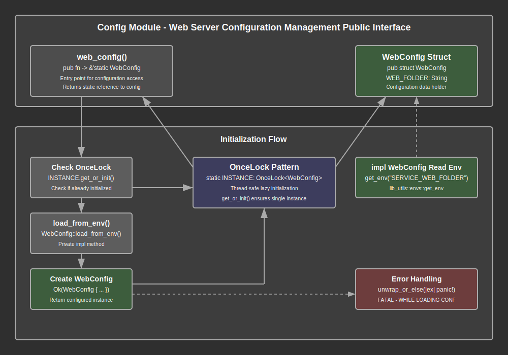

# Configuration Module Documentation

## Overview

The configuration module provides centralized environment-based configuration management for the web server. This module serves as the single source of truth for all web server configuration values, implementing a singleton pattern with lazy initialization to ensure consistent configuration access throughout the application lifecycle.

The module implements a simple yet robust configuration architecture through the `WebConfig` struct and `web_config()` function. The configuration is loaded once from environment variables at first access and cached statically for subsequent requests. This design ensures optimal performance while maintaining configuration consistency across all application components.

Key responsibilities include loading configuration values from environment variables, providing static singleton access to configuration data, implementing fail-fast behavior for missing required configuration, and ensuring thread-safe access to configuration values through OnceLock synchronization.

## API Summary

### Key Types

#### `WebConfig`

The primary configuration structure containing all web server configuration parameters.

```rust
#[allow(non_snake_case)]
pub struct WebConfig {
    pub WEB_FOLDER: String,
}
```

The `WebConfig` struct follows a convention where field names match their corresponding environment variable names exactly, using UPPER_SNAKE_CASE naming to maintain consistency with environment variable standards. The `non_snake_case` allow attribute is used to permit this naming convention while satisfying Rust's naming guidelines.

**Fields:**
- `WEB_FOLDER`: Path to the directory containing static web assets and files served by the web server

### Key Functions

#### `web_config`

The primary accessor function that provides singleton access to the web server configuration.

```rust
pub fn web_config() -> &'static WebConfig
```

**Returns:** A static reference to the singleton `WebConfig` instance

**Behavior:**
- First call initializes the configuration from environment variables
- Subsequent calls return the cached configuration instance
- Panics with detailed error message if configuration loading fails
- Thread-safe through OnceLock synchronization primitive

**Example Usage:**
```rust
// Access configuration in route handlers
async fn serve_static_files() -> Result<Response> {
    let config = web_config();
    let folder_path = &config.WEB_FOLDER;
    // Use folder_path for static file serving
}

// Access configuration in middleware
pub async fn static_file_middleware(req: Request<Body>) -> Response {
    let web_folder = &web_config().WEB_FOLDER;
    // Process static file requests using configured folder
}
```

#### `WebConfig::load_from_env` (Private)

Internal method responsible for loading configuration values from environment variables.

```rust
fn load_from_env() -> lib_utils::envs::Result<WebConfig>
```

**Returns:** Result containing loaded WebConfig or environment loading error

**Process:**
1. Reads `SERVICE_WEB_FOLDER` environment variable using lib_utils::envs::get_env
2. Constructs WebConfig instance with loaded values
3. Returns success result or propagates environment variable errors

**Error Handling:** Uses lib_utils::envs::Result for consistent error handling across the configuration loading process.

## Details

### Architecture

The configuration module follows a simple singleton architecture designed for performance and thread safety:

1. **Singleton Pattern**: Single global configuration instance accessible throughout the application
2. **Lazy Initialization**: Configuration is loaded only when first accessed, not at startup
3. **Static Caching**: Once loaded, configuration values are cached in static memory
4. **Thread Safety**: OnceLock ensures thread-safe initialization and access
5. **Fail-Fast Design**: Application panics immediately if required configuration is missing
6. **Environment Integration**: Direct integration with system environment variables

### Configuration Loading Process

The configuration loading follows these sequential steps:

1. **First Access**: Application code calls `web_config()` for the first time
2. **Initialization Check**: OnceLock determines if configuration has been loaded
3. **Environment Reading**: `load_from_env()` reads required environment variables
4. **Validation**: Environment variable presence and format are validated
5. **Instance Creation**: WebConfig struct is populated with loaded values
6. **Caching**: Loaded configuration is stored in static OnceLock instance
7. **Reference Return**: Static reference to configuration is returned to caller
8. **Subsequent Access**: Future calls return cached instance without re-reading environment

### Memory and Performance Model

The module implements an efficient memory and performance model:

#### Memory Characteristics
- **Static Allocation**: Configuration data is stored in static memory
- **Single Instance**: Only one WebConfig instance exists per application
- **String Ownership**: Configuration strings are owned by the static instance
- **Zero Copying**: Configuration access returns references, not copies

#### Performance Characteristics
- **First Access Cost**: Initial call performs environment variable reading and parsing
- **Subsequent Access Cost**: Near-zero cost reference lookup from static memory
- **Thread Contention**: OnceLock provides wait-free access after initialization
- **Memory Overhead**: Minimal memory footprint with single cached instance

### Error Handling Strategy

The configuration module implements a fail-fast error handling approach:

#### Environment Variable Errors
- **Missing Variables**: Application panics with descriptive error message
- **Invalid Values**: Errors are propagated from lib_utils::envs module
- **Detailed Context**: Panic messages include specific error cause information

#### Runtime Error Behavior
```rust
// Panic example when SERVICE_WEB_FOLDER is missing
FATAL - WHILE LOADING CONF - Cause: EnvVarNotFound("SERVICE_WEB_FOLDER")
```

This fail-fast approach ensures that configuration problems are detected immediately at startup rather than causing subtle runtime failures.

### Dependency Integration

The module integrates with key system dependencies:

- **lib_utils::envs**: Environment variable reading and validation
- **std::sync::OnceLock**: Thread-safe lazy initialization primitive
- **Environment System**: Direct integration with operating system environment variables

### Configuration Data Flow

Configuration data flows through the system following these patterns:

1. **Environment Variables**: System environment provides configuration source
2. **lib_utils::envs**: Environment variable extraction and validation
3. **WebConfig::load_from_env**: Configuration structure population
4. **OnceLock Storage**: Thread-safe static storage of configuration instance
5. **web_config() Access**: Public API for configuration access
6. **Application Usage**: Route handlers, middleware, and services access configuration
7. **Static References**: Configuration access returns borrowed references

### Security Considerations

The configuration module implements several security practices:

#### Environment Variable Security
- **No Secrets Storage**: Configuration contains paths, not sensitive credentials
- **Validation**: Environment variable format validation prevents injection
- **Immutable Access**: Configuration values cannot be modified after loading

#### Runtime Security
- **Static References**: Configuration cannot be mutated through public API
- **Thread Safety**: OnceLock prevents race conditions during initialization
- **Fail-Fast**: Missing configuration causes immediate application termination

### Configuration Extension Patterns

The module provides a foundation for future configuration expansion:

#### Adding New Configuration Values
```rust
#[allow(non_snake_case)]
pub struct WebConfig {
    pub WEB_FOLDER: String,
    pub WEB_PORT: u16,           // New configuration field
    pub WEB_HOST: String,        // Additional configuration field
}

impl WebConfig {
    fn load_from_env() -> lib_utils::envs::Result<WebConfig> {
        Ok(WebConfig {
            WEB_FOLDER: get_env("SERVICE_WEB_FOLDER")?,
            WEB_PORT: get_env("SERVICE_WEB_PORT")?,      // Load new field
            WEB_HOST: get_env("SERVICE_WEB_HOST")?,      // Load additional field
        })
    }
}
```

#### Environment Variable Naming Convention
- Prefix all web server variables with `SERVICE_WEB_`
- Use UPPER_SNAKE_CASE for environment variable names
- Match struct field names to environment variable names (minus the SERVICE_ prefix)

## Flow Diagram



## Implementation Notes

### Dependencies

The module relies on these key dependencies:

- **std::sync::OnceLock**: Thread-safe lazy initialization for singleton pattern
- **lib_utils::envs**: Environment variable reading with error handling and validation

### Design Decisions

1. **Singleton Pattern**: Ensures single source of truth for configuration across the application
2. **Lazy Initialization**: Defers configuration loading until first access for startup performance
3. **Static Caching**: Eliminates repeated environment variable reading overhead
4. **Fail-Fast Design**: Immediate panic on configuration errors prevents silent failures
5. **OnceLock Choice**: Provides thread-safe initialization without runtime overhead
6. **Field Naming Convention**: Matches environment variable names for clarity and consistency

### Environment Variable Requirements

The module requires specific environment variables to be set:

#### Required Variables

**SERVICE_WEB_FOLDER**
- **Purpose**: Specifies the directory path for static web assets
- **Type**: String (file system path)
- **Example**: `/var/www/static` or `./web-folder`
- **Usage**: Used by static file serving middleware and route handlers
- **Validation**: Must be a valid directory path accessible by the application

#### Environment Setup Examples

**Development Environment:**
```bash
export SERVICE_WEB_FOLDER="./web-folder"
```

**Production Environment:**
```bash
export SERVICE_WEB_FOLDER="/opt/app/static"
```

**Docker Environment:**
```dockerfile
ENV SERVICE_WEB_FOLDER="/app/web-folder"
```

**Container Orchestration:**
```yaml
env:
  - name: SERVICE_WEB_FOLDER
    value: "/app/static"
```

### Performance Considerations

The configuration module is optimized for high-performance access:

- **Zero-Cost Access**: After initialization, configuration access has no runtime overhead
- **Memory Efficiency**: Single static instance prevents multiple allocations
- **Thread Safety**: Lock-free access after initialization using OnceLock
- **Startup Cost**: One-time environment variable reading cost during first access
- **Cache Friendly**: Static memory location improves CPU cache performance

### Error Recovery Strategies

The module implements a fail-fast approach with no error recovery:

1. **No Recovery**: Configuration errors cause immediate application termination
2. **Clear Messaging**: Panic messages provide specific error context for debugging
3. **Early Detection**: Configuration problems are detected at first access, not at runtime
4. **Operational Clarity**: Missing configuration is treated as a deployment error, not a runtime condition

### Testing Considerations

When testing the configuration module:

- **Environment Isolation**: Tests should set/unset environment variables in isolated contexts
- **Static State**: Tests may need to handle static singleton state between test runs
- **Error Simulation**: Test behavior when required environment variables are missing
- **Thread Safety**: Verify concurrent access to configuration in multi-threaded scenarios
- **Integration Testing**: Test configuration integration with dependent modules

#### Test Environment Setup
```rust
#[cfg(test)]
mod tests {
    use super::*;
    use std::env;

    #[test]
    fn test_config_loading() {
        env::set_var("SERVICE_WEB_FOLDER", "/test/folder");
        let config = web_config();
        assert_eq!(config.WEB_FOLDER, "/test/folder");
        env::remove_var("SERVICE_WEB_FOLDER");
    }
}
```

### Usage Patterns

#### Static File Serving
```rust
use crate::config::web_config;

async fn serve_static_file(path: &str) -> Result<Response> {
    let web_folder = &web_config().WEB_FOLDER;
    let file_path = format!("{}/{}", web_folder, path);
    // Serve file from configured directory
}
```

#### Middleware Integration
```rust
pub async fn static_middleware(req: Request<Body>, next: Next) -> Response {
    if req.uri().path().starts_with("/static/") {
        let config = web_config();
        // Handle static file request using config.WEB_FOLDER
    } else {
        next.run(req).await
    }
}
```

#### Application Initialization
```rust
pub async fn start_server() -> Result<()> {
    // Configuration is automatically loaded on first access
    let server_config = web_config();
    println!("Serving static files from: {}", server_config.WEB_FOLDER);

    // Rest of server initialization
}
```

### Future Enhancement Opportunities

The configuration module provides a foundation for enhanced configuration management:

- **Configuration Validation**: Enhanced validation of configuration values beyond existence checks
- **Hot Reloading**: Dynamic configuration reloading without application restart
- **Configuration Sources**: Support for configuration files, databases, or remote configuration services
- **Environment Profiles**: Different configuration sets for development, staging, and production
- **Configuration Documentation**: Auto-generated documentation for configuration requirements
- **Type Safety**: Stronger typing for configuration values (URLs, ports, file paths)
- **Default Values**: Fallback configuration values when environment variables are not set
