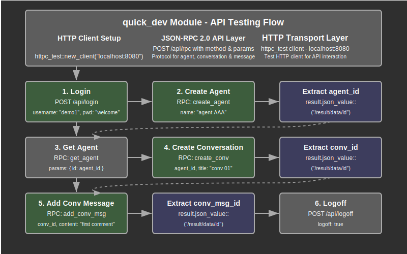

# Quick Development Testing Module Documentation

## Overview

The quick development testing module provides a comprehensive end-to-end testing framework for the web application's API endpoints. This module serves as an integration testing tool that validates the complete user workflow from authentication through core application functionality, ensuring all API endpoints work correctly together.

The module implements a sequential testing pattern that mirrors real user interactions with the application. It performs user authentication, creates application entities (agents and conversations), and tests CRUD operations through the JSON-RPC API interface. This approach validates not only individual endpoint functionality but also the integration between different system components.

Key responsibilities include authenticating users through the login endpoint, testing agent creation and retrieval operations, validating conversation management functionality, testing message creation within conversations, and ensuring proper session management through logout operations.

## API Summary

### Key Types

#### `Result<T>`

A type alias for the standard Result type used throughout the testing module.

```rust
pub type Result<T> = core::result::Result<T, Error>;
```

#### `Error`

A boxed dynamic error type that handles all error scenarios during testing.

```rust
pub type Error = Box<dyn std::error::Error>;
```

The error type provides flexible error handling for HTTP requests, JSON parsing, authentication failures, and any other errors that may occur during the testing process.

### Key Functions

#### `main`

The primary entry point that orchestrates the complete testing workflow.

```rust
#[tokio::main]
async fn main() -> Result<()>
```

**Returns:** Result indicating whether all tests completed successfully

**Process Flow:**
1. Initialize HTTP test client for localhost:8080
2. Perform user authentication with demo credentials
3. Create and retrieve an agent entity
4. Create a conversation associated with the agent
5. Add a message to the conversation
6. Perform user logout to clean up session

**Example Usage:**
```bash
# Run the quick development tests
cargo run --example quick_dev
```

## Details

### Architecture

The quick development module follows a linear integration testing architecture that validates the complete application stack:

1. **HTTP Client Layer**: Uses httpc_test crate for HTTP request management and response validation
2. **Authentication Layer**: Tests login/logout endpoints with credential validation
3. **JSON-RPC Layer**: Validates JSON-RPC 2.0 protocol implementation for API operations
4. **Entity Management Layer**: Tests CRUD operations for agents, conversations, and messages
5. **Session Management Layer**: Verifies proper session lifecycle from login to logout

### Testing Flow Process

The testing process follows these sequential steps:

1. **Client Initialization**: HTTP test client is created targeting the local development server
2. **User Authentication**: Login request is sent with demo user credentials (username: "demo1", password: "welcome")
3. **Agent Creation**: New agent entity is created using JSON-RPC create_agent method
4. **Agent Retrieval**: Created agent is retrieved using get_agent method to verify creation success
5. **Conversation Creation**: New conversation is created associated with the agent
6. **Message Addition**: Message is added to the conversation using add_conv_msg method
7. **Session Cleanup**: User logout is performed to properly terminate the session

### API Testing Coverage

The module provides comprehensive testing coverage for key API endpoints:

#### Authentication Endpoints
- **POST /api/login**: User authentication with username and password validation
- **POST /api/logoff**: Session termination and cleanup

#### JSON-RPC API Endpoints
- **create_agent**: Agent entity creation with name parameter
- **get_agent**: Agent retrieval by ID with existence validation
- **create_conv**: Conversation creation with agent association and title
- **add_conv_msg**: Message creation within conversation context

### Request Pattern Analysis

All JSON-RPC requests follow a consistent structure pattern:

```rust
json!({
    "jsonrpc": "2.0",
    "id": 1,
    "method": "method_name",
    "params": {
        "data": {
            // Method-specific parameters
        }
    }
})
```

This pattern ensures compatibility with JSON-RPC 2.0 specification and provides consistent request formatting across all API operations.

### Response Processing Strategy

The module implements comprehensive response processing:

1. **Response Printing**: All responses are printed for visual inspection and debugging
2. **JSON Value Extraction**: Specific values are extracted from JSON responses using path syntax
3. **ID Propagation**: Entity IDs are extracted and used in subsequent requests to maintain relationships
4. **Error Handling**: HTTP and parsing errors are propagated through the Result type

### Data Flow Architecture

The testing data flows through several key stages:

1. **Request Construction**: JSON requests are built using serde_json macros
2. **HTTP Transmission**: Requests are sent through httpc_test client to localhost server
3. **Response Reception**: HTTP responses are received and processed
4. **JSON Parsing**: Response bodies are parsed and specific values extracted
5. **State Management**: Extracted IDs are stored and used in subsequent requests
6. **Result Validation**: Response content is printed for manual verification

### Integration Testing Philosophy

The module implements integration testing best practices:

#### End-to-End Validation
- **Complete Workflow Testing**: Tests the entire user journey from login to logout
- **Entity Relationship Testing**: Validates proper relationships between agents, conversations, and messages
- **API Contract Testing**: Ensures JSON-RPC API conforms to expected interface specifications

#### Real Environment Testing
- **Local Server Testing**: Tests against actual running server instance
- **Network Protocol Testing**: Validates HTTP protocol handling and JSON serialization
- **Session State Testing**: Verifies proper session management across multiple requests

#### Manual Verification Support
- **Response Printing**: All responses are printed for manual inspection
- **Detailed Output**: Response content includes full JSON structure for verification
- **Error Visibility**: Any errors are clearly displayed for debugging

## Flow Diagram



## Implementation Notes

### Dependencies

The module relies on several key dependencies for its testing functionality:

- **tokio**: Async runtime for handling HTTP requests and JSON-RPC calls
- **httpc_test**: HTTP client testing library for making requests to the development server
- **serde_json**: JSON serialization and deserialization with macro support for request building
- **std::error::Error**: Standard error handling trait for flexible error management

### Design Decisions

1. **Linear Testing Flow**: Sequential test execution ensures proper entity relationships and dependencies
2. **Manual Verification**: Response printing allows developers to manually verify correct behavior
3. **Real Server Testing**: Tests against actual running server rather than mocks for realistic validation
4. **Entity ID Propagation**: Extracted IDs are used in subsequent requests to test entity relationships
5. **Simple Error Handling**: Boxed dynamic errors provide flexibility while keeping test code simple

### Security Considerations

1. **Test Credentials**: Uses demo credentials that should only exist in development environments
2. **Local Server Only**: Hardcoded to localhost:8080 to prevent accidental production testing
3. **Session Cleanup**: Properly logs out after testing to clean up authentication state
4. **No Sensitive Data**: All test data uses generic placeholder content

### Performance Considerations

- **Sequential Execution**: Tests run sequentially to ensure proper state management
- **Minimal Resource Usage**: Creates only necessary test entities during execution
- **Efficient JSON Processing**: Uses serde_json for optimal JSON serialization performance
- **Connection Reuse**: Single HTTP client instance is reused for all requests

### Development Workflow Integration

The module supports rapid development iteration:

1. **Quick Validation**: Fast execution provides immediate feedback on API changes
2. **Manual Inspection**: Printed responses allow developers to verify correct behavior
3. **Integration Verification**: Tests the complete stack rather than individual components
4. **Error Detection**: Immediate failure on any step helps identify regression issues

### Testing Considerations

When using the quick development module:

- **Server State**: Ensure the development server is running on localhost:8080
- **Database State**: Verify that demo user exists and test entities can be created
- **Clean State**: Run tests from a clean database state for consistent results
- **Output Review**: Manually review printed responses to verify correct behavior
- **Error Analysis**: Investigate any step failures to identify system issues
- **Performance Monitoring**: Monitor response times to detect performance regressions

### Usage Patterns

#### Running Integration Tests
```bash
# Start the development server
cargo run

# In another terminal, run the quick development tests
cargo run --example quick_dev
```

#### Verifying API Changes
```rust
// After making API changes, run quick_dev to verify:
// 1. Authentication still works correctly
// 2. Entity creation follows expected patterns
// 3. JSON-RPC responses maintain proper structure
// 4. Session management operates correctly
```

#### Debugging API Issues
```rust
// Use printed responses to debug:
// 1. Verify request format matches expected JSON-RPC structure
// 2. Check response status codes and content
// 3. Validate entity IDs are properly generated and returned
// 4. Ensure error responses provide adequate information
```

### Future Enhancement Opportunities

The quick development module provides a foundation for expanded testing capabilities:

- **Automated Assertions**: Add automated verification of response content and structure
- **Test Data Management**: Enhanced test data setup and cleanup capabilities
- **Performance Benchmarking**: Response time measurement and performance regression detection
- **Error Scenario Testing**: Comprehensive testing of error conditions and edge cases
- **API Version Testing**: Support for testing multiple API versions and compatibility
