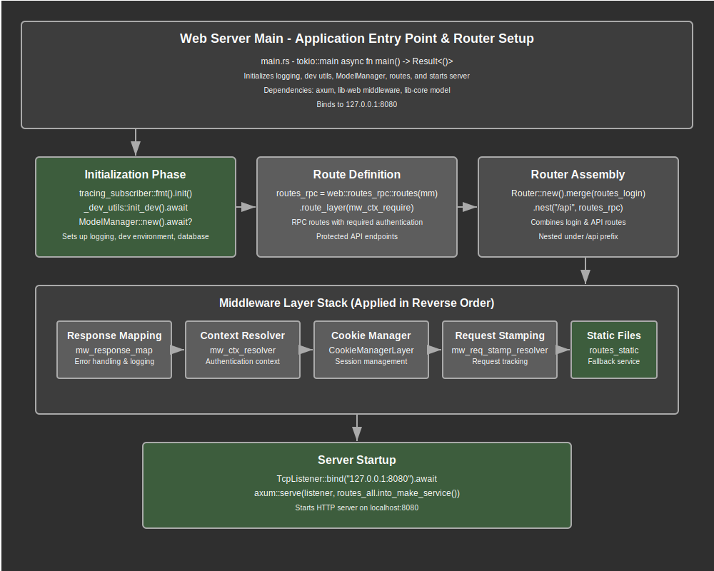

# Services Web-Server Main Module Documentation

## Overview

The `main` module serves as the primary entry point and application orchestrator for the Rust `services/web-server` application. This module is responsible for initializing the complete web application stack, configuring middleware layers, defining route hierarchies, and starting the HTTP server. It acts as the central coordinator that brings together authentication, routing, request processing, and static file serving into a cohesive web application.

The module implements a comprehensive web server architecture using the Axum framework with a layered middleware approach. Key responsibilities include configuring distributed tracing for observability, initializing development utilities for local development, creating the model manager for database operations, defining the complete route hierarchy with appropriate middleware layers, configuring authentication and authorization middleware, setting up request/response processing middleware, and starting the TCP listener on the configured address.

The application follows a modular design pattern where each functional area (authentication, routing, RPC handling) is separated into distinct modules while being coordinated through the main entry point. This design ensures maintainability, testability, and clear separation of concerns throughout the application.

## API Summary

### Key Components

#### Main Function

The application entry point that initializes and starts the web server.

```rust
#[tokio::main]
async fn main() -> Result<()>
```

**Process Flow:**
1. Initialize distributed tracing with environment-based filtering
2. Set up development utilities for local development mode
3. Create and configure the model manager for database operations
4. Define and configure all application routes with middleware
5. Start the TCP listener and serve the application

**Example Structure:**
```rust
#[tokio::main]
async fn main() -> Result<()> {
    // Initialize tracing
    tracing_subscriber::fmt()
        .without_time()
        .with_target(false)
        .with_env_filter(EnvFilter::from_default_env())
        .init();

    // Development setup
    _dev_utils::init_dev().await;

    // ModelManager initialization
    let mm = ModelManager::new().await?;

    // Route configuration and server startup
    // ...
}
```

#### Module Structure

The module organizes functionality into distinct areas:

```rust
// Core modules
mod config;     // Configuration management
mod error;      // Error types and handling
mod web;        // Web routing and handlers

// Public exports
pub use self::error::{Error, Result};
```

### Route Architecture

#### Protected RPC Routes

Routes requiring authentication for RPC functionality:

```rust
let routes_rpc = web::routes_rpc::routes(mm.clone())
    .route_layer(middleware::from_fn(mw_ctx_require));
```

**Middleware Stack:**
- `mw_ctx_require`: Enforces authentication requirement

#### Complete Route Hierarchy

The main route structure combining all application endpoints:

```rust
let routes_all = Router::new()
    .merge(routes_login::routes(mm.clone()))
    .nest("/api", routes_rpc)
    .layer(middleware::map_response(mw_response_map))
    .layer(middleware::from_fn_with_state(mm.clone(), mw_ctx_resolver))
    .layer(CookieManagerLayer::new())
    .layer(middleware::from_fn(mw_req_stamp_resolver))
    .fallback_service(routes_static::serve_dir(&web_config().WEB_FOLDER));
```

**Route Organization:**
- **Login Routes**: Authentication endpoints merged at root level
- **API Routes**: Protected RPC endpoints nested under `/api`
- **Static Files**: Fallback service for serving static assets
- **Middleware Layers**: Applied in specific order for proper request processing

#### Middleware Layer Ordering

The middleware stack is carefully ordered for optimal security and functionality:

1. **Request Stamping** (`mw_req_stamp_resolver`): Adds request timing and identification
2. **Cookie Management** (`CookieManagerLayer`): Handles HTTP cookie processing
3. **Authentication Context** (`mw_ctx_resolver`): Resolves authentication context
4. **Response Mapping** (`mw_response_map`): Maps responses and handles errors
5. **Authentication Requirement** (`mw_ctx_require`): Enforces authentication on protected routes

### Configuration Integration

#### Web Configuration

The module integrates with the configuration system:

```rust
use config::web_config;

// Used for static file serving
.fallback_service(routes_static::serve_dir(&web_config().WEB_FOLDER));
```

The `web_config()` function provides access to environment-based configuration settings, particularly the web folder path for static asset serving.

#### Server Binding

Server configuration with hardcoded development settings:

```rust
let listener = TcpListener::bind("127.0.0.1:8080").await.unwrap();
info!("{:<12} - {:?}\n", "LISTENING", listener.local_addr());
```

**Configuration Details:**
- **Address**: Localhost (127.0.0.1) for development
- **Port**: 8080 as the default development port
- **Logging**: Request listening information with structured formatting

## Details

### Application Architecture - A Composition of Modules

The main module implements a layered web application architecture having a clear separation of concerns. The layers are composed of the collection of modules that make up this project:

#### Infrastructure Layer
- **Tracing System**: Distributed tracing for request monitoring and debugging
- **Development Utilities**: Local development helpers and database seeding
- **Configuration Management**: Environment-based configuration loading
- **Error Handling**: Centralized error type definitions and propagation

#### Data Layer
- **Model Manager**: Database connection and transaction management
- **Entity Access**: User and application data through business model controllers
- **Transaction Scope**: Request-scoped database operations

#### Business Logic Layer
- **Authentication**: User login, logout, and session management
- **RPC Processing**: Remote procedure call handling for API functionality
- **Request Processing**: Middleware-based request and response processing

#### Presentation Layer
- **Route Definitions**: HTTP endpoint mapping and handler assignment
- **Middleware Stack**: Request/response processing pipeline
- **Static Asset Serving**: Frontend file delivery system

### Middleware Processing Pipeline

The application implements a sophisticated middleware pipeline for request processing:

#### Inbound Request Processing
1. **Request Stamping**: Adds unique identifiers and timing information
2. **Cookie Extraction**: Processes HTTP cookies for authentication tokens
3. **Authentication Resolution**: Resolves user context from authentication tokens
4. **Route Matching**: Matches requests to appropriate handlers
5. **Authentication Enforcement**: Validates authentication for protected routes

#### Outbound Response Processing
1. **Response Mapping**: Converts application results to HTTP responses
2. **Error Handling**: Maps application errors to appropriate HTTP status codes
3. **Cookie Updates**: Sets updated authentication cookies
4. **Response Logging**: Logs response details for monitoring

### Security Architecture

The main module establishes comprehensive security measures:

#### Authentication Security
- **Token-Based Authentication**: Cryptographic token validation for user identification
- **Session Management**: Automatic token refresh for active sessions
- **Cookie Security**: Secure HTTP cookie handling with appropriate flags
- **Context Isolation**: Request-scoped authentication context

#### Route Protection
- **Layered Security**: Different security requirements for different route groups
- **Authentication Enforcement**: Mandatory authentication for protected endpoints
- **Public Access**: Open access for login and static file endpoints
- **Graceful Degradation**: Appropriate error responses for authentication failures

#### Error Security
- **Information Disclosure Prevention**: Safe error messages that don't expose sensitive information
- **Audit Logging**: Comprehensive logging for security monitoring
- **Input Validation**: Request validation through middleware pipeline

### Development Support

The module includes comprehensive development support features:

#### Local Development
- **Development Utilities**: Database seeding and test data creation
- **Debug Logging**: Detailed request and response logging
- **Error Reporting**: Comprehensive error information for debugging
- **Hot Reloading Support**: Compatible with development tools for rapid iteration

#### Observability
- **Distributed Tracing**: Request flow tracking across system components
- **Structured Logging**: Consistent log formatting and information
- **Performance Monitoring**: Request timing and processing metrics
- **Error Tracking**: Comprehensive error capture and reporting

### Request Lifecycle

The complete request processing lifecycle:

#### Request Initiation
1. **TCP Connection**: Client establishes connection to server
2. **HTTP Parsing**: Axum parses HTTP request into structured format
3. **Route Matching**: Router determines appropriate handler for request path

#### Middleware Processing
1. **Request Stamping**: Unique identifier and timestamp assignment
2. **Cookie Processing**: Authentication token extraction from cookies
3. **Context Resolution**: Authentication context creation or error capture
4. **Route Processing**: Handler execution with middleware context

#### Response Generation
1. **Handler Execution**: Business logic processing with authenticated context
2. **Response Mapping**: Application result conversion to HTTP response
3. **Cookie Setting**: Updated authentication token in response cookies
4. **Response Delivery**: HTTP response transmission to client

### Integration Architecture

The main module integrates with multiple system components:

#### External Dependencies
- **Axum Framework**: Web server framework providing routing and middleware
- **Tokio Runtime**: Async runtime for concurrent request processing
- **Tower Ecosystem**: Middleware and service abstractions
- **Tracing System**: Distributed tracing and observability

#### Internal Dependencies
- **lib-core**: Core business logic and model management
- **lib-web**: Web-specific utilities and middleware
- **lib-utils**: Common utilities and configuration management
- **Application Modules**: Local configuration, error handling, and routing

#### Service Integration
- **Database Layer**: Model manager for data access operations
- **Authentication Service**: Token validation and user context management
- **Static File Service**: Asset serving for frontend resources
- **Logging Service**: Centralized logging and monitoring

## Flow Diagram



## Implementation Notes

### Dependencies

The module relies on several key dependencies for its functionality:

- **Axum**: Core web framework providing routing, middleware, and HTTP server capabilities
- **Tokio**: Async runtime for handling concurrent connections and operations
- **lib-core**: Core business logic including ModelManager and development utilities
- **lib-web**: Web-specific middleware, handlers, and utilities
- **tower-cookies**: HTTP cookie management and processing
- **tracing/tracing-subscriber**: Distributed tracing and logging infrastructure

### Error Handling Strategy

The module implements a comprehensive error handling approach:

1. **Result Type**: Uses application-specific Result type with Error enum
2. **Error Propagation**: Propagates errors from underlying layers (model, authentication)
3. **Graceful Failures**: Application startup failures result in panic with detailed error information
4. **Middleware Errors**: Different error handling strategies for different middleware layers

### Performance Considerations

The application is designed for high performance and scalability:

- **Async Processing**: Fully async implementation prevents blocking operations
- **Connection Pooling**: Database connections managed through ModelManager
- **Middleware Efficiency**: Minimal overhead middleware with early termination for failures
- **Static Asset Optimization**: Efficient static file serving through Axum's built-in capabilities
- **Memory Management**: Careful resource management and minimal allocations

### Security Considerations

Security is implemented at multiple levels:

1. **Authentication Pipeline**: Comprehensive token validation and user context management
2. **Route Protection**: Layered security with different requirements for different endpoints
3. **Error Information**: Safe error handling that doesn't expose sensitive information
4. **Cookie Security**: Secure cookie handling with appropriate flags and validation
5. **Input Validation**: Request validation through middleware pipeline

### Configuration Management

The module integrates with environment-based configuration:

- **Environment Variables**: Configuration loaded from environment variables
- **Default Values**: Sensible defaults for development environments
- **Configuration Validation**: Startup failure on invalid configuration
- **Static Configuration**: Some values (like server address) are hardcoded for development

### Development Workflow Support

The module supports efficient development workflows:

- **Development Utilities**: Automatic database setup and test data creation
- **Debug Logging**: Comprehensive logging for development debugging
- **Error Reporting**: Detailed error information for development troubleshooting
- **Hot Reloading**: Compatible with development tools for rapid iteration
- **Local Configuration**: Development-friendly default settings

### Testing Considerations

When testing the main module:

- **Integration Testing**: Test complete request/response cycles through the application
- **Middleware Testing**: Verify middleware ordering and interaction
- **Authentication Testing**: Test protected and unprotected route access
- **Error Handling Testing**: Verify appropriate error responses for various failure scenarios
- **Configuration Testing**: Test behavior with different configuration values
- **Static File Testing**: Verify static asset serving functionality

### Deployment Considerations

For production deployment:

- **Configuration**: Environment-specific configuration management
- **Security**: Production-appropriate security settings and middleware configuration
- **Monitoring**: Enhanced logging and monitoring for production environments
- **Performance**: Production-optimized settings for database connections and middleware
- **Error Handling**: Production-appropriate error responses and logging

### Future Enhancement Opportunities

The main module provides a foundation for future enhancements:

- **Microservice Architecture**: Potential extraction of components into separate services
- **Advanced Routing**: More sophisticated routing patterns and middleware
- **Enhanced Security**: Additional security layers and authentication methods
- **Performance Optimization**: Caching layers and performance monitoring
- **Service Discovery**: Integration with service discovery and load balancing systems
