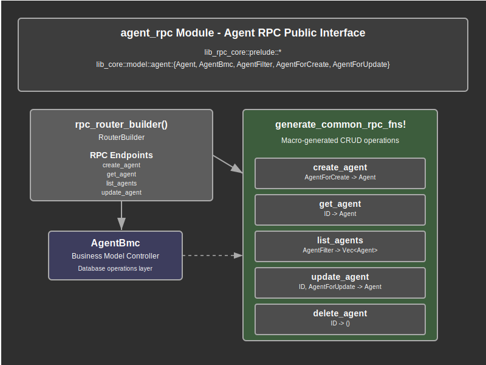

# Agent RPC Documentation

## Overview

The `agent_rpc` module provides JSON-RPC endpoint implementations for managing AI Agent entities within the web application. This module serves as the RPC layer that bridges client requests with the underlying agent data model, providing a complete CRUD (Create, Read, Update, Delete) API interface for agent management operations.

The module implements the standard RPC pattern through macro-generated functions that handle agent lifecycle management. It leverages the common RPC framework to provide consistent request/response structures, error handling, and data validation across all agent-related operations. This ensures that agent management follows the same architectural patterns as other entities in the system.

Key responsibilities include processing agent creation requests with validation and database persistence, handling agent retrieval operations by ID with proper authorization, managing agent listing and filtering operations with pagination support, processing agent updates with partial data modification capabilities, and managing agent deletion with proper cleanup and authorization checks.

## API Summary

### Key Types

#### Router Builder Function

```rust
pub fn rpc_router_builder() -> RouterBuilder
```

The main entry point for building the agent RPC router. This function creates a RouterBuilder configured with all agent-related RPC endpoints using the `router_builder!` macro. The returned RouterBuilder can be integrated into the main application router to expose agent management functionality through JSON-RPC endpoints.

**Usage:**
```rust
// Integration into main router
let agent_router = agent_rpc::rpc_router_builder().build();
app.merge(agent_router);
```

#### Generated RPC Functions

The module uses the `generate_common_rpc_fns!` macro to create standard CRUD operations for agents. This macro generates the following functions with consistent signatures and behavior patterns:

**Function Signatures:**
```rust
// Generated by macro expansion
pub async fn create_agent(
    ctx: Ctx,
    mm: ModelManager,
    params: ParamsForCreate<AgentForCreate>,
) -> Result<DataRpcResult<Agent>>

pub async fn get_agent(
    ctx: Ctx,
    mm: ModelManager,
    params: ParamsIded,
) -> Result<DataRpcResult<Agent>>

pub async fn list_agents(
    ctx: Ctx,
    mm: ModelManager,
    params: ParamsList<AgentFilter>,
) -> Result<DataRpcResult<Vec<Agent>>>

pub async fn update_agent(
    ctx: Ctx,
    mm: ModelManager,
    params: ParamsForUpdate<AgentForUpdate>,
) -> Result<DataRpcResult<Agent>>

pub async fn delete_agent(
    ctx: Ctx,
    mm: ModelManager,
    params: ParamsIded,
) -> Result<DataRpcResult<Agent>>
```

### Core Entity Types

#### `Agent`
The primary entity representing an AI agent in the system.

```rust
pub struct Agent {
    pub id: i64,                    // Unique agent identifier
    pub owner_id: i64,             // User who owns this agent
    pub name: String,              // Human-readable agent name
    pub ai_provider: String,       // AI service provider (e.g., "openai", "anthropic")
    pub ai_model: String,          // Specific model identifier
    pub cid: i64,                  // Creator user ID
    pub ctime: OffsetDateTime,     // Creation timestamp
    pub mid: i64,                  // Last modifier user ID
    pub mtime: OffsetDateTime,     // Last modification timestamp
}
```

#### `AgentForCreate`
Request payload for creating new agents.

```rust
pub struct AgentForCreate {
    pub name: String,              // Required agent name
}
```

**Usage Example:**
```rust
// JSON-RPC request
{
    "method": "create_agent",
    "params": {
        "data": {
            "name": "GPT-4 Assistant"
        }
    }
}
```

#### `AgentForUpdate`
Request payload for updating existing agents with optional fields.

```rust
pub struct AgentForUpdate {
    pub name: Option<String>,      // Optional name update
}
```

**Usage Example:**
```rust
// JSON-RPC request
{
    "method": "update_agent",
    "params": {
        "id": 123,
        "data": {
            "name": "Updated Agent Name"
        }
    }
}
```

#### `AgentFilter`
Filter criteria for agent listing and search operations.

```rust
pub struct AgentFilter {
    pub id: Option<OpValsInt64>,           // ID-based filtering
    pub name: Option<OpValsString>,        // Name-based filtering
    pub cid: Option<OpValsInt64>,          // Creator ID filtering
    pub ctime: Option<OpValsValue>,        // Creation time filtering
    pub mid: Option<OpValsInt64>,          // Modifier ID filtering
    pub mtime: Option<OpValsValue>,        // Modification time filtering
}
```

**Usage Examples:**
```rust
// Filter by name containing "GPT"
{
    "method": "list_agents",
    "params": {
        "filters": [
            {"name": {"$contains": "GPT"}}
        ]
    }
}

// Filter by creation date range
{
    "method": "list_agents",
    "params": {
        "filters": [
            {"ctime": {"$gte": "2024-01-01T00:00:00Z"}}
        ]
    }
}
```

## Details

Note: The information below takes into consideration the expansion of [`router_builder!`](https://github.com/jeremychone/rust-rpc-router/blob/ce2b7aaf7e682911859089bae0ef1229875cda82/src/router/router_builder_macro.rs#L49) and `generate_common_rpc_fns!` in `/crates/libs/lib-rpc-core/src/utils/macro_utils.rs` as well as other modules in this application. See `Dependencies` below.

### Architecture

The agent RPC module follows a layered architecture with clear separation of concerns:

1. **RPC Interface Layer**: Exposes JSON-RPC endpoints through the router builder pattern
2. **Parameter Validation Layer**: Validates and deserializes incoming request parameters
3. **Authorization Layer**: Ensures users can only access agents they own or have permission to view
4. **Business Logic Layer**: Delegates to AgentBmc for actual database operations
5. **Response Formatting Layer**: Formats successful results and errors for JSON-RPC responses

### Agent Management Flow Process

The agent management process follows these sequential steps for each operation type:

#### Creation Flow
1. **Request Reception**: JSON-RPC request received with AgentForCreate data
2. **Parameter Extraction**: `ParamsForCreate<AgentForCreate>` is deserialized from request
3. **Context Validation**: User authentication context is validated
4. **Data Creation**: `AgentBmc::create()` persists new agent with ownership information
5. **Entity Retrieval**: Newly created agent is retrieved to return complete data
6. **Response Formation**: Agent data is wrapped in DataRpcResult and returned

#### Retrieval Flow
1. **ID Extraction**: Agent ID is extracted from ParamsIded parameters
2. **Authorization Check**: System verifies user has permission to access the agent
3. **Database Query**: `AgentBmc::get()` retrieves agent by ID
4. **Ownership Validation**: Agent ownership is validated against requesting user
5. **Response Generation**: Agent data is formatted and returned

#### Listing Flow
1. **Filter Processing**: AgentFilter parameters are parsed and validated
2. **Authorization Filtering**: Filters are augmented with user ownership constraints
3. **Database Query**: `AgentBmc::list()` executes filtered query with pagination
4. **Result Processing**: Retrieved agents are filtered for user access permissions
5. **Response Assembly**: Agent list is formatted and returned with metadata

#### Update Flow
1. **Parameter Validation**: ID and update data are extracted and validated
2. **Existence Check**: Target agent existence and ownership are verified
3. **Data Modification**: `AgentBmc::update()` applies changes to database
4. **Result Retrieval**: Updated agent is retrieved to return current state
5. **Response Creation**: Updated agent data is formatted and returned

#### Deletion Flow
1. **ID Validation**: Target agent ID is extracted and validated
2. **Pre-deletion Retrieval**: Agent is retrieved for return data and ownership check
3. **Cleanup Operations**: Related data and dependencies are handled
4. **Database Deletion**: `AgentBmc::delete()` removes agent from database
5. **Confirmation Response**: Deleted agent data is returned for confirmation

### Security Model

The module implements a comprehensive security model with multiple layers of protection:

#### Authentication Requirements
- **Context Validation**: All operations require valid user authentication context
- **Session Verification**: User sessions are validated before processing requests
- **Token Verification**: Authentication tokens are cryptographically verified

#### Authorization Control
- **Ownership Enforcement**: Users can only manage agents they own
- **Role-Based Access**: Future extension point for role-based permissions
- **Resource Isolation**: Agent data is isolated by owner_id automatically

#### Data Protection
- **Input Validation**: All input parameters are validated and sanitized
- **SQL Injection Prevention**: Parameterized queries prevent injection attacks
- **Error Information Control**: Error messages provide appropriate detail without exposing sensitive data

### Request Processing Strategy

The module implements a consistent request processing strategy across all endpoints:

#### Parameter Processing
- **Type Safety**: Strong typing ensures parameter correctness at compile time
- **Validation Pipeline**: Multi-stage validation ensures data integrity
- **Error Handling**: Comprehensive error handling provides clear feedback

#### Database Integration
- **Transaction Management**: Database operations use appropriate transaction scoping
- **Connection Pooling**: Efficient database connection management through ModelManager
- **Query Optimization**: Generated queries are optimized for performance

#### Response Generation
- **Consistent Format**: All responses follow the same DataRpcResult structure
- **Error Standardization**: Errors are consistently formatted across all endpoints
- **Metadata Inclusion**: Responses include appropriate metadata for client processing

### Data Flow Architecture

Agent data flows through several key components:

1. **JSON-RPC Request**: Client sends structured request with method and parameters
2. **Router Dispatch**: Request is routed to appropriate handler function
3. **Parameter Extraction**: Request parameters are deserialized into typed structures
4. **Context Resolution**: User authentication context is resolved and validated
5. **BMC Operation**: Business logic delegated to AgentBmc for database operations
6. **Data Transformation**: Database results are transformed into API response format
7. **JSON-RPC Response**: Structured response is serialized and returned to client

### Error Handling Strategy

The module implements comprehensive error handling across multiple layers:

#### Parameter Validation Errors
- **Deserialization Errors**: Invalid JSON or parameter structure
- **Type Validation**: Parameter type mismatches and validation failures
- **Required Field Errors**: Missing required parameters or fields

#### Authorization Errors
- **Authentication Failures**: Invalid or expired user sessions
- **Permission Denied**: Insufficient permissions for requested operations
- **Ownership Violations**: Attempts to access or modify non-owned resources

#### Database Operation Errors
- **Entity Not Found**: Requested agents that don't exist
- **Constraint Violations**: Database integrity constraint failures
- **Connection Errors**: Database connectivity or transaction failures

#### System Errors
- **Internal Server Errors**: Unexpected system failures
- **Service Unavailable**: Temporary service outages or maintenance

### Integration Points

The agent RPC module integrates with several key system components:

- **lib-rpc-core Framework**: Uses common RPC patterns and utilities for consistent behavior
- **lib-core Agent Model**: Delegates all data operations to AgentBmc for database access
- **Authentication System**: Relies on Ctx for user authentication and authorization
- **Model Management**: Uses ModelManager for database connection and transaction management
- **Error System**: Integrates with application-wide error handling and reporting
- **Logging System**: Provides request tracing and debugging capabilities

## Flow Diagram



## Implementation Notes

### Dependencies

The module relies on several key dependencies for its functionality:

- **lib-rpc-core**: Provides core RPC framework, macros, and common patterns for consistent API implementation
- **lib-core::model::agent**: Contains Agent entity definitions, AgentBmc business logic, and database operations
- **Authentication Context (Ctx)**: Provides user authentication and authorization context for all operations
- **ModelManager**: Manages database connections, transactions, and provides access to data layer
- **Parameter Types**: ParamsForCreate, ParamsForUpdate, ParamsIded, and ParamsList for request structure
- **Error Handling**: Integration with application-wide error types and handling strategies

### Design Decisions

1. **Macro-Generated Functions**: Using `generate_common_rpc_fns!` ensures consistency across all entity RPC modules while reducing boilerplate code
2. **Standard CRUD Pattern**: Following established CRUD patterns provides predictable API behavior for client applications
3. **Type Safety**: Strong typing throughout the parameter and response chain prevents runtime errors
4. **Ownership Integration**: Built-in owner_id filtering ensures automatic data isolation and security
5. **Consistent Error Handling**: Standardized error responses enable reliable client error handling

### Security Considerations

1. **Authentication Required**: All operations require valid user authentication context
2. **Owner-Based Authorization**: Users can only access and modify their own agents
3. **Input Validation**: All parameters are validated and sanitized before processing
4. **Database Security**: Parameterized queries prevent SQL injection attacks
5. **Error Information**: Error messages provide debugging information without exposing sensitive system details

### Performance Considerations

- **Efficient Database Operations**: Single-query operations minimize database round trips
- **Connection Pooling**: ModelManager provides efficient database connection management
- **Minimal Data Transfer**: Only necessary data is transferred in request and response payloads
- **Query Optimization**: Generated database queries are optimized for performance
- **Caching Opportunities**: Response data can be cached at various levels for improved performance

### Error Recovery Strategies

The module implements several error recovery mechanisms:

1. **Graceful Degradation**: Partial failures don't prevent successful operations from completing
2. **Detailed Error Information**: Specific error types enable appropriate client-side recovery actions
3. **Transactional Integrity**: Database operations maintain consistency even during failures
4. **Idempotent Operations**: Safe retry mechanisms for network or temporary failures

### Testing Considerations

When testing the agent RPC module:

- **Parameter Validation Testing**: Test various invalid parameter combinations and formats
- **Authorization Testing**: Verify users cannot access or modify agents they don't own
- **Database Integration Testing**: Test behavior with database errors and connectivity issues
- **End-to-End Testing**: Test complete JSON-RPC request/response cycles
- **Performance Testing**: Verify response times and throughput under load
- **Error Handling Testing**: Ensure all error conditions are properly handled and reported

### Usage Patterns

#### Basic Agent Operations
```rust
// Creating a new agent
{
    "method": "create_agent",
    "params": {
        "data": {
            "name": "My AI Assistant"
        }
    }
}

// Retrieving an agent
{
    "method": "get_agent",
    "params": {
        "id": 123
    }
}

// Updating an agent
{
    "method": "update_agent",
    "params": {
        "id": 123,
        "data": {
            "name": "Updated Assistant Name"
        }
    }
}
```

#### Advanced Filtering and Listing
```rust
// List agents with name filtering
{
    "method": "list_agents",
    "params": {
        "filters": [
            {"name": {"$contains": "GPT"}}
        ],
        "list_options": {
            "offset": 0,
            "limit": 10
        }
    }
}

// Complex filtering with multiple criteria
{
    "method": "list_agents",
    "params": {
        "filters": [
            {"name": {"$startsWith": "Assistant"}},
            {"ctime": {"$gte": "2024-01-01T00:00:00Z"}}
        ]
    }
}
```

### Future Enhancement Opportunities

The agent RPC module provides a foundation for future enhancements:

- **Batch Operations**: Support for bulk create, update, and delete operations
- **Advanced Filtering**: More sophisticated filtering and search capabilities
- **Agent Templates**: Pre-configured agent templates for common use cases
- **Agent Analytics**: Usage statistics and performance metrics
- **Agent Sharing**: Controlled sharing of agents between users
- **Audit Logging**: Comprehensive audit trails for all agent operations
- **Agent Versioning**: Version control and rollback capabilities for agent configurations
