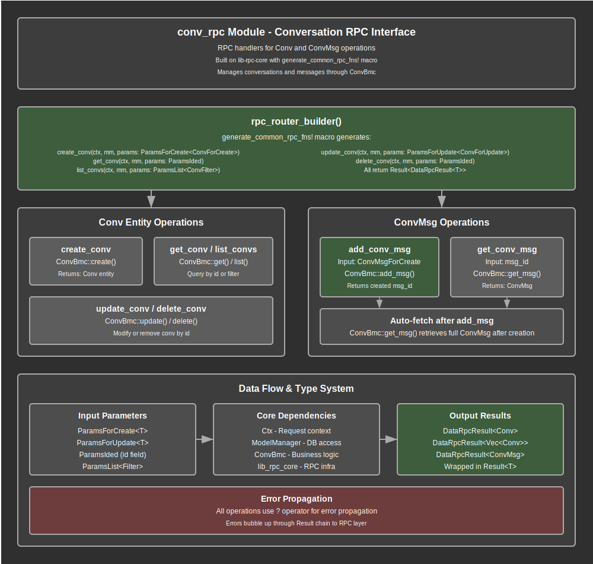

# Conversation RPC Module Documentation

## Overview

The conversation RPC module provides JSON-RPC endpoints for managing conversations and conversation messages within the web application. This module serves as the primary interface for creating, reading, updating, and deleting conversation entities, as well as managing conversation message operations through a standardized RPC interface.

The module implements a comprehensive CRUD (Create, Read, Update, Delete) API for conversations using the common RPC pattern, with additional specialized functionality for conversation message management. It leverages the `generate_common_rpc_fns` macro to provide consistent behavior across all conversation operations while maintaining type safety and proper error handling.

Key responsibilities include exposing conversation CRUD operations through JSON-RPC endpoints, managing conversation message creation and retrieval, providing standardized parameter validation and response formatting, integrating with the core conversation model layer (ConvBmc), and maintaining authentication context through the Ctx parameter for all operations.

## API Summary

### Key Types

#### Router Builder
The module exports a router builder function that registers all conversation-related RPC endpoints:

```rust
pub fn rpc_router_builder() -> RouterBuilder
```

This function returns a configured RouterBuilder containing all conversation RPC endpoints, ready to be integrated into the main application router.

#### Generated CRUD Operations

The module uses the `generate_common_rpc_fns` macro to automatically generate standard CRUD operations:

```rust
generate_common_rpc_fns!(
    Bmc: ConvBmc,
    Entity: Conv,
    ForCreate: ConvForCreate,
    ForUpdate: ConvForUpdate,
    Filter: ConvFilter,
    Suffix: conv
);
```

This macro generates the following functions:
- `create_conv`: Creates a new conversation
- `get_conv`: Retrieves a conversation by ID
- `list_convs`: Lists conversations with optional filtering
- `update_conv`: Updates an existing conversation
- `delete_conv`: Deletes a conversation by ID

### Key Functions

#### `create_conv`
Creates a new conversation entity with the provided data.

```rust
pub async fn create_conv(
    ctx: Ctx,
    mm: ModelManager,
    params: ParamsForCreate<ConvForCreate>,
) -> Result<DataRpcResult<Conv>>
```

**Parameters:**
- `ctx`: Authentication context containing user ID and security information
- `mm`: Model manager for database operations
- `params`: Creation parameters containing ConvForCreate data

**Returns:** Result containing the created conversation entity

**Example Usage:**
```rust
// RPC call payload
{
    "id": 1,
    "method": "create_conv",
    "params": {
        "data": {
            "title": "Customer Support Chat",
            "kind": "OwnerOnly"
        }
    }
}
```

#### `get_conv`
Retrieves a specific conversation by its ID.

```rust
pub async fn get_conv(
    ctx: Ctx,
    mm: ModelManager,
    params: ParamsIded,
) -> Result<DataRpcResult<Conv>>
```

**Parameters:**
- `ctx`: Authentication context for access control
- `mm`: Model manager for database operations
- `params`: Parameters containing the conversation ID to retrieve

**Returns:** Result containing the requested conversation entity

#### `list_convs`
Lists conversations with optional filtering and pagination.

```rust
pub async fn list_convs(
    ctx: Ctx,
    mm: ModelManager,
    params: ParamsList<ConvFilter>,
) -> Result<DataRpcResult<Vec<Conv>>>
```

**Parameters:**
- `ctx`: Authentication context for user-scoped listing
- `mm`: Model manager for database operations
- `params`: List parameters containing optional filters and list options

**Returns:** Result containing a vector of conversation entities

#### `update_conv`
Updates an existing conversation with new data.

```rust
pub async fn update_conv(
    ctx: Ctx,
    mm: ModelManager,
    params: ParamsForUpdate<ConvForUpdate>,
) -> Result<DataRpcResult<Conv>>
```

**Parameters:**
- `ctx`: Authentication context for permission validation
- `mm`: Model manager for database operations
- `params`: Update parameters containing conversation ID and update data

**Returns:** Result containing the updated conversation entity

#### `delete_conv`
Deletes a conversation by its ID.

```rust
pub async fn delete_conv(
    ctx: Ctx,
    mm: ModelManager,
    params: ParamsIded,
) -> Result<DataRpcResult<Conv>>
```

**Parameters:**
- `ctx`: Authentication context for deletion authorization
- `mm`: Model manager for database operations
- `params`: Parameters containing the conversation ID to delete

**Returns:** Result containing the deleted conversation entity

#### `add_conv_msg`
Adds a new message to an existing conversation.

```rust
pub async fn add_conv_msg(
    ctx: Ctx,
    mm: ModelManager,
    params: ParamsForCreate<ConvMsgForCreate>,
) -> Result<DataRpcResult<ConvMsg>>
```

**Parameters:**
- `ctx`: Authentication context for message creation authorization
- `mm`: Model manager for database operations
- `params`: Creation parameters containing ConvMsgForCreate data

**Returns:** Result containing the created conversation message entity

**Process:**
1. Extracts message creation data from parameters
2. Creates the message using ConvBmc::add_msg
3. Retrieves the complete message entity with ConvBmc::get_msg
4. Returns the formatted message result

**Example Usage:**
```rust
// RPC call payload
{
    "id": 1,
    "method": "add_conv_msg",
    "params": {
        "data": {
            "conv_id": 123,
            "content": "Hello, how can I help you today?",
            "role": "assistant"
        }
    }
}
```

#### `get_conv_msg`
Retrieves a specific conversation message by its ID.

```rust
#[allow(unused)]
pub async fn get_conv_msg(
    ctx: Ctx,
    mm: ModelManager,
    params: ParamsIded,
) -> Result<DataRpcResult<ConvMsg>>
```

**Parameters:**
- `ctx`: Authentication context for access control
- `mm`: Model manager for database operations
- `params`: Parameters containing the message ID to retrieve

**Returns:** Result containing the requested conversation message entity

**Note:** Currently marked as unused, indicating this endpoint may not be actively exposed in the RPC router but is available for future use.

## Details

Note: The information below takes into consideration the expansion of [`router_builder!`](https://github.com/jeremychone/rust-rpc-router/blob/ce2b7aaf7e682911859089bae0ef1229875cda82/src/router/router_builder_macro.rs#L49) and `generate_common_rpc_fns!` in `/crates/libs/lib-rpc-core/src/utils/macro_utils.rs` as well as other modules in this application. See `Dependencies` below.

### Architecture

The conversation RPC module follows a layered architecture with clear separation of concerns:

1. **RPC Interface Layer**: Exposes JSON-RPC endpoints for conversation operations
2. **Parameter Validation Layer**: Validates and processes RPC parameters using typed parameter structs
3. **Business Logic Layer**: Delegates operations to the ConvBmc model controller
4. **Data Access Layer**: Accesses conversation and message data through the model manager
5. **Response Formatting Layer**: Converts model entities to standardized RPC responses

### Data Flow Architecture

The conversation data flows through several key components:

1. **JSON-RPC Request**: Contains method name, parameters, and authentication cookies
2. **Router Dispatch**: RPC router matches method names to handler functions
3. **Parameter Extraction**: Typed parameters are extracted and validated from RPC payload
4. **Authentication Context**: Ctx provides user identity and authorization context
5. **Model Layer Access**: ConvBmc performs database operations through ModelManager
6. **Entity Processing**: Conversation and message entities are processed and formatted
7. **Response Generation**: Standardized DataRpcResult responses are returned
8. **JSON-RPC Response**: Formatted response containing conversation data or error information

### Security Model

The module implements comprehensive security through multiple layers:

#### Authentication Requirements
- **Context Validation**: All operations require valid authentication context (Ctx)
- **User Authorization**: Operations are performed within the authenticated user's security scope
- **Token Verification**: Authentication tokens are validated before any conversation operations

#### Access Control
- **User-Scoped Operations**: Conversations are accessed within the authenticated user's context
- **Permission Validation**: Create, update, and delete operations validate user permissions
- **Message Authorization**: Conversation message operations respect conversation ownership

#### Data Protection
- **Input Validation**: All RPC parameters undergo type validation and sanitization
- **Output Sanitization**: Response data is properly formatted and sanitized
- **Error Information Control**: Error messages provide debugging information without exposing sensitive data

### Conversation Management Strategy

The module implements a comprehensive conversation management strategy:

#### CRUD Operations Standardization
- **Consistent Interface**: All conversation operations follow the same parameter and response patterns
- **Type Safety**: Strong typing ensures compile-time validation of operation parameters
- **Error Handling**: Uniform error handling across all conversation operations

#### Message Integration
- **Conversation Scoping**: Messages are always created within the context of a specific conversation
- **Atomic Operations**: Message creation includes immediate retrieval for consistency
- **Relationship Integrity**: Proper foreign key relationships between conversations and messages

#### Performance Optimization
- **Efficient Queries**: Database operations are optimized through the ConvBmc layer
- **Minimal Database Hits**: Message creation includes retrieval in a single transaction scope
- **Response Caching**: Entity responses can be cached at the model layer level

### Integration Points

The conversation RPC module integrates with several key system components:

- **lib-core Model Layer**: Uses ConvBmc and ConvMsgBmc for all database operations
- **lib-rpc-core Framework**: Leverages common RPC patterns, macros, and parameter types
- **Authentication System**: Requires Ctx for all operations through the authentication middleware
- **JSON-RPC Router**: Integrates with the rpc-router crate for method dispatch and parameter handling
- **Axum Framework**: Built on Axum's async foundation with Tower middleware support
- **Database Layer**: Accesses PostgreSQL through SQLx via the model manager

## Flow Diagram



## Implementation Notes

### Dependencies

The module relies on several key dependencies for its functionality:

- **lib-core**: Core conversation models (Conv, ConvBmc, ConvFilter, ConvForCreate, ConvForUpdate) and message models (ConvMsg, ConvMsgForCreate)
- **lib-rpc-core**: RPC framework providing macros, parameter types, and common patterns
- **Axum**: Web framework providing async handlers and request processing
- **JSON-RPC Router**: Method dispatch and parameter handling for RPC operations
- **SQLx**: Database access through the model manager
- **Serde**: Serialization support for request/response processing

### Design Decisions

1. **Macro-Generated CRUD**: Using `generate_common_rpc_fns` ensures consistency across all entity types while reducing boilerplate code
2. **Separate Message Operations**: Conversation messages have dedicated functions (`add_conv_msg`, `get_conv_msg`) for specialized message handling
3. **Authentication Integration**: All operations require Ctx parameter ensuring security is enforced at the API level
4. **Type-Safe Parameters**: Strong typing of all RPC parameters prevents runtime type errors
5. **Consistent Return Types**: All operations return DataRpcResult for uniform response handling

### Error Handling Strategy

The module implements robust error handling:

1. **Parameter Validation**: Type system prevents invalid parameter structures
2. **Authentication Errors**: Missing or invalid authentication context results in appropriate errors
3. **Model Layer Errors**: Database and business logic errors are propagated with context
4. **Response Formatting**: All errors are converted to standardized RPC error responses

### Performance Considerations

- **Efficient Database Access**: All database operations go through optimized ConvBmc methods
- **Minimal Allocations**: Parameter and response handling minimize unnecessary memory allocations
- **Async Processing**: Fully async implementation prevents blocking operations
- **Connection Pooling**: Database connections are managed efficiently through the model manager

### Testing Considerations

When testing the conversation RPC module:

- **Parameter Validation**: Test various invalid parameter structures and formats
- **Authentication Testing**: Test behavior with missing, invalid, or expired authentication context
- **Database Error Simulation**: Test scenarios where database operations fail
- **Message Relationship Testing**: Verify proper conversation-message relationships
- **Concurrent Access**: Test multiple simultaneous operations on the same conversation
- **Filter Testing**: Verify list operations with various filter combinations
- **Edge Case Handling**: Test operations with non-existent conversation IDs

### Usage Patterns

#### Basic Conversation Operations
```rust
// Creating a conversation
let rpc_request = json!({
    "id": 1,
    "method": "create_conv",
    "params": {
        "data": {
            "title": "Support Ticket #12345",
            "kind": "MultiUsers"
        }
    }
});

// Listing user conversations
let rpc_request = json!({
    "id": 2,
    "method": "list_convs",
    "params": {
        "filters": {
            "kind": "OwnerOnly"
        },
        "list_options": {
            "limit": 10,
            "offset": 0
        }
    }
});
```

#### Message Management
```rust
// Adding a message to a conversation
let rpc_request = json!({
    "id": 3,
    "method": "add_conv_msg",
    "params": {
        "data": {
            "conv_id": 123,
            "content": "Thank you for contacting support.",
            "role": "agent"
        }
    }
});
```

### Future Enhancement Opportunities

The conversation RPC module provides a foundation for future conversation management enhancements:

- **Real-time Updates**: WebSocket integration for live conversation updates
- **Message Threading**: Support for threaded conversation messages
- **File Attachments**: Integration with file upload and attachment systems
- **Message Search**: Full-text search capabilities across conversation messages
- **Conversation Analytics**: Usage metrics and conversation analysis features
- **Message Encryption**: End-to-end encryption for sensitive conversations
